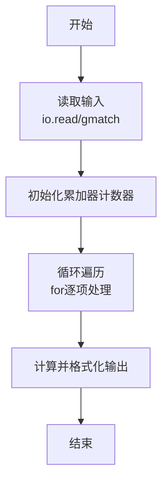
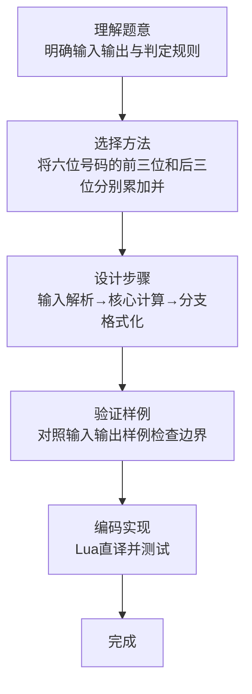

# L1-062 - 幸运彩票（15 分）

- **时间限制**: 400 ms
- **内存限制**: 65536 KB
- **代码长度限制**: 16 KB

---

## 题目描述


彩票的号码有 6 位数字，若一张彩票的前 3 位上的数之和等于后 3 位上的数之和，则称这张彩票是幸运的。本题就请你判断给定的彩票是不是幸运的。

### 输入格式:

输入在第一行中给出一个正整数 N（$$\le$$ 100）。随后 N 行，每行给出一张彩票的 6 位数字。

### 输出格式:

对每张彩票，如果它是幸运的，就在一行中输出 `You are lucky!`；否则输出 `Wish you good luck.`。

### 输入样例:
```in
2
233008
123456
```

### 输出样例:
```out
You are lucky!
Wish you good luck.
```

## 示例

### 示例 1

**输入:**
```
2
233008
123456
```

**输出:**
```
You are lucky!
Wish you good luck.
```
### 解题思路

本题属于幸运彩票题型，核心在于将六位号码的前三位和后三位分别累加并比较。输入规模较小，可直接按题意模拟，无需复杂数据结构。

算法上采用线性遍历：对输入序列使用 `for` 循环逐个处理，累加或变换得到中间结果，再一次性计算最终答案，时间复杂度为 O(N)，与代码中的循环部分一致。

复杂度方面，遍历部分为 O(N)，额外空间 O(1)（除输入缓冲外）。边界上注意空输入、格式空格及数值精度的处理，Lua 中通过 `tonumber`/`string.format` 保证转换与保留小数位的正确性。

### 代码流程说明

1. **输入解析**：使用 `io.read` 直接读取输入行，得到数值或字符串形式的原始数据，必要时做 `tonumber` 类型转换与去空格处理。
2. **核心计算**：将六位号码的前三位和后三位分别累加并比较，在循环体内逐项累加、比较或变换（如代码中的 `for` 循环体），维护中间变量（如求和、计数、查表）。
3. **结果整理**：对计算结果进行格式化或拼接（如 `string.format`、`table.concat`），保证输出符合样例。
4. **输出**：通过 `print` 按行输出结果，含必要的换行与精度控制，完成题目要求的全部输出。

### 代码实现

```lua
-- 实现原理：将六位号码的前三位和后三位分别累加并比较。
local n = tonumber(io.read("*l"))
for _ = 1, n do
    local ticket = io.read("*l")
    local left, right = 0, 0
    for i = 1, 3 do left = left + tonumber(ticket:sub(i, i)) end
    for i = 4, 6 do right = right + tonumber(ticket:sub(i, i)) end
    print(left == right and "You are lucky!" or "Wish you good luck.")
end
```

### 代码流程图



### 解题流程图


