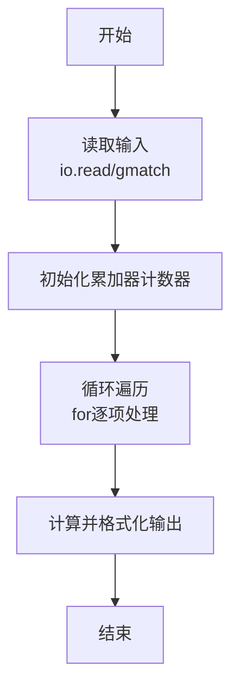
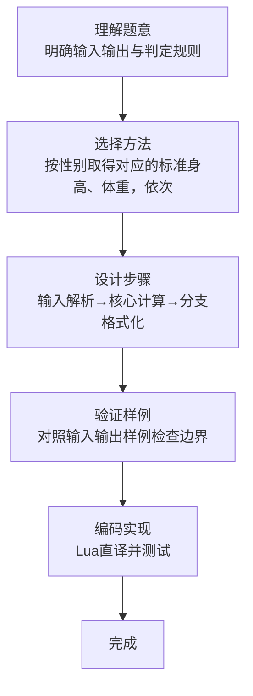

# L1-063 - 吃鱼还是吃肉（10 分）

- **时间限制**: 400 ms
- **内存限制**: 65536 KB
- **代码长度限制**: 16 KB

---

## 题目描述


  


国家给出了 8 岁男宝宝的标准身高为 130 厘米、标准体重为 27 公斤；8 岁女宝宝的标准身高为 129 厘米、标准体重为 25 公斤。

现在你要根据小宝宝的身高体重，给出补充营养的建议。

### 输入格式:

输入在第一行给出一个不超过 10 的正整数 $$N$$，随后 $$N$$ 行，每行给出一位宝宝的身体数据：
```
性别 身高 体重
```
其中`性别`是 1 表示男生，0 表示女生。`身高`和`体重`都是不超过 200 的正整数。

### 输出格式:

对于每一位宝宝，在一行中给出你的建议：

- 如果太矮了，输出：`duo chi yu!`（多吃鱼）；
- 如果太瘦了，输出：`duo chi rou!`（多吃肉）；
- 如果正标准，输出：`wan mei!`（完美）；
- 如果太高了，输出：`ni li hai!`（你厉害）；
- 如果太胖了，输出：`shao chi rou!`（少吃肉）。

先评价身高，再评价体重。两句话之间要有 1 个空格。

### 输入样例:
```in
4
0 130 23
1 129 27
1 130 30
0 128 27
```

### 输出样例:
```out
ni li hai! duo chi rou!
duo chi yu! wan mei!
wan mei! shao chi rou!
duo chi yu! shao chi rou!
```

## 示例

### 示例 1

**输入:**
```
4
0 130 23
1 129 27
1 130 30
0 128 27
```

**输出:**
```
ni li hai! duo chi rou!
duo chi yu! wan mei!
wan mei! shao chi rou!
duo chi yu! shao chi rou!
```
### 解题思路

本题属于吃鱼还是吃肉题型，核心在于按性别取得对应的标准身高、体重，依次比较身高和体重给出两条建议。输入规模较小，可直接按题意模拟，无需复杂数据结构。

算法上采用线性遍历：对输入序列使用 `for` 循环逐个处理，累加或变换得到中间结果，再一次性计算最终答案，时间复杂度为 O(N)，与代码中的循环部分一致。

复杂度方面，遍历部分为 O(N)，额外空间 O(1)（除输入缓冲外）。边界上注意空输入、格式空格及数值精度的处理，Lua 中通过 `tonumber`/`string.format` 保证转换与保留小数位的正确性。

### 代码流程说明

1. **输入解析**：使用 `io.read("*l"):match` 按模式提取字段并经 `tonumber` 转换，得到数值或字符串形式的原始数据，必要时做 `tonumber` 类型转换与去空格处理。
2. **核心计算**：按性别取得对应的标准身高、体重，依次比较身高和体重给出两条建议，在循环体内逐项累加、比较或变换（如代码中的 `for` 循环体），维护中间变量（如求和、计数、查表）。
3. **结果整理**：对计算结果进行格式化或拼接（如 `string.format`、`table.concat`），保证输出符合样例。
4. **输出**：通过 `print` 按行输出结果，含必要的换行与精度控制，完成题目要求的全部输出。

### 代码实现

```lua
-- 实现原理：按性别取得对应的标准身高、体重，依次比较身高和体重给出两条建议。
local n = tonumber(io.read("*l"))
for _ = 1, n do
    local sex, height, weight = io.read("*l"):match("(%d+)%s+(%d+)%s+(%d+)")
    local standard_h, standard_w = sex == "1" and 130 or 129, sex == "1" and 27 or 25
    height, weight = tonumber(height), tonumber(weight)
    local height_word = height < standard_h and "duo chi yu!" or (height > standard_h and "ni li hai!" or "wan mei!")
    local weight_word = weight < standard_w and "duo chi rou!" or (weight > standard_w and "shao chi rou!" or "wan mei!")
    print(height_word .. " " .. weight_word)
end
```

### 代码流程图



### 解题流程图


