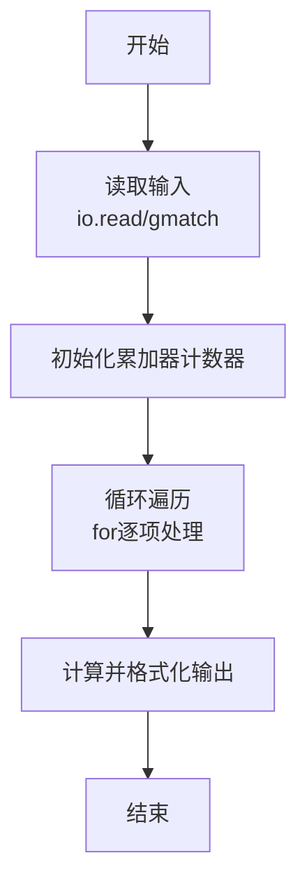
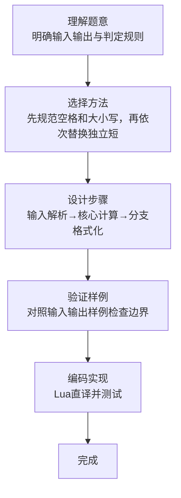

# L1-064 - 估值一亿的AI核心代码（20 分）

- **时间限制**: 400 ms
- **内存限制**: 65536 KB
- **代码长度限制**: 16 KB

---

## 题目描述


以上图片来自新浪微博。

本题要求你实现一个稍微更值钱一点的 AI 英文问答程序，规则是：

- 无论用户说什么，首先把对方说的话在一行中原样打印出来；
- 消除原文中多余空格：把相邻单词间的多个空格换成 1 个空格，把行首尾的空格全部删掉，把标点符号前面的空格删掉；
- 把原文中所有大写英文字母变成小写，除了 `I`；
- 把原文中所有独立的 `can you`、`could you` 对应地换成 `I can`、`I could`—— 这里“独立”是指被空格或标点符号分隔开的单词；
- 把原文中所有独立的 `I` 和 `me` 换成 `you`；
- 把原文中所有的问号 `?` 换成惊叹号 `!`；
- 在一行中输出替换后的句子作为 AI 的回答。

### 输入格式:

输入首先在第一行给出不超过 10 的正整数 N，随后 N 行，每行给出一句不超过 1000 个字符的、以回车结尾的用户的对话，对话为非空字符串，仅包括字母、数字、空格、可见的半角标点符号。

### 输出格式:

按题面要求输出，每个 AI 的回答前要加上 `AI:` 和一个空格。

### 输入样例:
```in
6
Hello ?
 Good to chat   with you
can   you speak Chinese?
Really?
Could you show me 5
What Is this prime? I,don 't know
```

### 输出样例:
```out
Hello ?
AI: hello!
 Good to chat   with you
AI: good to chat with you
can   you speak Chinese?
AI: I can speak chinese!
Really?
AI: really!
Could you show me 5
AI: I could show you 5
What Is this prime? I,don 't know
AI: what Is this prime! you,don't know
```

## 示例

### 示例 1

**输入:**
```
6
Hello ?
 Good to chat   with you
can   you speak Chinese?
Really?
Could you show me 5
What Is this prime? I,don 't know
```

**输出:**
```
Hello ?
AI: hello!
 Good to chat   with you
AI: good to chat with you
can   you speak Chinese?
AI: I can speak chinese!
Really?
AI: really!
Could you show me 5
AI: I could show you 5
What Is this prime? I,don 't know
AI: what Is this prime! you,don't know
```
### 解题思路

本题属于估值一亿的A题型，核心在于先规范空格和大小写，再依次替换独立短语、独立代词和问号。输入规模较小，可直接按题意模拟，无需复杂数据结构。

算法上采用线性遍历：对输入序列使用 `for` 循环逐个处理，累加或变换得到中间结果，再一次性计算最终答案，时间复杂度为 O(N)，与代码中的循环部分一致。

复杂度方面，遍历部分为 O(N)，额外空间 O(1)（除输入缓冲外）。边界上注意空输入、格式空格及数值精度的处理，Lua 中通过 `tonumber`/`string.format` 保证转换与保留小数位的正确性。

### 代码流程说明

1. **输入解析**：使用 `io.read("*l"):match` 按模式提取字段并经 `tonumber` 转换，得到数值或字符串形式的原始数据，必要时做 `tonumber` 类型转换与去空格处理。
2. **核心计算**：先规范空格和大小写，再依次替换独立短语、独立代词和问号，在循环体内逐项累加、比较或变换（如代码中的 `for` 循环体），维护中间变量（如求和、计数、查表）。
3. **结果整理**：对计算结果进行格式化或拼接（如 `string.format`、`table.concat`），保证输出符合样例。
4. **输出**：通过 `print` 按行输出结果，含必要的换行与精度控制，完成题目要求的全部输出。

### 代码实现

```lua
-- 实现原理：先规范空格和大小写，再依次替换独立短语、独立代词和问号。
local function normalize(line)
    line = line:match("^%s*(.-)%s*$") -- 去除首尾空格
    line = line:gsub("%s+", " ")
    line = line:gsub("%s+([%p])", "%1") -- 标点前不留空格
    line = line:gsub("[A-Z]", function(ch) return ch == "I" and "I" or ch:lower() end)
    line = line:gsub("%f[%a]can%s+you%f[^%a]", "I can")
    line = line:gsub("%f[%a]could%s+you%f[^%a]", "I could")
    line = line:gsub("%f[%a]I%f[^%a]", "you")
    line = line:gsub("%f[%a]me%f[^%a]", "you")
    return line:gsub("%?", "!")
end
local n = tonumber(io.read("*l"))
for _ = 1, n do
    local original = io.read("*l")
    print(original)
    print("AI: " .. normalize(original))
end
```

### 代码流程图



### 解题流程图


