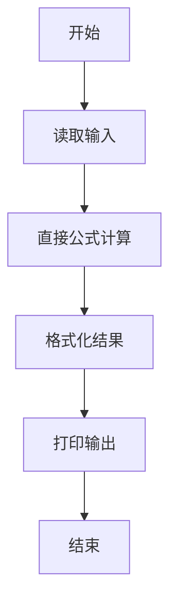
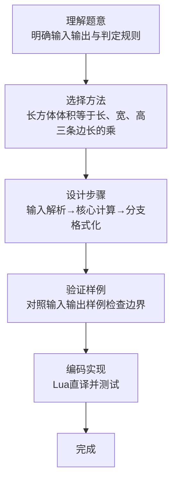

# L1-066 - 猫是液体（5 分）

- **时间限制**: 400 ms
- **内存限制**: 65536 KB
- **代码长度限制**: 16 KB

---

## 题目描述


测量一个人的体积是很难的，但猫就不一样了。因为猫是液体，所以可以很容易地通过测量一个长方体容器的容积来得到容器里猫的体积。本题就请你完成这个计算。

### 输入格式:

输入在第一行中给出 3 个不超过 100 的正整数，分别对应容器的长、宽、高。

### 输出格式:

在一行中输出猫的体积。

### 输入样例:
```in
23 15 20
```

### 输出样例:
```out
6900
```

## 示例

### 示例 1

**输入:**
```
23 15 20
```

**输出:**
```
6900
```
### 解题思路

本题属于猫是液体题型，核心在于长方体体积等于长、宽、高三条边长的乘积。输入规模较小，可直接按题意模拟，无需复杂数据结构。

算法直接按公式或规则计算：读取输入后通过算术或字符串运算一次性得到结果，无需循环，体现为代码中的直算与格式化输出。

边界与精度方面，需处理输入首尾空格、空行及数值类型转换；输出按题面要求的格式（如保留小数、固定文案）使用 `string.format`/`print` 精确控制，确保样例一致。

### 代码流程说明

1. **输入解析**：使用 `io.read("*l"):match` 按模式提取字段并经 `tonumber` 转换，得到数值或字符串形式的原始数据，必要时做 `tonumber` 类型转换与去空格处理。
2. **核心计算**：长方体体积等于长、宽、高三条边长的乘积，通过一次算术或逻辑表达式直接求得结果。
3. **结果整理**：对计算结果进行格式化或拼接（如 `string.format`、`table.concat`），保证输出符合样例。
4. **输出**：通过 `print` 按行输出结果，含必要的换行与精度控制，完成题目要求的全部输出。

### 代码实现

```lua
-- 实现原理：长方体体积等于长、宽、高三条边长的乘积。
local a, b, c = io.read("*l"):match("(%d+)%s+(%d+)%s+(%d+)")
print(tonumber(a) * tonumber(b) * tonumber(c))
```

### 代码流程图



### 解题流程图


