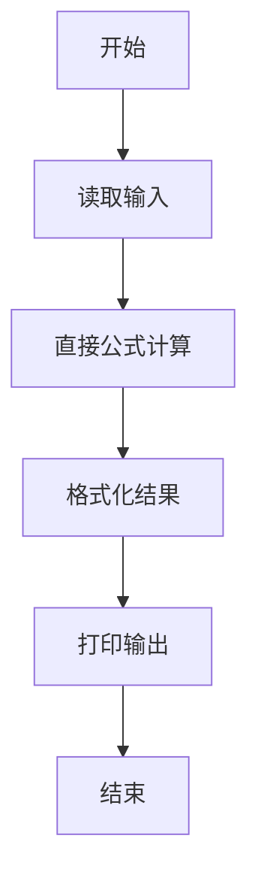
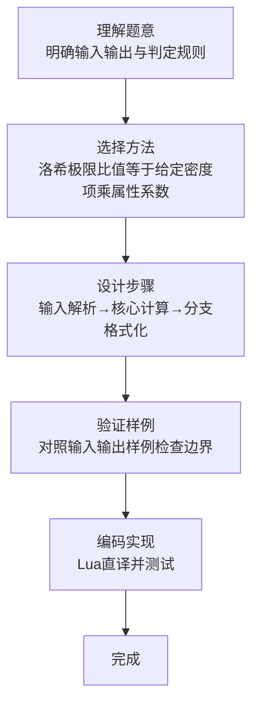

# L1-067 -  洛希极限（10 分）

- **时间限制**: 400 ms
- **内存限制**: 65536 KB
- **代码长度限制**: 16 KB

---

## 题目描述


科幻电影《流浪地球》中一个重要的情节是地球距离木星太近时，大气开始被木星吸走，而随着不断接近地木“刚体洛希极限”，地球面临被彻底撕碎的危险。但实际上，这个计算是错误的。


洛希极限（Roche limit）是一个天体自身的引力与第二个天体造成的潮汐力相等时的距离。当两个天体的距离少于洛希极限，天体就会倾向碎散，继而成为第二个天体的环。它以首位计算这个极限的人爱德华·洛希命名。（摘自百度百科）

大天体密度与小天体的密度的比值开 3 次方后，再乘以大天体的半径以及一个倍数（流体对应的倍数是 2.455，刚体对应的倍数是 1.26），就是洛希极限的值。例如木星与地球的密度比值开 3 次方是 0.622，如果假设地球是流体，那么洛希极限就是 $0.622\times 2.455=1.52701$ 倍木星半径；但地球是刚体，对应的洛希极限是 $0.622\times 1.26=0.78372$ 倍木星半径，这个距离比木星半径小，即只有当地球位于木星内部的时候才会被撕碎，换言之，就是地球不可能被撕碎。

本题就请你判断一个小天体会不会被一个大天体撕碎。

### 输入格式:

输入在一行中给出 3 个数字，依次为：大天体密度与小天体的密度的比值开 3 次方后计算出的值（$\le 1$）、小天体的属性（0 表示流体、1 表示刚体）、两个天体的距离与大天体半径的比值（$>1$ 但不超过 10）。

### 输出格式:

在一行中首先输出小天体的洛希极限与大天体半径的比值（输出小数点后2位）；随后空一格；最后输出 `^_^` 如果小天体不会被撕碎，否则输出 `T_T`。

### 输入样例 1：
```in
0.622 0 1.4
```

### 输出样例 1：
```out
1.53 T_T
```

### 输入样例 2：
```in
0.622 1 1.4
```

### 输出样例 2：
```out
0.78 ^_^
```

## 示例

### 示例 1

**输入:**
```
0.622 0 1.4
```

**输出:**
```
1.53 T_T
```

### 示例 2

**输入:**
```
0.622 1 1.4
```

**输出:**
```
0.78 ^_^
```
### 解题思路

本题属于洛希极限题型，核心在于洛希极限比值等于给定密度项乘属性系数；距离小于该极限则会被撕碎。输入规模较小，可直接按题意模拟，无需复杂数据结构。

算法直接按公式或规则计算：读取输入后通过算术或字符串运算一次性得到结果，无需循环，体现为代码中的直算与格式化输出。

边界与精度方面，需处理输入首尾空格、空行及数值类型转换；输出按题面要求的格式（如保留小数、固定文案）使用 `string.format`/`print` 精确控制，确保样例一致。

### 代码流程说明

1. **输入解析**：使用 `io.read("*l"):match` 按模式提取字段并经 `tonumber` 转换，得到数值或字符串形式的原始数据，必要时做 `tonumber` 类型转换与去空格处理。
2. **核心计算**：洛希极限比值等于给定密度项乘属性系数；距离小于该极限则会被撕碎，通过一次算术或逻辑表达式直接求得结果。
3. **结果整理**：对计算结果进行格式化或拼接（如 `string.format`、`table.concat`），保证输出符合样例。
4. **输出**：通过 `print` 按行输出结果，含必要的换行与精度控制，完成题目要求的全部输出。

### 代码实现

```lua
-- 实现原理：洛希极限比值等于给定密度项乘属性系数；距离小于该极限则会被撕碎。
local density, type_id, distance = io.read("*l"):match("([%d.]+)%s+(%d+)%s+([%d.]+)")
local limit = tonumber(density) * (type_id == "0" and 2.455 or 1.26)
print(string.format("%.2f %s", limit, tonumber(distance) < limit and "T_T" or "^_^"))
```

### 代码流程图



### 解题流程图


