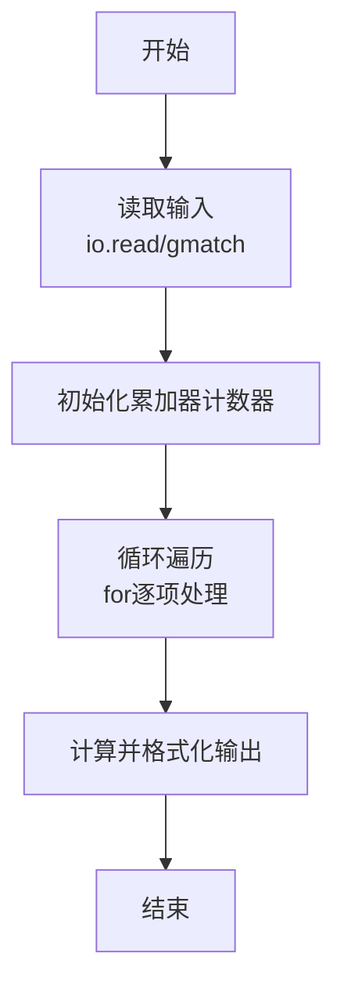

# L1-068 - 调和平均（10 分）

- **时间限制**: 400 ms
- **内存限制**: 65536 KB
- **代码长度限制**: 16 KB

---

## 题目描述


$$N$$ 个正数的**算数平均**是这些数的和除以 $$N$$，它们的**调和平均**是它们倒数的算数平均的倒数。本题就请你计算给定的一系列正数的调和平均值。

### 输入格式:

每个输入包含 1 个测试用例。每个测试用例第 1 行给出正整数 $$N$$ ($$\le 1000$$)；第 2 行给出 $$N$$ 个正数，都在区间 $$[0.1, 100]$$ 内。

### 输出格式:

在一行中输出给定数列的调和平均值，输出小数点后2位。

### 输入样例:
```in
8
10 15 12.7 0.3 4 13 1 15.6
```

### 输出样例:
```out
1.61
```

## 示例

### 示例 1

**输入:**
```
8
10 15 12.7 0.3 4 13 1 15.6
```

**输出:**
```
1.61
```
### 解题思路

本题属于调和平均题型，核心在于调和平均为 $N/(1/a_1+1/a_2+\cdots+1/a_N)$。输入规模较小，可直接按题意模拟，无需复杂数据结构。

算法上采用线性遍历：对输入序列使用 `for` 循环逐个处理，累加或变换得到中间结果，再一次性计算最终答案，时间复杂度为 O(N)，与代码中的循环部分一致。

复杂度方面，遍历部分为 O(N)，额外空间 O(1)（除输入缓冲外）。边界上注意空输入、格式空格及数值精度的处理，Lua 中通过 `tonumber`/`string.format` 保证转换与保留小数位的正确性。

### 代码流程说明

1. **输入解析**：使用 `io.read("*l")` 配合 `gmatch` 逐 token 解析输入，得到数值或字符串形式的原始数据，必要时做 `tonumber` 类型转换与去空格处理。
2. **核心计算**：调和平均为 $N/(1/a_1+1/a_2+\cdots+1/a_N)$，在循环体内逐项累加、比较或变换（如代码中的 `for` 循环体），维护中间变量（如求和、计数、查表）。
3. **结果整理**：对计算结果进行格式化或拼接（如 `string.format`、`table.concat`），保证输出符合样例。
4. **输出**：通过 `print` 按行输出结果，含必要的换行与精度控制，完成题目要求的全部输出。

### 代码实现

```lua
-- 实现原理：调和平均为 N / (1/a1 + 1/a2 + ... + 1/aN)。
local n = tonumber(io.read("*l"))
local reciprocal_sum = 0
for value in io.read("*l"):gmatch("[%d.]+") do reciprocal_sum = reciprocal_sum + 1 / tonumber(value) end
print(string.format("%.2f", n / reciprocal_sum))
```

### 代码流程图



### 解题流程图

```mermaid
graph TD
    A[理解题意<br/>明确输入输出与判定规则] --> B[选择方法<br/>调和平均为 N / (1/a1 + ]
    B --> C[设计步骤<br/>输入解析→核心计算→分支格式化]
    C --> D[验证样例<br/>对照输入输出样例检查边界]
    D --> E[编码实现<br/>Lua直译并测试]
    E --> F[完成]
```
