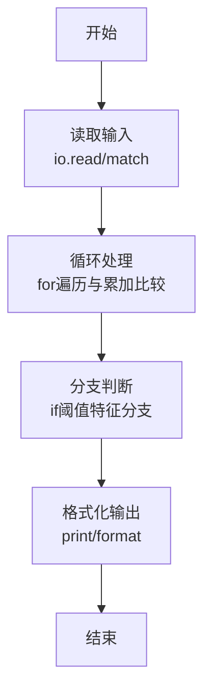
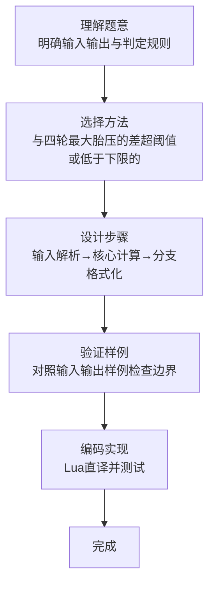

# L1-069 - 胎压监测（15 分）

- **时间限制**: 400 ms
- **内存限制**: 65536 KB
- **代码长度限制**: 16 KB

---

## 题目描述


小轿车中有一个系统随时监测四个车轮的胎压，如果四轮胎压不是很平衡，则可能对行车造成严重的影响。


让我们把四个车轮 —— 左前轮、右前轮、右后轮、左后轮 —— 顺次编号为 1、2、3、4。本题就请你编写一个监测程序，随时监测四轮的胎压，并给出正确的报警信息。报警规则如下：

- 如果所有轮胎的压力值与它们中的最大值误差在一个给定阈值内，并且都不低于系统设定的最低报警胎压，则说明情况正常，不报警；
- 如果存在一个轮胎的压力值与它们中的最大值误差超过了阈值，或者低于系统设定的最低报警胎压，则不仅要报警，而且要给出可能漏气的轮胎的准确位置；
- 如果存在两个或两个以上轮胎的压力值与它们中的最大值误差超过了阈值，或者低于系统设定的最低报警胎压，则报警要求检查所有轮胎。

### 输入格式:

输入在一行中给出 6 个 [0, 400] 范围内的整数，依次为 1~4 号轮胎的胎压、最低报警胎压、以及胎压差的阈值。

### 输出格式:

根据输入的胎压值给出对应信息：

- 如果不用报警，输出 `Normal`；
- 如果有一个轮胎需要报警，输出 `Warning: please check #X!`，其中 `X` 是出问题的轮胎的编号；
- 如果需要检查所有轮胎，输出 `Warning: please check all the tires!`。

### 输入样例 1：
```in
242 251 231 248 230 20
```

### 输出样例 1：
```out
Normal
```

### 输入样例 2：
```in
242 251 232 248 230 10
```

### 输出样例 2：
```out
Warning: please check #3!
```

### 输入样例 3：
```in
240 251 232 248 240 10
```

### 输出样例 3：
```out
Warning: please check all the tires!
```

## 示例

### 示例 1

**输入:**
```
242 251 231 248 230 20
```

**输出:**
```
Normal
```

### 示例 2

**输入:**
```
242 251 232 248 230 10
```

**输出:**
```
Warning: please check #3!
```

### 示例 3

**输入:**
```
240 251 232 248 240 10
```

**输出:**
```
Warning: please check all the tires!
```
### 解题思路

本题属于胎压监测题型，核心在于与四轮最大胎压的差超阈值或低于下限的轮胎视为异常，再按异常数量输出。输入规模较小，可直接按题意模拟，无需复杂数据结构。

算法上采用循环遍历配合条件分支：通过 `for/while` 逐项处理输入，利用 `if` 判断实现题设的分支逻辑（如阈值比较、分类输出或异常检测），与 Lua 代码中 `for`/`if` 的结构一一对应。

复杂度方面，遍历部分为 O(N)，额外空间 O(1)（除输入缓冲外）。边界上注意空输入、格式空格及数值精度的处理，Lua 中通过 `tonumber`/`string.format` 保证转换与保留小数位的正确性。

### 代码流程说明

1. **输入解析**：使用 `io.read("*l")` 配合 `gmatch` 逐 token 解析输入，得到数值或字符串形式的原始数据，必要时做 `tonumber` 类型转换与去空格处理。
2. **核心计算**：与四轮最大胎压的差超阈值或低于下限的轮胎视为异常，再按异常数量输出，在循环体内逐项累加、比较或变换（如代码中的 `for` 循环体），维护中间变量（如求和、计数、查表）。
3. **分支判定**：依据阈值或特征进行 `if-else` 分支，选择不同输出文案或标记异常。
4. **输出**：通过 `print` 按行输出结果，含必要的换行与精度控制，完成题目要求的全部输出。

### 代码实现

```lua
-- 实现原理：与四轮最大胎压的差超阈值或低于下限的轮胎视为异常，再按异常数量输出。
local values = {}
for number in io.read("*l"):gmatch("%d+") do values[#values + 1] = tonumber(number) end
local maximum = math.max(values[1], values[2], values[3], values[4])
local bad = {}
for i = 1, 4 do
    if maximum - values[i] > values[6] or values[i] < values[5] then bad[#bad + 1] = i end
end
if #bad == 0 then
    print("Normal")
elseif #bad == 1 then
    print("Warning: please check #" .. bad[1] .. "!")
else
    print("Warning: please check all the tires!")
end
```

### 代码流程图



### 解题流程图


