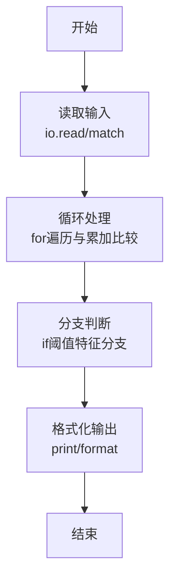
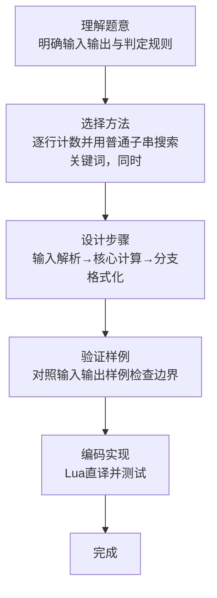

# L1-070 - 吃火锅（15 分）

- **时间限制**: 400 ms
- **内存限制**: 65536 KB
- **代码长度限制**: 16 KB

---

## 题目描述


以上图片来自微信朋友圈：这种天气你有什么破事打电话给我基本没用。但是如果你说“吃火锅”，那就厉害了，我们的故事就开始了。

本题要求你实现一个程序，自动检查你朋友给你发来的信息里有没有 `chi1 huo3 guo1`。

### 输入格式:

输入每行给出一句不超过 80 个字符的、以回车结尾的朋友信息，信息为非空字符串，仅包括字母、数字、空格、可见的半角标点符号。当读到某一行只有一个英文句点 `.` 时，输入结束，此行不算在朋友信息里。

### 输出格式:

首先在一行中输出朋友信息的总条数。然后对朋友的每一行信息，检查其中是否包含 `chi1 huo3 guo1`，并且统计这样厉害的信息有多少条。在第二行中首先输出第一次出现 `chi1 huo3 guo1` 的信息是第几条（从 1 开始计数），然后输出这类信息的总条数，其间以一个空格分隔。题目保证输出的所有数字不超过 100。

如果朋友从头到尾都没提 `chi1 huo3 guo1` 这个关键词，则在第二行输出一个表情 `-_-#`。

### 输入样例 1：
```in
Hello!
are you there?
wantta chi1 huo3 guo1?
that's so li hai le
our story begins from chi1 huo3 guo1 le
.
```

### 输出样例 1：
```out
5
3 2
```

### 输入样例 2：
```in
Hello!
are you there?
wantta qi huo3 guo1 chi1huo3guo1?
that's so li hai le
our story begins from ci1 huo4 guo2 le
.
```

### 输出样例 2：
```out
5
-_-#
```

## 示例

### 示例 1

**输入:**
```
Hello!
are you there?
wantta chi1 huo3 guo1?
that's so li hai le
our story begins from chi1 huo3 guo1 le
.
```

**输出:**
```
5
3 2
```

### 示例 2

**输入:**
```
Hello!
are you there?
wantta qi huo3 guo1 chi1huo3guo1?
that's so li hai le
our story begins from ci1 huo4 guo2 le
.
```

**输出:**
```
5
-_-#
```
### 解题思路

本题属于吃火锅题型，核心在于逐行计数并用普通子串搜索关键词，同时记录首次出现位置与总次数。输入规模较小，可直接按题意模拟，无需复杂数据结构。

算法上采用循环遍历配合条件分支：通过 `for/while` 逐项处理输入，利用 `if` 判断实现题设的分支逻辑（如阈值比较、分类输出或异常检测），与 Lua 代码中 `for`/`if` 的结构一一对应。

复杂度方面，遍历部分为 O(N)，额外空间 O(1)（除输入缓冲外）。边界上注意空输入、格式空格及数值精度的处理，Lua 中通过 `tonumber`/`string.format` 保证转换与保留小数位的正确性。

### 代码流程说明

1. **输入解析**：使用 `io.read` 直接读取输入行，得到数值或字符串形式的原始数据，必要时做 `tonumber` 类型转换与去空格处理。
2. **核心计算**：逐行计数并用普通子串搜索关键词，同时记录首次出现位置与总次数，在循环体内逐项累加、比较或变换（如代码中的 `for` 循环体），维护中间变量（如求和、计数、查表）。
3. **分支判定**：依据阈值或特征进行 `if-else` 分支，选择不同输出文案或标记异常。
4. **输出**：通过 `print` 按行输出结果，含必要的换行与精度控制，完成题目要求的全部输出。

### 代码实现

```lua
-- 实现原理：逐行计数并用普通子串搜索关键词，同时记录首次出现位置与总次数。
local total, first, count = 0, nil, 0
while true do
    local line = io.read("*l")
    if line == "." then break end
    total = total + 1
    if line:find("chi1 huo3 guo1", 1, true) then
        count = count + 1
        if not first then first = total end
    end
end
print(total)
if first then print(first .. " " .. count) else print("-_-#") end
```

### 代码流程图



### 解题流程图


