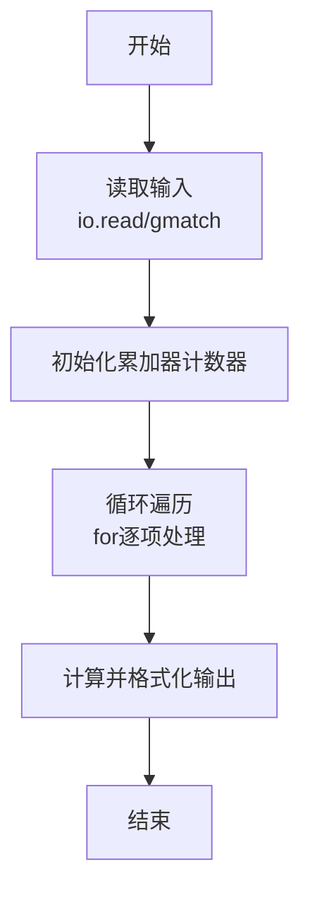
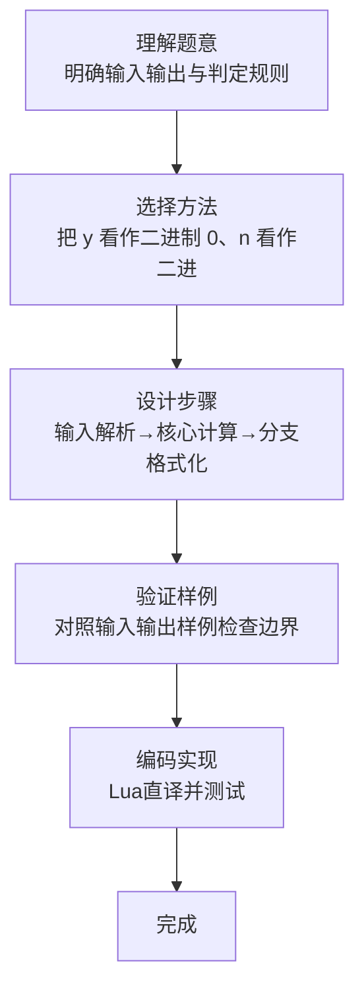

# L1-071 - 前世档案（20 分）

- **时间限制**: 400 ms
- **内存限制**: 65536 KB
- **代码长度限制**: 16 KB

---

## 题目描述


网络世界中时常会遇到这类滑稽的算命小程序，实现原理很简单，随便设计几个问题，根据玩家对每个问题的回答选择一条判断树中的路径（如下图所示），结论就是路径终点对应的那个结点。


现在我们把结论从左到右顺序编号，编号从 1 开始。这里假设回答都是简单的“是”或“否”，又假设回答“是”对应向左的路径，回答“否”对应向右的路径。给定玩家的一系列回答，请你返回其得到的结论的编号。

### 输入格式:

输入第一行给出两个正整数：$N$（$\le 30$）为玩家做一次测试要回答的问题数量；$M$（$\le 100$）为玩家人数。

随后 $M$ 行，每行顺次给出玩家的 $N$ 个回答。这里用 `y` 代表“是”，用 `n` 代表“否”。

### 输出格式:

对每个玩家，在一行中输出其对应的结论的编号。

### 输入样例:
```in
3 4
yny
nyy
nyn
yyn
```

### 输出样例:
```out
3
5
6
2
```

## 示例

### 示例 1

**输入:**
```
3 4
yny
nyy
nyn
yyn
```

**输出:**
```
3
5
6
2
```
### 解题思路

本题属于前世档案题型，核心在于把 y 看作二进制 0、n 看作二进制 1；路径对应的值加 1 即叶子从左到右的编号。输入规模较小，可直接按题意模拟，无需复杂数据结构。

算法上采用线性遍历：对输入序列使用 `for` 循环逐个处理，累加或变换得到中间结果，再一次性计算最终答案，时间复杂度为 O(N)，与代码中的循环部分一致。

复杂度方面，遍历部分为 O(N)，额外空间 O(1)（除输入缓冲外）。边界上注意空输入、格式空格及数值精度的处理，Lua 中通过 `tonumber`/`string.format` 保证转换与保留小数位的正确性。

### 代码流程说明

1. **输入解析**：使用 `io.read("*l")` 配合 `gmatch` 逐 token 解析输入，得到数值或字符串形式的原始数据，必要时做 `tonumber` 类型转换与去空格处理。
2. **核心计算**：把 y 看作二进制 0、n 看作二进制 1；路径对应的值加 1 即叶子从左到右的编号，在循环体内逐项累加、比较或变换（如代码中的 `for` 循环体），维护中间变量（如求和、计数、查表）。
3. **结果整理**：对计算结果进行格式化或拼接（如 `string.format`、`table.concat`），保证输出符合样例。
4. **输出**：通过 `print` 按行输出结果，含必要的换行与精度控制，完成题目要求的全部输出。

### 代码实现

```lua
-- 实现原理：把 y 看作二进制 0、n 看作二进制 1；路径对应的值加 1 即叶子从左到右的编号。
local _, m = io.read("*l"):match("(%d+)%s+(%d+)")
for _ = 1, tonumber(m) do
    local value = 0
    for ch in io.read("*l"):gmatch(".") do value = value * 2 + (ch == "n" and 1 or 0) end
    print(value + 1)
end
```

### 代码流程图



### 解题流程图


