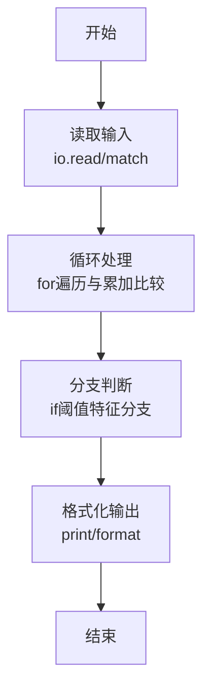
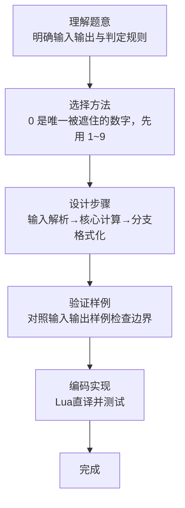

# L1-072 - 刮刮彩票（20 分）

- **时间限制**: 400 ms
- **内存限制**: 65536 KB
- **代码长度限制**: 16 KB

---

## 题目描述


“刮刮彩票”是一款网络游戏里面的一个小游戏。如图所示：


每次游戏玩家会拿到一张彩票，上面会有 9 个数字，分别为数字 1 到数字 9，数字各不重复，并以 $$3\times3$$ 的“九宫格”形式排布在彩票上。

在游戏开始时能看见一个位置上的数字，其他位置上的数字均不可见。你可以选择三个位置的数字刮开，这样玩家就能看见四个位置上的数字了。最后玩家再从 3 横、3 竖、2 斜共 8 个方向中挑选一个方向，方向上三个数字的和可根据下列表格进行兑奖，获得对应数额的金币。


| 数字合计 | 获得金币 | 数字合计 | 获得金币 |
| -------- | -------- | -------- | -------- |
| 6     | 10,000     | 16     | 72     |
| 7     | 36     | 17     | 180     |
| 8     | 720     | 18     | 119     |
| 9     | 360     | 19     | 36     |
| 10     | 80     | 20     | 306     |
| 11    | 252     | 21     | 1,080     |
| 12    | 108     | 22    | 144     |
| 13    | 72     | 23    | 1,800     |
| 14    | 54     | 24    | 3,600     |
| 15    | 180     |      ||      |


现在请你写出一个模拟程序，模拟玩家的游戏过程。

### 输入格式:

输入第一部分给出一张合法的彩票，即用 3 行 3 列给出 0 至 9 的数字。**0 表示的是这个位置上的数字初始时就能看见了**，而不是彩票上的数字为 0。

第二部给出玩家刮开的三个位置，分为三行，每行按格式 `x y` 给出玩家刮开的位置的行号和列号（题目中定义左上角的位置为第 1 行、第 1 列。）。数据保证玩家不会重复刮开已刮开的数字。

最后一部分给出玩家选择的方向，即一个整数： 1 至 3 表示选择横向的第一行、第二行、第三行，4 至 6 表示纵向的第一列、第二列、第三列，7、8分别表示左上到右下的主对角线和右上到左下的副对角线。

### 输出格式:

对于每一个刮开的操作，在一行中输出玩家能看到的数字。最后对于选择的方向，在一行中输出玩家获得的金币数量。

### 输入样例:
```in
1 2 3
4 5 6
7 8 0
1 1
2 2
2 3
7
```

### 输出样例:
```out
1
5
6
180
```

## 示例

### 示例 1

**输入:**
```
1 2 3
4 5 6
7 8 0
1 1
2 2
2 3
7
```

**输出:**
```
1
5
6
180
```
### 解题思路

本题属于刮刮彩票题型，核心在于0 是唯一被遮住的数字，先用 1~9 中缺失的数补全，再按所选方向求和查奖金表。输入规模较小，可直接按题意模拟，无需复杂数据结构。

算法上采用循环遍历配合条件分支：通过 `for/while` 逐项处理输入，利用 `if` 判断实现题设的分支逻辑（如阈值比较、分类输出或异常检测），与 Lua 代码中 `for`/`if` 的结构一一对应。

复杂度方面，遍历部分为 O(N)，额外空间 O(1)（除输入缓冲外）。边界上注意空输入、格式空格及数值精度的处理，Lua 中通过 `tonumber`/`string.format` 保证转换与保留小数位的正确性。

### 代码流程说明

1. **输入解析**：使用 `io.read("*l")` 配合 `gmatch` 逐 token 解析输入，得到数值或字符串形式的原始数据，必要时做 `tonumber` 类型转换与去空格处理。
2. **核心计算**：0 是唯一被遮住的数字，先用 1~9 中缺失的数补全，再按所选方向求和查奖金表，在循环体内逐项累加、比较或变换（如代码中的 `for` 循环体），维护中间变量（如求和、计数、查表）。
3. **分支判定**：依据阈值或特征进行 `if-else` 分支，选择不同输出文案或标记异常。
4. **输出**：通过 `print` 按行输出结果，含必要的换行与精度控制，完成题目要求的全部输出。

### 代码实现

```lua
-- 实现原理：0 是唯一被遮住的数字，先用 1~9 中缺失的数补全，再按所选方向求和查奖金表。
local grid, used = {}, {}
for i = 1, 3 do
    grid[i] = {}
    for token in io.read("*l"):gmatch("%d+") do
        local value = tonumber(token)
        grid[i][#grid[i] + 1] = value
        if value ~= 0 then used[value] = true end
    end
end
local missing
for value = 1, 9 do if not used[value] then missing = value end end
for i = 1, 3 do for j = 1, 3 do if grid[i][j] == 0 then grid[i][j] = missing end end end
for _ = 1, 3 do
    local x, y = io.read("*l"):match("(%d+)%s+(%d+)")
    print(grid[tonumber(x)][tonumber(y)])
end
local direction = tonumber(io.read("*l"))
local lines = {
    {grid[1][1], grid[1][2], grid[1][3]}, {grid[2][1], grid[2][2], grid[2][3]}, {grid[3][1], grid[3][2], grid[3][3]},
    {grid[1][1], grid[2][1], grid[3][1]}, {grid[1][2], grid[2][2], grid[3][2]}, {grid[1][3], grid[2][3], grid[3][3]},
    {grid[1][1], grid[2][2], grid[3][3]}, {grid[1][3], grid[2][2], grid[3][1]}
}
local sum = lines[direction][1] + lines[direction][2] + lines[direction][3]
local prize = {[6]=10000,[7]=36,[8]=720,[9]=360,[10]=80,[11]=252,[12]=108,[13]=72,[14]=54,[15]=180,[16]=72,[17]=180,[18]=119,[19]=36,[20]=306,[21]=1080,[22]=144,[23]=1800,[24]=3600}
print(prize[sum])
```

### 代码流程图



### 解题流程图


