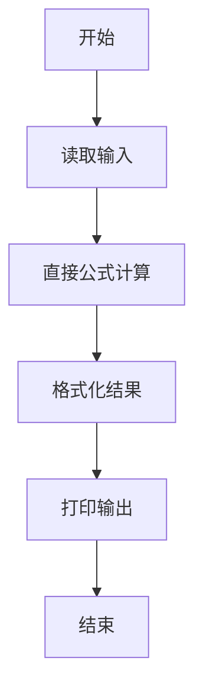
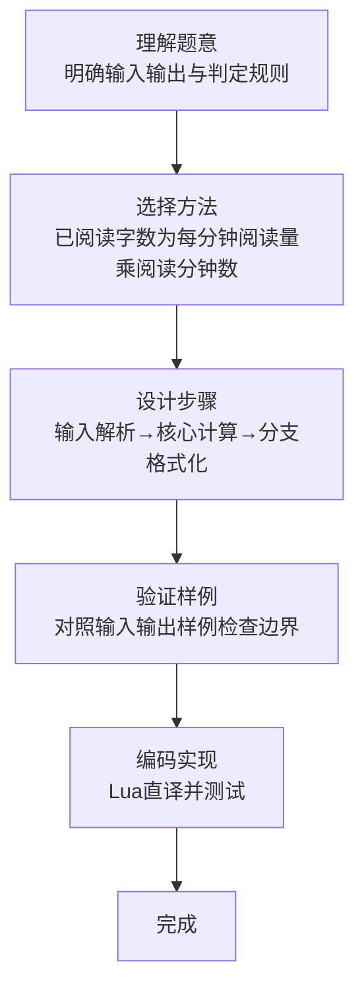

# L1-074 - 两小时学完C语言（5 分）

- **时间限制**: 400 ms
- **内存限制**: 65536 KB
- **代码长度限制**: 16 KB

---

## 题目描述


知乎上有个宝宝问：“两个小时内如何学完 C 语言？”当然，问的是“学完”并不是“学会”。

假设一本 C 语言教科书有 N 个字，这个宝宝每分钟能看 K 个字，看了 M 分钟。还剩多少字没有看？

### 输入格式:

输入在一行中给出 3 个正整数，分别是 N（不超过 400 000），教科书的总字数；K（不超过 3 000），是宝宝每分钟能看的字数；M（不超过 120），是宝宝看书的分钟数。

题目保证宝宝看完的字数不超过 N。

### 输出格式:

在一行中输出宝宝还没有看的字数。

### 输入样例:
```in
100000 1000 72
```

### 输出样例:
```out
28000
```

## 示例

### 示例 1

**输入:**
```
100000 1000 72
```

**输出:**
```
28000
```
### 解题思路

本题属于两小时学完C题型，核心在于已阅读字数为每分钟阅读量乘阅读分钟数，用总字数减去即可。输入规模较小，可直接按题意模拟，无需复杂数据结构。

算法直接按公式或规则计算：读取输入后通过算术或字符串运算一次性得到结果，无需循环，体现为代码中的直算与格式化输出。

边界与精度方面，需处理输入首尾空格、空行及数值类型转换；输出按题面要求的格式（如保留小数、固定文案）使用 `string.format`/`print` 精确控制，确保样例一致。

### 代码流程说明

1. **输入解析**：使用 `io.read("*l"):match` 按模式提取字段并经 `tonumber` 转换，得到数值或字符串形式的原始数据，必要时做 `tonumber` 类型转换与去空格处理。
2. **核心计算**：已阅读字数为每分钟阅读量乘阅读分钟数，用总字数减去即可，通过一次算术或逻辑表达式直接求得结果。
3. **结果整理**：对计算结果进行格式化或拼接（如 `string.format`、`table.concat`），保证输出符合样例。
4. **输出**：通过 `print` 按行输出结果，含必要的换行与精度控制，完成题目要求的全部输出。

### 代码实现

```lua
-- 实现原理：已阅读字数为每分钟阅读量乘阅读分钟数，用总字数减去即可。
local n, k, m = io.read("*l"):match("(%d+)%s+(%d+)%s+(%d+)")
print(tonumber(n) - tonumber(k) * tonumber(m))
```

### 代码流程图



### 解题流程图


