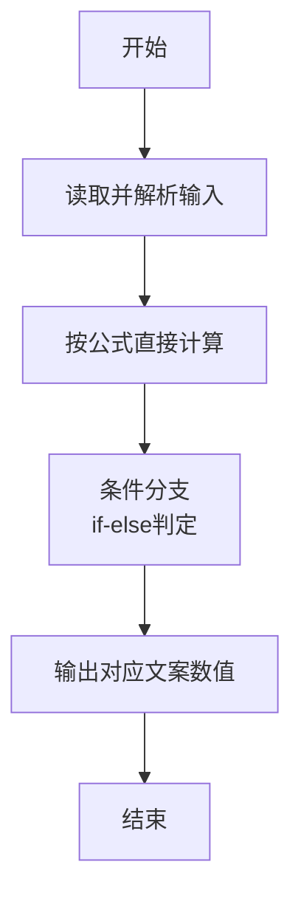
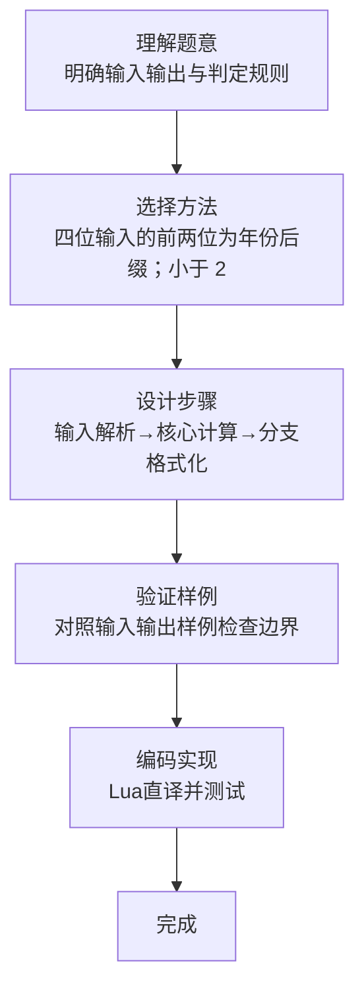

# L1-075 - 强迫症（10 分）

- **时间限制**: 400 ms
- **内存限制**: 65536 KB
- **代码长度限制**: 16 KB

---

## 题目描述


小强在统计一个小区里居民的出生年月，但是发现大家填写的生日格式不统一，例如有的人写 `199808`，有的人只写 `9808`。有强迫症的小强请你写个程序，把所有人的出生年月都整理成 `年年年年-月月` 格式。对于那些只写了年份后两位的信息，我们默认小于 `22` 都是 `20` 开头的，其他都是 `19` 开头的。

### 输入格式:

输入在一行中给出一个出生年月，为一个 6 位或者 4 位数，题目保证是 1000 年 1 月到 2021 年 12 月之间的合法年月。

### 输出格式:

在一行中按标准格式 `年年年年-月月` 将输入的信息整理输出。

### 输入样例 1：
```in
9808
```

### 输出样例 1：
```out
1998-08
```

### 输入样例 2：
```in
0510
```

### 输出样例 2：
```out
2005-10
```

### 输入样例 3：
```in
196711
```

### 输出样例 3：
```out
1967-11
```

## 示例

### 示例 1

**输入:**
```
9808
```

**输出:**
```
1998-08
```

### 示例 2

**输入:**
```
0510
```

**输出:**
```
2005-10
```

### 示例 3

**输入:**
```
196711
```

**输出:**
```
1967-11
```
### 解题思路

本题属于强迫症题型，核心在于四位输入的前两位为年份后缀；小于 22 归入 2000 年代，否则归入 1900 年代。输入规模较小，可直接按题意模拟，无需复杂数据结构。

算法核心是条件判断：根据输入数值或字符串特征通过 `if-else` 分支选择不同输出路径，直接映射题目给出的判定规则，代码中即体现为多分支的 `if` 结构。

边界与精度方面，需处理输入首尾空格、空行及数值类型转换；输出按题面要求的格式（如保留小数、固定文案）使用 `string.format`/`print` 精确控制，确保样例一致。

### 代码流程说明

1. **输入解析**：使用 `io.read` 直接读取输入行，得到数值或字符串形式的原始数据，必要时做 `tonumber` 类型转换与去空格处理。
2. **核心计算**：四位输入的前两位为年份后缀；小于 22 归入 2000 年代，否则归入 1900 年代，通过一次算术或逻辑表达式直接求得结果。
3. **分支判定**：依据阈值或特征进行 `if-else` 分支，选择不同输出文案或标记异常。
4. **输出**：通过 `print` 按行输出结果，含必要的换行与精度控制，完成题目要求的全部输出。

### 代码实现

```lua
-- 实现原理：四位输入的前两位为年份后缀；小于 22 归入 2000 年代，否则归入 1900 年代。
local text = io.read("*l")
if #text == 6 then
    print(text:sub(1, 4) .. "-" .. text:sub(5, 6))
else
    local yy = tonumber(text:sub(1, 2))
    print((yy < 22 and "20" or "19") .. text:sub(1, 2) .. "-" .. text:sub(3, 4))
end
```

### 代码流程图



### 解题流程图


