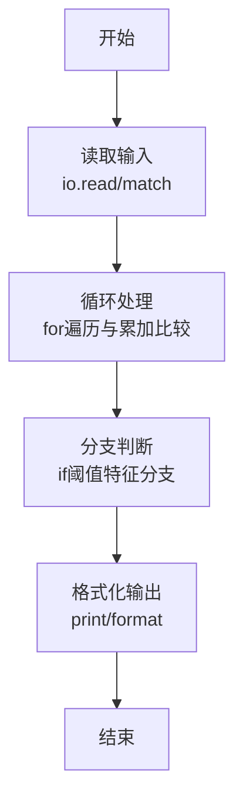
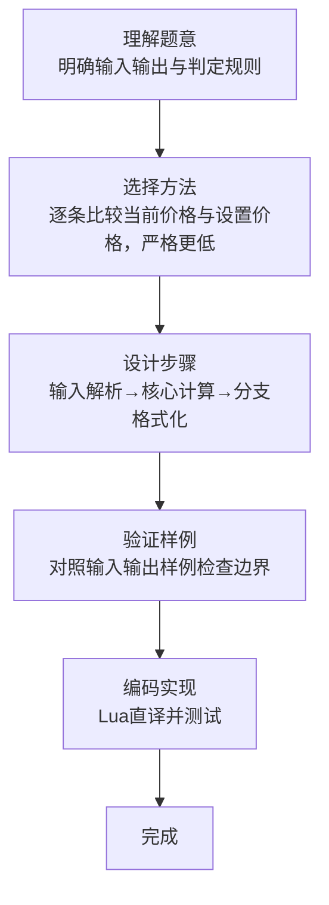

# L1-076 - 降价提醒机器人（10 分）

- **时间限制**: 400 ms
- **内存限制**: 65536 KB
- **代码长度限制**: 16 KB

---

## 题目描述


小 T 想买一个玩具很久了，但价格有些高，他打算等便宜些再买。但天天盯着购物网站很麻烦，请你帮小 T 写一个降价提醒机器人，当玩具的当前价格比他设定的价格便宜时发出提醒。

### 输入格式:

输入第一行是两个正整数 $N$ 和 $M$ ($1 \le N \le 100, 0 \le M \le 1000$)，表示有 $N$ 条价格记录，小 T 设置的价格为 $M$。

接下来 $N$ 行，每行有一个实数 $P_i$（$-1000.0 < P_i < 1000.0$），表示一条价格记录。

### 输出格式:

对每一条比设定价格 $M$ 便宜的价格记录 `P`，在一行中输出 `On Sale! P`，其中 `P` 输出到小数点后 1 位。

### 输入样例:
```in
4 99
98.0
97.0
100.2
98.9
```

### 输出样例:
```out
On Sale! 98.0
On Sale! 97.0
On Sale! 98.9
```

## 示例

### 示例 1

**输入:**
```
4 99
98.0
97.0
100.2
98.9
```

**输出:**
```
On Sale! 98.0
On Sale! 97.0
On Sale! 98.9
```
### 解题思路

本题属于降价提醒机器题型，核心在于逐条比较当前价格与设置价格，严格更低才提示。输入规模较小，可直接按题意模拟，无需复杂数据结构。

算法上采用循环遍历配合条件分支：通过 `for/while` 逐项处理输入，利用 `if` 判断实现题设的分支逻辑（如阈值比较、分类输出或异常检测），与 Lua 代码中 `for`/`if` 的结构一一对应。

复杂度方面，遍历部分为 O(N)，额外空间 O(1)（除输入缓冲外）。边界上注意空输入、格式空格及数值精度的处理，Lua 中通过 `tonumber`/`string.format` 保证转换与保留小数位的正确性。

### 代码流程说明

1. **输入解析**：使用 `io.read("*l"):match` 按模式提取字段并经 `tonumber` 转换，得到数值或字符串形式的原始数据，必要时做 `tonumber` 类型转换与去空格处理。
2. **核心计算**：逐条比较当前价格与设置价格，严格更低才提示，在循环体内逐项累加、比较或变换（如代码中的 `for` 循环体），维护中间变量（如求和、计数、查表）。
3. **分支判定**：依据阈值或特征进行 `if-else` 分支，选择不同输出文案或标记异常。
4. **输出**：通过 `print` 按行输出结果，含必要的换行与精度控制，完成题目要求的全部输出。

### 代码实现

```lua
-- 实现原理：逐条比较当前价格与设置价格，严格更低才提示。
local n, limit = io.read("*l"):match("(%d+)%s+(%d+)")
for _ = 1, tonumber(n) do
    local price = tonumber(io.read("*l"))
    if price < tonumber(limit) then print(string.format("On Sale! %.1f", price)) end
end
```

### 代码流程图



### 解题流程图


