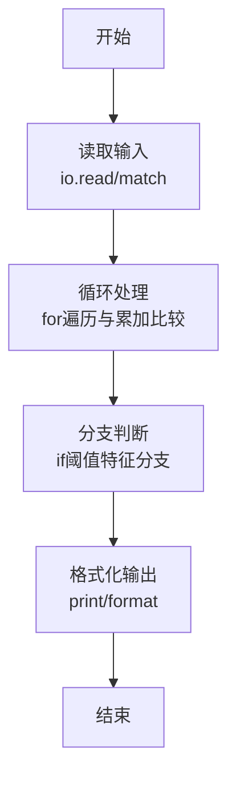
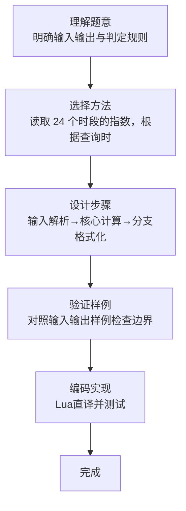

# L1-077 - 大笨钟的心情（15 分）

- **时间限制**: 400 ms
- **内存限制**: 65536 KB
- **代码长度限制**: 16 KB

---

## 题目描述


有网友问：未来还会有更多大笨钟题吗？笨钟回复说：看心情……

本题就请你替大笨钟写一个程序，根据心情自动输出回答。

### 输入格式:

输入在一行中给出 24 个 [0, 100] 区间内的整数，依次代表大笨钟在一天 24 小时中，每个小时的心情指数。

随后若干行，每行给出一个 [0, 23] 之间的整数，代表网友询问笨钟这个问题的时间点。当出现非法的时间点时，表示输入结束，这个非法输入不要处理。题目保证至少有 1 次询问。

### 输出格式:

对每一次提问，如果当时笨钟的心情指数大于 50，就在一行中输出 `心情指数 Yes`，否则输出 `心情指数 No`。

### 输入样例:
```in
80 75 60 50 20 20 20 20 55 62 66 51 42 33 47 58 67 52 41 20 35 49 50 63
17
7
3
15
-1
```

### 输出样例:
```out
52 Yes
20 No
50 No
58 Yes
```

## 示例

### 示例 1

**输入:**
```
80 75 60 50 20 20 20 20 55 62 66 51 42 33 47 58 67 52 41 20 35 49 50 63
17
7
3
15
-1
```

**输出:**
```
52 Yes
20 No
50 No
58 Yes
```
### 解题思路

本题属于大笨钟的心情题型，核心在于读取 24 个时段的指数，根据查询时刻取值并判断是否大于 50。输入规模较小，可直接按题意模拟，无需复杂数据结构。

算法上采用循环遍历配合条件分支：通过 `for/while` 逐项处理输入，利用 `if` 判断实现题设的分支逻辑（如阈值比较、分类输出或异常检测），与 Lua 代码中 `for`/`if` 的结构一一对应。

复杂度方面，遍历部分为 O(N)，额外空间 O(1)（除输入缓冲外）。边界上注意空输入、格式空格及数值精度的处理，Lua 中通过 `tonumber`/`string.format` 保证转换与保留小数位的正确性。

### 代码流程说明

1. **输入解析**：使用 `io.read("*l")` 配合 `gmatch` 逐 token 解析输入，得到数值或字符串形式的原始数据，必要时做 `tonumber` 类型转换与去空格处理。
2. **核心计算**：读取 24 个时段的指数，根据查询时刻取值并判断是否大于 50，在循环体内逐项累加、比较或变换（如代码中的 `for` 循环体），维护中间变量（如求和、计数、查表）。
3. **分支判定**：依据阈值或特征进行 `if-else` 分支，选择不同输出文案或标记异常。
4. **输出**：通过 `print` 按行输出结果，含必要的换行与精度控制，完成题目要求的全部输出。

### 代码实现

```lua
-- 实现原理：读取 24 个时段的指数，根据查询时刻取值并判断是否大于 50。
local mood = {}
for value in io.read("*l"):gmatch("%d+") do mood[#mood + 1] = tonumber(value) end
while true do
    local hour = tonumber(io.read("*l"))
    if hour < 0 or hour > 23 then break end
    print(mood[hour + 1] .. (mood[hour + 1] > 50 and " Yes" or " No"))
end
```

### 代码流程图



### 解题流程图


