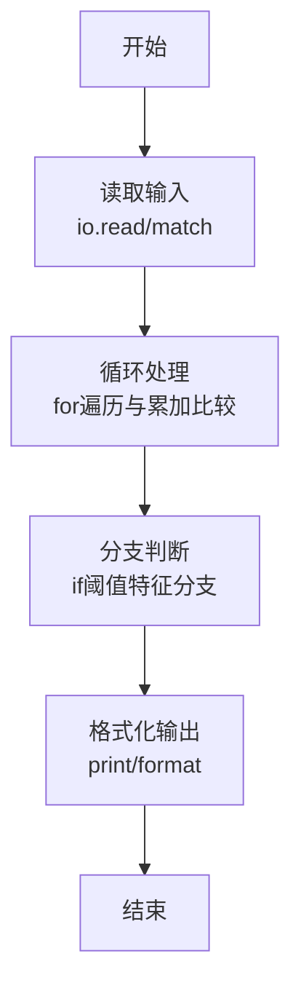
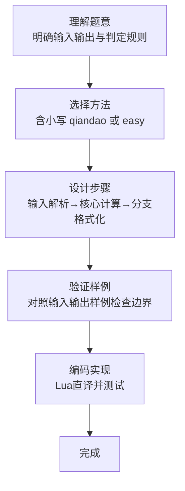

# L1-078 - 吉老师的回归（15 分）

- **时间限制**: 400 ms
- **内存限制**: 65536 KB
- **代码长度限制**: 16 KB

---

## 题目描述


曾经在天梯赛大杀四方的吉老师决定回归天梯赛赛场啦！

为了简化题目，我们不妨假设天梯赛的每道题目可以用一个不超过 500 的、只包括可打印符号的字符串描述出来，如：`Problem A: Print "Hello world!"`。

众所周知，吉老师的竞赛水平非常高超，你可以认为他每道题目都会做（事实上也是……）。因此，吉老师会按照顺序看题并做题。但吉老师水平太高了，所以签到题他就懒得做了（浪费时间），具体来说，假如题目的字符串里有 `qiandao` 或者 `easy`（区分大小写）的话，吉老师看完题目就会跳过这道题目不做。

现在给定这次天梯赛总共有几道题目以及吉老师已经做完了几道题目，请你告诉大家吉老师现在正在做哪个题，或者吉老师已经把所有他打算做的题目做完了。

*提醒：天梯赛有分数升级的规则，如果不做签到题可能导致团队总分不足以升级，一般的选手请千万不要学习吉老师的酷炫行为！*

### 输入格式:

输入第一行是两个正整数 $N, M$ ($1 \le M\le N \le 30$)，表示本次天梯赛有 $N$ 道题目，吉老师现在做完了 $M$ 道。

接下来 $N$ 行，每行是一个符合题目描述的字符串，表示天梯赛的题目内容。吉老师会按照给出的顺序看题——第一行就是吉老师看的第一道题，第二行就是第二道，以此类推。

### 输出格式:

在一行中输出吉老师当前正在做的题目对应的题面（即做完了 $M$ 道题目后，吉老师正在做哪个题）。如果吉老师已经把所有他打算做的题目做完了，输出一行 `Wo AK le`。

### 输入样例 1：
```in
5 1
L1-1 is a qiandao problem.
L1-2 is so...easy.
L1-3 is Easy.
L1-4 is qianDao.
Wow, such L1-5, so easy.
```

### 输出样例 1：
```out
L1-4 is qianDao.
```

### 输入样例 2：
```in
5 4
L1-1 is a-qiandao problem.
L1-2 is so easy.
L1-3 is Easy.
L1-4 is qianDao.
Wow, such L1-5, so!!easy.
```

### 输出样例 2：
```out
Wo AK le
```

## 示例

### 示例 1

**输入:**
```
5 1
L1-1 is a qiandao problem.
L1-2 is so...easy.
L1-3 is Easy.
L1-4 is qianDao.
Wow, such L1-5, so easy.
```

**输出:**
```
L1-4 is qianDao.
```

### 示例 2

**输入:**
```
5 4
L1-1 is a-qiandao problem.
L1-2 is so easy.
L1-3 is Easy.
L1-4 is qianDao.
Wow, such L1-5, so!!easy.
```

**输出:**
```
Wo AK le
```
### 解题思路

本题属于吉老师的回归题型，核心在于含小写 qiandao 或 easy 的题跳过，其余题依次计数，取完成 M 题后的下一题。输入规模较小，可直接按题意模拟，无需复杂数据结构。

算法上采用循环遍历配合条件分支：通过 `for/while` 逐项处理输入，利用 `if` 判断实现题设的分支逻辑（如阈值比较、分类输出或异常检测），与 Lua 代码中 `for`/`if` 的结构一一对应。

复杂度方面，遍历部分为 O(N)，额外空间 O(1)（除输入缓冲外）。边界上注意空输入、格式空格及数值精度的处理，Lua 中通过 `tonumber`/`string.format` 保证转换与保留小数位的正确性。

### 代码流程说明

1. **输入解析**：使用 `io.read("*l"):match` 按模式提取字段并经 `tonumber` 转换，得到数值或字符串形式的原始数据，必要时做 `tonumber` 类型转换与去空格处理。
2. **核心计算**：含小写 qiandao 或 easy 的题跳过，其余题依次计数，取完成 M 题后的下一题，在循环体内逐项累加、比较或变换（如代码中的 `for` 循环体），维护中间变量（如求和、计数、查表）。
3. **分支判定**：依据阈值或特征进行 `if-else` 分支，选择不同输出文案或标记异常。
4. **输出**：通过 `print` 按行输出结果，含必要的换行与精度控制，完成题目要求的全部输出。

### 代码实现

```lua
-- 实现原理：含小写 qiandao 或 easy 的题跳过，其余题依次计数，取完成 M 题后的下一题。
local n, m = io.read("*l"):match("(%d+)%s+(%d+)")
n, m = tonumber(n), tonumber(m)
local solved, answer = 0, nil
for _ = 1, n do
    local problem = io.read("*l")
    if not problem:find("qiandao", 1, true) and not problem:find("easy", 1, true) then
        if solved == m and not answer then answer = problem end
        solved = solved + 1
    end
end
print(answer or "Wo AK le")
```

### 代码流程图



### 解题流程图


