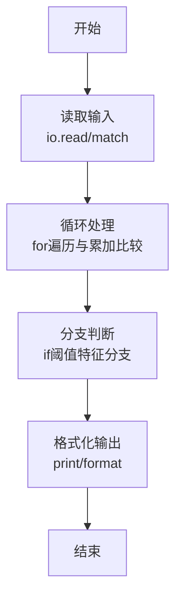
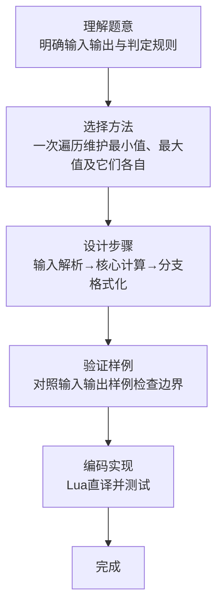

# L1-079 - 天梯赛的善良（20 分）

- **时间限制**: 200 ms
- **内存限制**: 65536 KB
- **代码长度限制**: 16 KB

---

## 题目描述


天梯赛是个善良的比赛。善良的命题组希望将题目难度控制在一个范围内，使得每个参赛的学生都有能做出来的题目，并且最厉害的学生也要非常努力才有可能得到高分。

于是命题组首先将编程能力划分成了 $10^6$ 个等级（太疯狂了，这是假的），然后调查了每个参赛学生的编程能力。现在请你写个程序找出所有参赛学生的最小和最大能力值，给命题组作为出题的参考。

### 输入格式:

输入在第一行中给出一个正整数 $N$（$\le 2\times 10^4$），即参赛学生的总数。随后一行给出 $N$ 个不超过 $10^6$ 的正整数，是参赛学生的能力值。

### 输出格式:

第一行输出所有参赛学生的最小能力值，以及具有这个能力值的学生人数。第二行输出所有参赛学生的最大能力值，以及具有这个能力值的学生人数。同行数字间以 1 个空格分隔，行首尾不得有多余空格。

### 输入样例:
```in
10
86 75 233 888 666 75 886 888 75 666
```

### 输出样例:
```out
75 3
888 2
```

## 示例

### 示例 1

**输入:**
```
10
86 75 233 888 666 75 886 888 75 666
```

**输出:**
```
75 3
888 2
```
### 解题思路

本题属于天梯赛的善良题型，核心在于一次遍历维护最小值、最大值及它们各自的出现次数。输入规模较小，可直接按题意模拟，无需复杂数据结构。

算法上采用循环遍历配合条件分支：通过 `for/while` 逐项处理输入，利用 `if` 判断实现题设的分支逻辑（如阈值比较、分类输出或异常检测），与 Lua 代码中 `for`/`if` 的结构一一对应。

复杂度方面，遍历部分为 O(N)，额外空间 O(1)（除输入缓冲外）。边界上注意空输入、格式空格及数值精度的处理，Lua 中通过 `tonumber`/`string.format` 保证转换与保留小数位的正确性。

### 代码流程说明

1. **输入解析**：使用 `io.read("*l")` 配合 `gmatch` 逐 token 解析输入，得到数值或字符串形式的原始数据，必要时做 `tonumber` 类型转换与去空格处理。
2. **核心计算**：一次遍历维护最小值、最大值及它们各自的出现次数，在循环体内逐项累加、比较或变换（如代码中的 `for` 循环体），维护中间变量（如求和、计数、查表）。
3. **分支判定**：依据阈值或特征进行 `if-else` 分支，选择不同输出文案或标记异常。
4. **输出**：通过 `print` 按行输出结果，含必要的换行与精度控制，完成题目要求的全部输出。

### 代码实现

```lua
-- 实现原理：一次遍历维护最小值、最大值及它们各自的出现次数。
local _ = io.read("*l")
local minimum, maximum, min_count, max_count = math.huge, -math.huge, 0, 0
for token in io.read("*l"):gmatch("%d+") do
    local value = tonumber(token)
    if value < minimum then minimum, min_count = value, 1 elseif value == minimum then min_count = min_count + 1 end
    if value > maximum then maximum, max_count = value, 1 elseif value == maximum then max_count = max_count + 1 end
end
print(minimum .. " " .. min_count)
print(maximum .. " " .. max_count)
```

### 代码流程图



### 解题流程图


