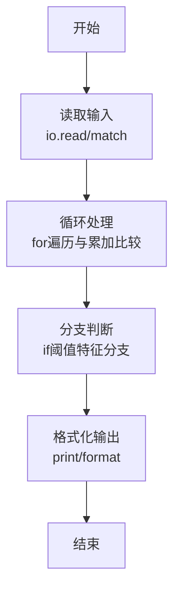
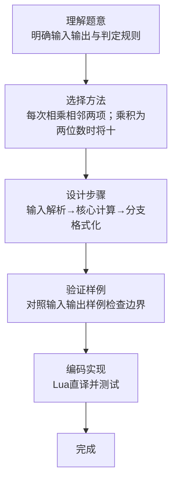

# L1-080 - 乘法口诀数列（20 分）

- **时间限制**: 400 ms
- **内存限制**: 65536 KB
- **代码长度限制**: 16 KB

---

## 题目描述


本题要求你从任意给定的两个 1 位数字 $a_1$ 和 $a_2$ 开始，用乘法口诀生成一个数列 {$a_n$}，规则为从 $a_1$ 开始顺次进行，每次将当前数字与后面一个数字相乘，将结果贴在数列末尾。如果结果不是 1 位数，则其每一位都应成为数列的一项。

### 输入格式:

输入在一行中给出 3 个整数，依次为 $a_1$、$a_2$ 和 $n$，满足 $0\le a_1,a_2\le 9$，$0<n\le 10^3$。

### 输出格式:

在一行中输出数列的前 $n$ 项。数字间以 1 个空格分隔，行首尾不得有多余空格。

### 输入样例:
```in
2 3 10
```

### 输出样例:
```out
2 3 6 1 8 6 8 4 8 4
```

## 示例

### 示例 1

**输入:**
```
2 3 10
```

**输出:**
```
2 3 6 1 8 6 8 4 8 4
```
### 解题思路

本题属于乘法口诀数列题型，核心在于每次相乘相邻两项；乘积为两位数时将十位、个位分别追加，直到得到 n 项。输入规模较小，可直接按题意模拟，无需复杂数据结构。

算法上采用循环遍历配合条件分支：通过 `for/while` 逐项处理输入，利用 `if` 判断实现题设的分支逻辑（如阈值比较、分类输出或异常检测），与 Lua 代码中 `for`/`if` 的结构一一对应。

复杂度方面，遍历部分为 O(N)，额外空间 O(1)（除输入缓冲外）。边界上注意空输入、格式空格及数值精度的处理，Lua 中通过 `tonumber`/`string.format` 保证转换与保留小数位的正确性。

### 代码流程说明

1. **输入解析**：使用 `io.read("*l"):match` 按模式提取字段并经 `tonumber` 转换，得到数值或字符串形式的原始数据，必要时做 `tonumber` 类型转换与去空格处理。
2. **核心计算**：每次相乘相邻两项；乘积为两位数时将十位、个位分别追加，直到得到 n 项，在循环体内逐项累加、比较或变换（如代码中的 `for` 循环体），维护中间变量（如求和、计数、查表）。
3. **分支判定**：依据阈值或特征进行 `if-else` 分支，选择不同输出文案或标记异常。
4. **输出**：通过 `print` 按行输出结果，含必要的换行与精度控制，完成题目要求的全部输出。

### 代码实现

```lua
-- 实现原理：每次相乘相邻两项；乘积为两位数时将十位、个位分别追加，直到得到 n 项。
local a, b, n = io.read("*l"):match("(%d+)%s+(%d+)%s+(%d+)")
local sequence = {tonumber(a), tonumber(b)}
n = tonumber(n)
local index = 1
while #sequence < n do
    local product = sequence[index] * sequence[index + 1]
    if product >= 10 then sequence[#sequence + 1] = product // 10 end
    if #sequence < n then sequence[#sequence + 1] = product % 10 end
    index = index + 1
end
local output = {}
for i = 1, n do output[i] = sequence[i] end
print(table.concat(output, " "))
```

### 代码流程图



### 解题流程图


