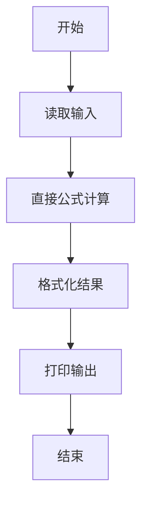
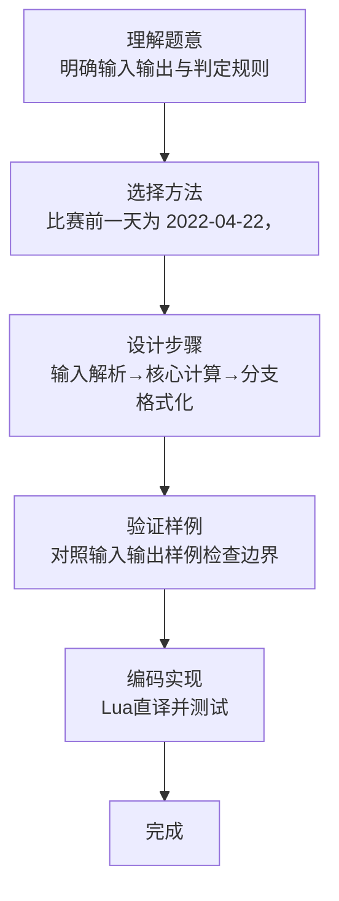

# L1-081 - 今天我要赢（5 分）

- **时间限制**: 400 ms
- **内存限制**: 65536 KB
- **代码长度限制**: 16 KB

---

## 题目描述


2018 年我们曾经出过一题，是输出“2018 我们要赢”。今年是 2022 年，你要输出的句子变成了“我要赢！就在今天！”然后以比赛当天的日期落款。

### 输入格式:

本题没有输入。

### 输出格式:

输出分 2 行。在第一行中输出 `I'm gonna win! Today!`，在第二行中用 `年年年年-月月-日日` 的格式输出比赛当天的日期。已知比赛的前一天是 `2022-04-22`。

### 输入样例:
```in
无
```

### 输出样例:
```out
I'm gonna win! Today!
这一行的内容我不告诉你…… 你要自己输出正确的日期呀~
```

## 示例

### 示例 1

**输入:**
```
无
```

**输出:**
```
I'm gonna win! Today!
这一行的内容我不告诉你…… 你要自己输出正确的日期呀~
```
### 解题思路

本题属于今天我要赢题型，核心在于比赛前一天为 2022-04-22，因此比赛日为次日 2022-04-23。输入规模较小，可直接按题意模拟，无需复杂数据结构。

算法直接按公式或规则计算：读取输入后通过算术或字符串运算一次性得到结果，无需循环，体现为代码中的直算与格式化输出。

边界与精度方面，需处理输入首尾空格、空行及数值类型转换；输出按题面要求的格式（如保留小数、固定文案）使用 `string.format`/`print` 精确控制，确保样例一致。

### 代码流程说明

1. **输入解析**：按题设无输入或固定输入，直接进入处理，得到数值或字符串形式的原始数据，必要时做 `tonumber` 类型转换与去空格处理。
2. **核心计算**：比赛前一天为 2022-04-22，因此比赛日为次日 2022-04-23，通过一次算术或逻辑表达式直接求得结果。
3. **结果整理**：对计算结果进行格式化或拼接（如 `string.format`、`table.concat`），保证输出符合样例。
4. **输出**：通过 `print` 按行输出结果，含必要的换行与精度控制，完成题目要求的全部输出。

### 代码实现

```lua
-- 实现原理：比赛前一天为 2022-04-22，因此比赛日为次日 2022-04-23。
print("I'm gonna win! Today!")
print("2022-04-23")
```

### 代码流程图



### 解题流程图


