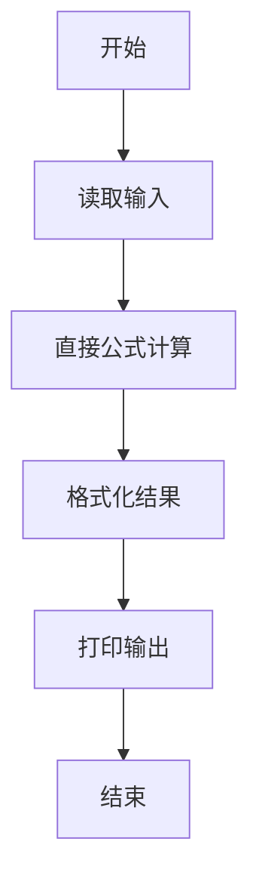
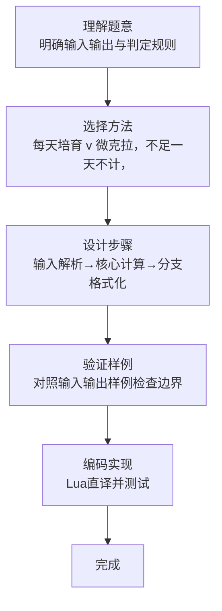

# L1-082 - 种钻石（5 分）

- **时间限制**: 400 ms
- **内存限制**: 65536 KB
- **代码长度限制**: 16 KB

---

## 题目描述


2019年10月29日，中央电视台专题报道，中国科学院在培育钻石领域，取得科技突破。科学家们用金刚石的籽晶片作为种子，利用甲烷气体在能量作用下形成碳的等离子体，慢慢地沉积到钻石种子上，一周“种”出了一颗 1 克拉大小的钻石。

本题给出钻石的需求量和人工培育钻石的速度，请你计算出货需要的时间。

### 输入格式:

输入在一行中给出钻石的需求量 $N$（不超过 $10^7$ 的正整数，以`微克拉`为单位）和人工培育钻石的速度 $v$（$1\le v \le 200$，以`微克拉/天`为单位的整数）。

### 输出格式:

在一行中输出培育 $N$ 微克拉钻石需要的整数天数。不到一天的时间不算在内。

### 输入样例:
```in
102000 130
```

### 输出样例:
```out
784
```

## 示例

### 示例 1

**输入:**
```
102000 130
```

**输出:**
```
784
```
### 解题思路

本题属于种钻石题型，核心在于每天培育 v 微克拉，不足一天不计，结果为 N 整除 v。输入规模较小，可直接按题意模拟，无需复杂数据结构。

算法直接按公式或规则计算：读取输入后通过算术或字符串运算一次性得到结果，无需循环，体现为代码中的直算与格式化输出。

边界与精度方面，需处理输入首尾空格、空行及数值类型转换；输出按题面要求的格式（如保留小数、固定文案）使用 `string.format`/`print` 精确控制，确保样例一致。

### 代码流程说明

1. **输入解析**：使用 `io.read("*l"):match` 按模式提取字段并经 `tonumber` 转换，得到数值或字符串形式的原始数据，必要时做 `tonumber` 类型转换与去空格处理。
2. **核心计算**：每天培育 v 微克拉，不足一天不计，结果为 N 整除 v，通过一次算术或逻辑表达式直接求得结果。
3. **结果整理**：对计算结果进行格式化或拼接（如 `string.format`、`table.concat`），保证输出符合样例。
4. **输出**：通过 `print` 按行输出结果，含必要的换行与精度控制，完成题目要求的全部输出。

### 代码实现

```lua
-- 实现原理：每天培育 v 微克拉，不足一天不计，结果为 N 整除 v。
local n, v = io.read("*l"):match("(%d+)%s+(%d+)")
print(tonumber(n) // tonumber(v))
```

### 代码流程图



### 解题流程图


