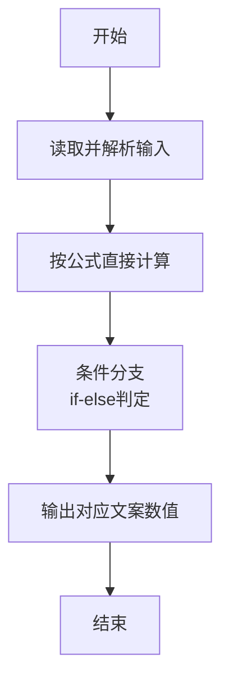
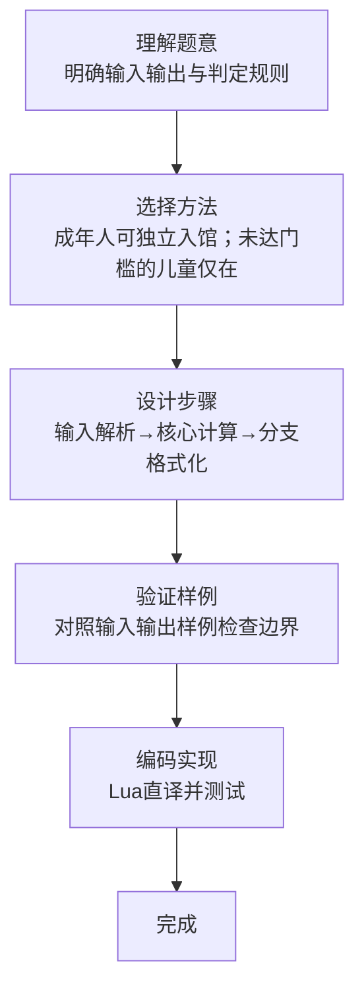

# L1-083 - 谁能进图书馆（10 分）

- **时间限制**: 400 ms
- **内存限制**: 65536 KB
- **代码长度限制**: 16 KB

---

## 题目描述


为了保障安静的阅读环境，有些公共图书馆对儿童入馆做出了限制。例如“12 岁以下儿童禁止入馆，除非有 18 岁以上（包括 18 岁）的成人陪同”。现在有两位小/大朋友跑来问你，他们能不能进去？请你写个程序自动给他们一个回复。

### 输入格式:

输入在一行中给出 4 个整数：
```
禁入年龄线 陪同年龄线 询问者1的年龄 询问者2的年龄
```

这里的`禁入年龄线`是指严格小于该年龄的儿童禁止入馆；`陪同年龄线`是指大于等于该年龄的人士可以陪同儿童入馆。默认两个询问者的编号依次分别为 `1` 和 `2`；年龄和年龄线都是 [1, 200] 区间内的整数，并且保证 `陪同年龄线` 严格大于 `禁入年龄线`。

### 输出格式:

在一行中输出对两位询问者的回答，如果可以进就输出 `年龄-Y`，否则输出 `年龄-N`，中间空 1 格，行首尾不得有多余空格。

在第二行根据两个询问者的情况输出一句话：

- 如果两个人必须一起进，则输出 `qing X zhao gu hao Y`，其中 `X` 是陪同人的编号， `Y` 是小孩子的编号；
- 如果两个人都可以进但不是必须一起的，则输出 `huan ying ru guan`；
- 如果两个人都进不去，则输出 `zhang da zai lai ba`；
- 如果一个人能进一个不能，则输出 `X: huan ying ru guan`，其中 `X` 是可以入馆的那个人的编号。

### 输入样例 1：
```in
12 18 18 8
```

### 输出样例 1：
```out
18-Y 8-Y
qing 1 zhao gu hao 2
```

### 输入样例 2：
```in
12 18 10 15
```

### 输出样例 2：
```out
10-N 15-Y
2: huan ying ru guan
```

## 示例

### 示例 1

**输入:**
```
12 18 18 8
```

**输出:**
```
18-Y 8-Y
qing 1 zhao gu hao 2
```

### 示例 2

**输入:**
```
12 18 10 15
```

**输出:**
```
10-N 15-Y
2: huan ying ru guan
```
### 解题思路

本题属于谁能进图书馆题型，核心在于成年人可独立入馆；未达门槛的儿童仅在另一人达到陪同年龄时可进入。输入规模较小，可直接按题意模拟，无需复杂数据结构。

算法核心是条件判断：根据输入数值或字符串特征通过 `if-else` 分支选择不同输出路径，直接映射题目给出的判定规则，代码中即体现为多分支的 `if` 结构。

边界与精度方面，需处理输入首尾空格、空行及数值类型转换；输出按题面要求的格式（如保留小数、固定文案）使用 `string.format`/`print` 精确控制，确保样例一致。

### 代码流程说明

1. **输入解析**：使用 `io.read("*l"):match` 按模式提取字段并经 `tonumber` 转换，得到数值或字符串形式的原始数据，必要时做 `tonumber` 类型转换与去空格处理。
2. **核心计算**：成年人可独立入馆；未达门槛的儿童仅在另一人达到陪同年龄时可进入，通过一次算术或逻辑表达式直接求得结果。
3. **分支判定**：依据阈值或特征进行 `if-else` 分支，选择不同输出文案或标记异常。
4. **输出**：通过 `print` 按行输出结果，含必要的换行与精度控制，完成题目要求的全部输出。

### 代码实现

```lua
-- 实现原理：成年人可独立入馆；未达门槛的儿童仅在另一人达到陪同年龄时可进入。
local minimum, adult, age1, age2 = io.read("*l"):match("(%d+)%s+(%d+)%s+(%d+)%s+(%d+)")
minimum, adult, age1, age2 = tonumber(minimum), tonumber(adult), tonumber(age1), tonumber(age2)
local in1 = age1 >= minimum or (age1 < minimum and age2 >= adult)
local in2 = age2 >= minimum or (age2 < minimum and age1 >= adult)
print(age1 .. (in1 and "-Y" or "-N") .. " " .. age2 .. (in2 and "-Y" or "-N"))
if in1 and in2 then
    if age1 < minimum then print("qing 2 zhao gu hao 1")
    elseif age2 < minimum then print("qing 1 zhao gu hao 2")
    else print("huan ying ru guan") end
elseif not in1 and not in2 then
    print("zhang da zai lai ba")
else
    print((in1 and 1 or 2) .. ": huan ying ru guan")
end
```

### 代码流程图



### 解题流程图


