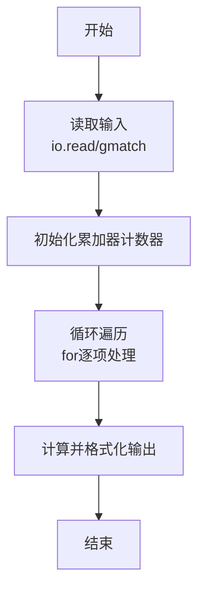
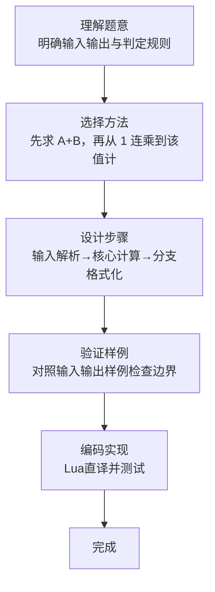

# L1-084 - 拯救外星人（10 分）

- **时间限制**: 400 ms
- **内存限制**: 65536 KB
- **代码长度限制**: 16 KB

---

## 题目描述


你的外星人朋友不认得地球上的加减乘除符号，但是会算阶乘 —— 正整数 N 的阶乘记为 “N!”，是从 1 到 N 的连乘积。所以当他不知道“5+7”等于多少时，如果你告诉他等于“12!”，他就写出了“479001600”这个答案。

本题就请你写程序模仿外星人的行为。

### 输入格式:

输入在一行中给出两个正整数 A 和 B。

### 输出格式:

在一行中输出 (A+B) 的阶乘。题目保证 (A+B) 的值小于 12。

### 输入样例:
```in
3 6
```

### 输出样例:
```out
362880
```

## 示例

### 示例 1

**输入:**
```
3 6
```

**输出:**
```
362880
```
### 解题思路

本题属于拯救外星人题型，核心在于先求 A+B，再从 1 连乘到该值计算阶乘。输入规模较小，可直接按题意模拟，无需复杂数据结构。

算法上采用线性遍历：对输入序列使用 `for` 循环逐个处理，累加或变换得到中间结果，再一次性计算最终答案，时间复杂度为 O(N)，与代码中的循环部分一致。

复杂度方面，遍历部分为 O(N)，额外空间 O(1)（除输入缓冲外）。边界上注意空输入、格式空格及数值精度的处理，Lua 中通过 `tonumber`/`string.format` 保证转换与保留小数位的正确性。

### 代码流程说明

1. **输入解析**：使用 `io.read("*l"):match` 按模式提取字段并经 `tonumber` 转换，得到数值或字符串形式的原始数据，必要时做 `tonumber` 类型转换与去空格处理。
2. **核心计算**：先求 A+B，再从 1 连乘到该值计算阶乘，在循环体内逐项累加、比较或变换（如代码中的 `for` 循环体），维护中间变量（如求和、计数、查表）。
3. **结果整理**：对计算结果进行格式化或拼接（如 `string.format`、`table.concat`），保证输出符合样例。
4. **输出**：通过 `print` 按行输出结果，含必要的换行与精度控制，完成题目要求的全部输出。

### 代码实现

```lua
-- 实现原理：先求 A+B，再从 1 连乘到该值计算阶乘。
local a, b = io.read("*l"):match("(%d+)%s+(%d+)")
local result = 1
for i = 1, tonumber(a) + tonumber(b) do result = result * i end
print(result)
```

### 代码流程图



### 解题流程图


