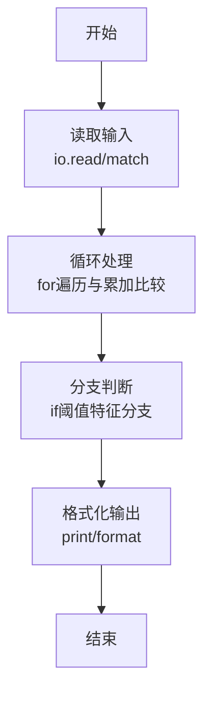
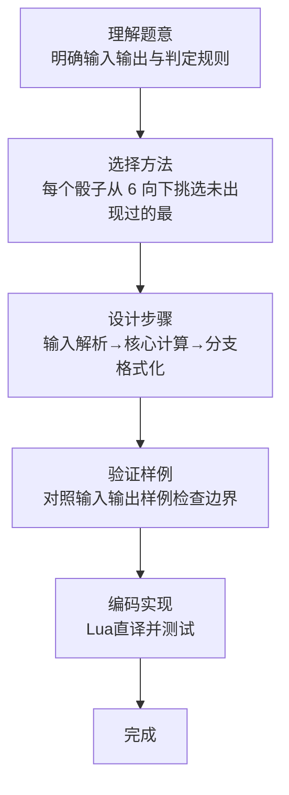

# L1-085 - 试试手气（15 分）

- **时间限制**: 400 ms
- **内存限制**: 65536 KB
- **代码长度限制**: 16 KB

---

## 题目描述


我们知道一个骰子有 6 个面，分别刻了 1 到 6 个点。下面给你 6 个骰子的初始状态，即它们朝上一面的点数，让你一把抓起摇出另一套结果。假设你摇骰子的手段特别精妙，每次摇出的结果都满足以下两个条件：

- 1、每个骰子摇出的点数都跟它之前任何一次出现的点数不同；
- 2、在满足条件 1 的前提下，每次都能让每个骰子得到可能得到的最大点数。

那么你应该可以预知自己第 $n$ 次（$1\le n\le 5$）摇出的结果。

### 输入格式:

输入第一行给出 6 个骰子的初始点数，即 [1,6] 之间的整数，数字间以空格分隔；第二行给出摇的次数 $n$（$1\le n\le 5$）。

### 输出格式:

在一行中顺序列出第 $n$ 次摇出的每个骰子的点数。数字间必须以 1 个空格分隔，行首位不得有多余空格。

### 输入样例:
```in
3 6 5 4 1 4
3
```

### 输出样例:
```out
4 3 3 3 4 3
```

## 示例

### 示例 1

**输入:**
```
3 6 5 4 1 4
3
```

**输出:**
```
4 3 3 3 4 3
```
### 解题思路

本题属于试试手气题型，核心在于每个骰子从 6 向下挑选未出现过的最大点数；初始点数也属于已出现集合。输入规模较小，可直接按题意模拟，无需复杂数据结构。

算法上采用循环遍历配合条件分支：通过 `for/while` 逐项处理输入，利用 `if` 判断实现题设的分支逻辑（如阈值比较、分类输出或异常检测），与 Lua 代码中 `for`/`if` 的结构一一对应。

复杂度方面，遍历部分为 O(N)，额外空间 O(1)（除输入缓冲外）。边界上注意空输入、格式空格及数值精度的处理，Lua 中通过 `tonumber`/`string.format` 保证转换与保留小数位的正确性。

### 代码流程说明

1. **输入解析**：使用 `io.read("*l")` 配合 `gmatch` 逐 token 解析输入，得到数值或字符串形式的原始数据，必要时做 `tonumber` 类型转换与去空格处理。
2. **核心计算**：每个骰子从 6 向下挑选未出现过的最大点数；初始点数也属于已出现集合，在循环体内逐项累加、比较或变换（如代码中的 `for` 循环体），维护中间变量（如求和、计数、查表）。
3. **分支判定**：依据阈值或特征进行 `if-else` 分支，选择不同输出文案或标记异常。
4. **输出**：通过 `print` 按行输出结果，含必要的换行与精度控制，完成题目要求的全部输出。

### 代码实现

```lua
-- 实现原理：每个骰子从 6 向下挑选未出现过的最大点数；初始点数也属于已出现集合。
local dice = {}
for value in io.read("*l"):gmatch("%d+") do dice[#dice + 1] = tonumber(value) end
local rounds = tonumber(io.read("*l"))
for i = 1, 6 do
    local used, value = { [dice[i]] = true }, 6
    for _ = 1, rounds do
        while used[value] do value = value - 1 end
        used[value] = true
        if _ == rounds then dice[i] = value end
        value = value - 1
    end
end
print(table.concat(dice, " "))
```

### 代码流程图



### 解题流程图


