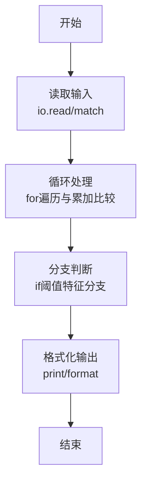
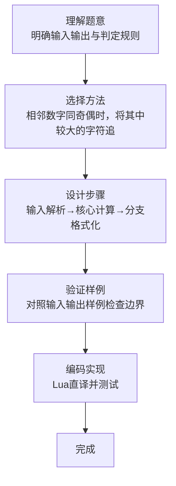

# L1-086 - 斯德哥尔摩火车上的题（15 分）

- **时间限制**: 400 ms
- **内存限制**: 65536 KB
- **代码长度限制**: 16 KB

---

## 题目描述


上图是新浪微博上的一则趣闻，是瑞典斯德哥尔摩火车上的一道题，看上去是段伪代码：

```
s = ''
a = '1112031584'
for (i = 1; i < length(a); i++) {
  if (a[i] % 2 == a[i-1] % 2) {
    s += max(a[i], a[i-1])
  }
}
goto_url('www.multisoft.se/' + s)
```

其中字符串的 `+` 操作是连接两个字符串的意思。所以这道题其实是让大家访问网站 `www.multisoft.se/112358`（**注意：比赛中千万不要访问这个网址！！！**）。

当然，能通过上述算法得到 `112358` 的原始字符串 `a` 是不唯一的。本题就请你判断，两个给定的原始字符串，能否通过上述算法得到相同的输出？

### 输入格式:

输入为两行仅由数字组成的非空字符串，长度均不超过 $10^4$，以回车结束。

### 输出格式:

对两个字符串分别采用上述斯德哥尔摩火车上的算法进行处理。如果两个结果是一样的，则在一行中输出那个结果；否则分别输出各自对应的处理结果，每个占一行。题目保证输出结果不为空。

### 输入样例 1：
```in
1112031584
011102315849
```

### 输出样例 1：
```out
112358
```

### 输入样例 2：
```in
111203158412334
12341112031584
```

### 输出样例 2：
```out
1123583
112358
```

## 示例

### 示例 1

**输入:**
```
1112031584
011102315849
```

**输出:**
```
112358
```

### 示例 2

**输入:**
```
111203158412334
12341112031584
```

**输出:**
```
1123583
112358
```
### 解题思路

本题属于斯德哥尔摩火题型，核心在于相邻数字同奇偶时，将其中较大的字符追加到处理结果。输入规模较小，可直接按题意模拟，无需复杂数据结构。

算法上采用循环遍历配合条件分支：通过 `for/while` 逐项处理输入，利用 `if` 判断实现题设的分支逻辑（如阈值比较、分类输出或异常检测），与 Lua 代码中 `for`/`if` 的结构一一对应。

复杂度方面，遍历部分为 O(N)，额外空间 O(1)（除输入缓冲外）。边界上注意空输入、格式空格及数值精度的处理，Lua 中通过 `tonumber`/`string.format` 保证转换与保留小数位的正确性。

### 代码流程说明

1. **输入解析**：使用 `io.read` 直接读取输入行，得到数值或字符串形式的原始数据，必要时做 `tonumber` 类型转换与去空格处理。
2. **核心计算**：相邻数字同奇偶时，将其中较大的字符追加到处理结果，在循环体内逐项累加、比较或变换（如代码中的 `for` 循环体），维护中间变量（如求和、计数、查表）。
3. **分支判定**：依据阈值或特征进行 `if-else` 分支，选择不同输出文案或标记异常。
4. **输出**：通过 `print` 按行输出结果，含必要的换行与精度控制，完成题目要求的全部输出。

### 代码实现

```lua
-- 实现原理：相邻数字同奇偶时，将其中较大的字符追加到处理结果。
local function transform(s)
    local result = {}
    for i = 2, #s do
        local previous, current = tonumber(s:sub(i - 1, i - 1)), tonumber(s:sub(i, i))
        if previous % 2 == current % 2 then result[#result + 1] = math.max(previous, current) end
    end
    return table.concat(result)
end
local first, second = transform(io.read("*l")), transform(io.read("*l"))
print(first)
if first ~= second then print(second) end
```

### 代码流程图



### 解题流程图


