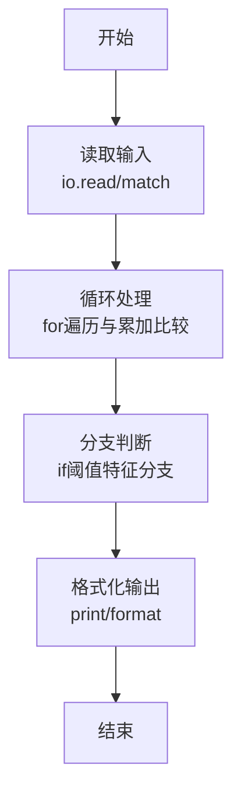
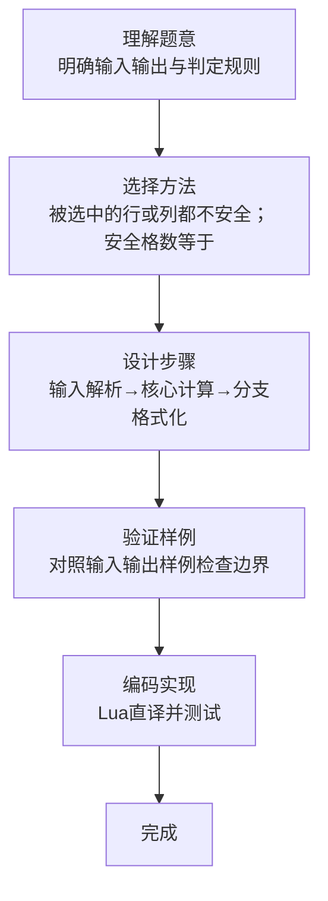

# L1-087 - 机工士姆斯塔迪奥（20 分）

- **时间限制**: 400 ms
- **内存限制**: 65536 KB
- **代码长度限制**: 16 KB

---

## 题目描述


在 MMORPG《最终幻想14》的副本“乐欲之所瓯博讷修道院”里，BOSS 机工士姆斯塔迪奥将会接受玩家的挑战。

你需要处理这个副本其中的一个机制：$N \times M$ 大小的地图被拆分为了 $N \times M$ 个 $1 \times 1$ 的格子，BOSS 会选择若干行或/及若干列释放技能，玩家不能站在释放技能的方格上，否则就会被击中而失败。

给定 BOSS 所有释放技能的行或列信息，请你计算出最后有多少个格子是安全的。

### 输入格式:

输入第一行是三个整数 $N, M, Q$ ($1 \le N \times M \le 10^5$，$0 \le Q \le 1000$)，表示地图为 $N$ 行 $M$ 列大小以及选择的行/列数量。

接下来 $Q$ 行，每行两个数 $T_i, C_i$，其中 $T_i = 0$ 表示 BOSS 选择的是一整行，$T_i = 1$ 表示选择的是一整列，$C_i$ 为选择的行号/列号。行和列的编号均从 1 开始。

### 输出格式:

输出一个数，表示安全格子的数量。

### 输入样例:
```in
5 5 3
0 2
0 4
1 3
```

### 输出样例:
```out
12
```

## 示例

### 示例 1

**输入:**
```
5 5 3
0 2
0 4
1 3
```

**输出:**
```
12
```
### 解题思路

本题属于机工士姆斯塔题型，核心在于被选中的行或列都不安全；安全格数等于未选行数乘未选列数。输入规模较小，可直接按题意模拟，无需复杂数据结构。

算法上采用循环遍历配合条件分支：通过 `for/while` 逐项处理输入，利用 `if` 判断实现题设的分支逻辑（如阈值比较、分类输出或异常检测），与 Lua 代码中 `for`/`if` 的结构一一对应。

复杂度方面，遍历部分为 O(N)，额外空间 O(1)（除输入缓冲外）。边界上注意空输入、格式空格及数值精度的处理，Lua 中通过 `tonumber`/`string.format` 保证转换与保留小数位的正确性。

### 代码流程说明

1. **输入解析**：使用 `io.read("*l"):match` 按模式提取字段并经 `tonumber` 转换，得到数值或字符串形式的原始数据，必要时做 `tonumber` 类型转换与去空格处理。
2. **核心计算**：被选中的行或列都不安全；安全格数等于未选行数乘未选列数，在循环体内逐项累加、比较或变换（如代码中的 `for` 循环体），维护中间变量（如求和、计数、查表）。
3. **分支判定**：依据阈值或特征进行 `if-else` 分支，选择不同输出文案或标记异常。
4. **输出**：通过 `print` 按行输出结果，含必要的换行与精度控制，完成题目要求的全部输出。

### 代码实现

```lua
-- 实现原理：被选中的行或列都不安全；安全格数等于未选行数乘未选列数。
local n, m, q = io.read("*l"):match("(%d+)%s+(%d+)%s+(%d+)")
n, m, q = tonumber(n), tonumber(m), tonumber(q)
local rows, columns = {}, {}
for _ = 1, q do
    local type_id, index = io.read("*l"):match("(%d+)%s+(%d+)")
    if type_id == "0" then rows[tonumber(index)] = true else columns[tonumber(index)] = true end
end
local row_count, col_count = 0, 0
for _ in pairs(rows) do row_count = row_count + 1 end
for _ in pairs(columns) do col_count = col_count + 1 end
print((n - row_count) * (m - col_count))
```

### 代码流程图



### 解题流程图


