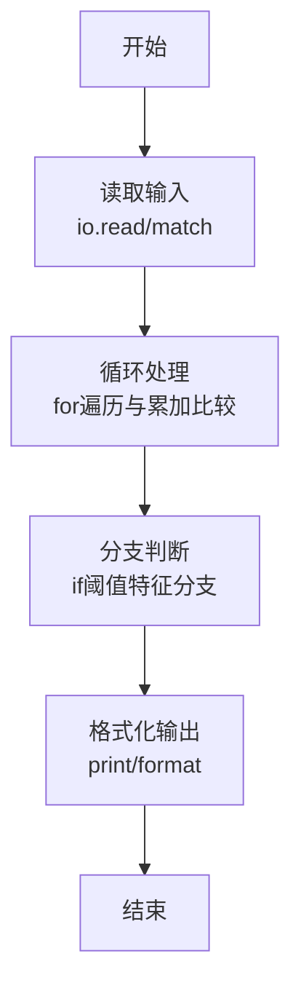
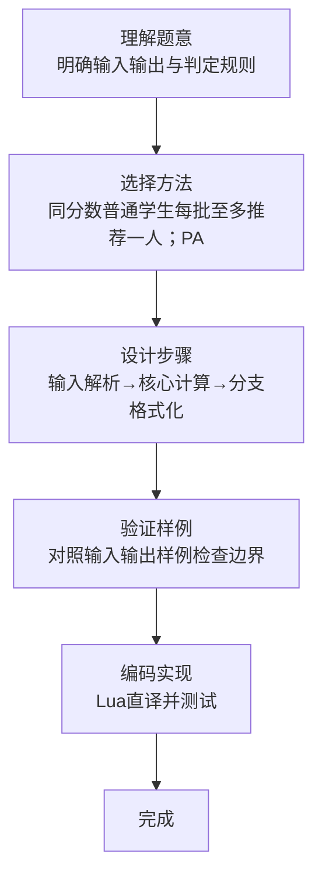

# L1-088 - 静静的推荐（20 分）

- **时间限制**: 200 ms
- **内存限制**: 65536 KB
- **代码长度限制**: 16 KB

---

## 题目描述


天梯赛结束后，某企业的人力资源部希望组委会能推荐一批优秀的学生，这个整理推荐名单的任务就由静静姐负责。企业接受推荐的流程是这样的：

- 只考虑得分不低于 175 分的学生；
- 一共接受 $$K$$ 批次的推荐名单；
- 同一批推荐名单上的学生的成绩原则上应严格递增；
- 如果有的学生天梯赛成绩虽然与前一个人相同，但其参加过 PAT 考试，且成绩达到了该企业的面试分数线，则也可以接受。

给定全体参赛学生的成绩和他们的 PAT 考试成绩，请你帮静静姐算一算，她最多能向企业推荐多少学生？

### 输入格式:

输入第一行给出 3 个正整数：$$N$$（$$\le 10^5$$）为参赛学生人数，$$K$$（$$\le 5\times 10^3$$）为企业接受的推荐批次，$$S$$（$$\le 100$$）为该企业的 PAT 面试分数线。

随后 $$N$$ 行，每行给出两个分数，依次为一位学生的天梯赛分数（最高分 290）和 PAT 分数（最高分 100）。

### 输出格式:

在一行中输出静静姐最多能向企业推荐的学生人数。

### 输入样例:
```in
10 2 90
203 0
169 91
175 88
175 0
175 90
189 0
189 0
189 95
189 89
256 100
```

### 输出样例:
```out
8
```

## 示例

### 示例 1

**输入:**
```
10 2 90
203 0
169 91
175 88
175 0
175 90
189 0
189 0
189 95
189 89
256 100
```

**输出:**
```
8
```
### 解题思路

本题属于静静的推荐题型，核心在于同分数普通学生每批至多推荐一人；PAT 达线者可额外推荐，按分数独立累计。输入规模较小，可直接按题意模拟，无需复杂数据结构。

算法上采用循环遍历配合条件分支：通过 `for/while` 逐项处理输入，利用 `if` 判断实现题设的分支逻辑（如阈值比较、分类输出或异常检测），与 Lua 代码中 `for`/`if` 的结构一一对应。

复杂度方面，遍历部分为 O(N)，额外空间 O(1)（除输入缓冲外）。边界上注意空输入、格式空格及数值精度的处理，Lua 中通过 `tonumber`/`string.format` 保证转换与保留小数位的正确性。

### 代码流程说明

1. **输入解析**：使用 `io.read("*l"):match` 按模式提取字段并经 `tonumber` 转换，得到数值或字符串形式的原始数据，必要时做 `tonumber` 类型转换与去空格处理。
2. **核心计算**：同分数普通学生每批至多推荐一人；PAT 达线者可额外推荐，按分数独立累计，在循环体内逐项累加、比较或变换（如代码中的 `for` 循环体），维护中间变量（如求和、计数、查表）。
3. **分支判定**：依据阈值或特征进行 `if-else` 分支，选择不同输出文案或标记异常。
4. **输出**：通过 `print` 按行输出结果，含必要的换行与精度控制，完成题目要求的全部输出。

### 代码实现

```lua
-- 实现原理：同分数普通学生每批至多推荐一人；PAT 达线者可额外推荐，按分数独立累计。
local n, k, threshold = io.read("*l"):match("(%d+)%s+(%d+)%s+(%d+)")
n, k, threshold = tonumber(n), tonumber(k), tonumber(threshold)
local total, qualified = {}, {}
for _ = 1, n do
    local score, pat = io.read("*l"):match("(%d+)%s+(%d+)")
    score, pat = tonumber(score), tonumber(pat)
    if score >= 175 then
        total[score] = (total[score] or 0) + 1
        if pat >= threshold then qualified[score] = (qualified[score] or 0) + 1 end
    end
end
local answer = 0
for score, count in pairs(total) do
    local special = qualified[score] or 0
    answer = answer + special + math.min(k, count - special)
end
print(answer)
```

### 代码流程图



### 解题流程图


