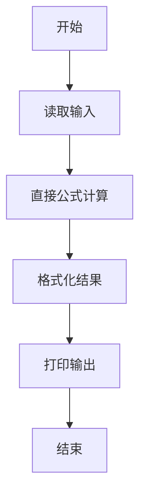
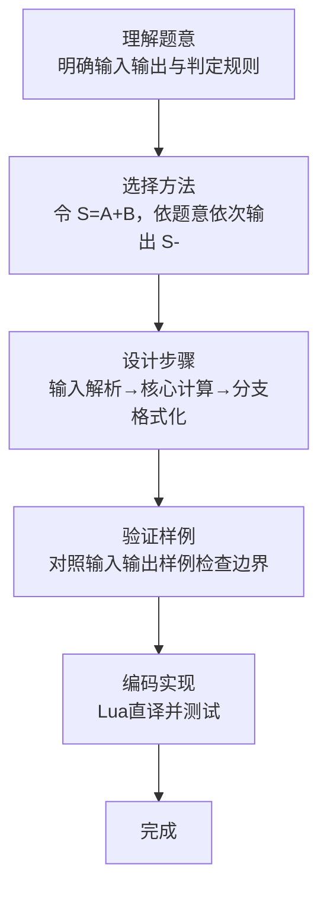

# L1-090 - 什么是机器学习（5 分）

- **时间限制**: 400 ms
- **内存限制**: 65536 KB
- **代码长度限制**: 16 KB

---

## 题目描述


什么是机器学习？上图展示了一段面试官与“机器学习程序”的对话：
```
面试官：9 + 10 等于多少？
答：3
面试官：差远了，是19。
答：16
面试官：错了，是19。
答：18
面试官：不，是19。
答：19
```
本题就请你模仿这个“机器学习程序”的行为。

### 输入格式:

输入在一行中给出两个整数，绝对值都不超过 100，中间用一个空格分开，分别表示面试官给出的两个数字 A 和 B。

### 输出格式:

要求你输出 4 行，每行一个数字。第 1 行比正确结果少 16，第 2 行少 3，第 3 行少 1，最后一行才输出 A+B 的正确结果。

### 输入样例:
```in
9 10
```

### 输出样例:
```out
3
16
18
19
```

## 示例

### 示例 1

**输入:**
```
9 10
```

**输出:**
```
3
16
18
19
```
### 解题思路

本题属于什么是机器学题型，核心在于令 S=A+B，依题意依次输出 S-16、S-3、S-1、S。输入规模较小，可直接按题意模拟，无需复杂数据结构。

算法直接按公式或规则计算：读取输入后通过算术或字符串运算一次性得到结果，无需循环，体现为代码中的直算与格式化输出。

边界与精度方面，需处理输入首尾空格、空行及数值类型转换；输出按题面要求的格式（如保留小数、固定文案）使用 `string.format`/`print` 精确控制，确保样例一致。

### 代码流程说明

1. **输入解析**：使用 `io.read("*l"):match` 按模式提取字段并经 `tonumber` 转换，得到数值或字符串形式的原始数据，必要时做 `tonumber` 类型转换与去空格处理。
2. **核心计算**：令 S=A+B，依题意依次输出 S-16、S-3、S-1、S，通过一次算术或逻辑表达式直接求得结果。
3. **结果整理**：对计算结果进行格式化或拼接（如 `string.format`、`table.concat`），保证输出符合样例。
4. **输出**：通过 `print` 按行输出结果，含必要的换行与精度控制，完成题目要求的全部输出。

### 代码实现

```lua
-- 实现原理：令 S=A+B，依题意依次输出 S-16、S-3、S-1、S。
local a, b = io.read("*l"):match("(-?%d+)%s+(-?%d+)")
local sum = tonumber(a) + tonumber(b)
print(sum - 16)
print(sum - 3)
print(sum - 1)
print(sum)
```

### 代码流程图



### 解题流程图


