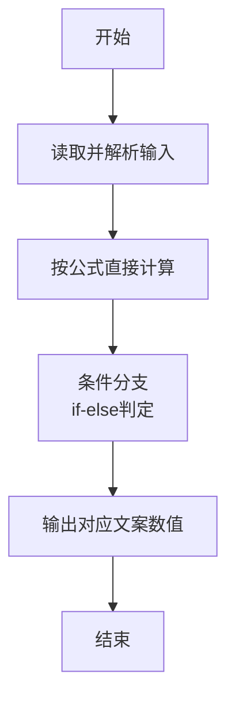
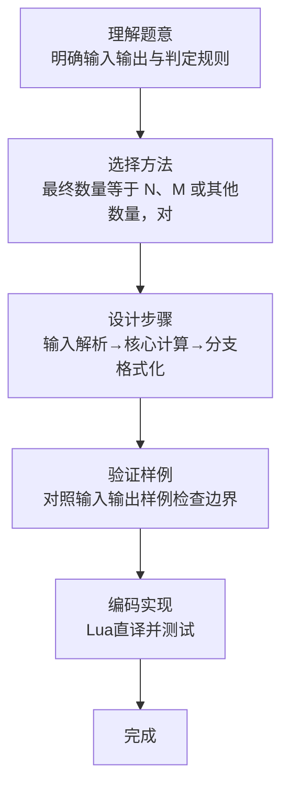

# L1-091 - 程序员买包子（10 分）

- **时间限制**: 400 ms
- **内存限制**: 65536 KB
- **代码长度限制**: 16 KB

---

## 题目描述


这是一条检测真正程序员的段子：假如你被家人要求下班顺路买十只包子，如果看到卖西瓜的，买一只。那么你会在什么情况下只买一只包子回家？
本题要求你考虑这个段子的通用版：假如你被要求下班顺路买 $$N$$ 只包子，如果看到卖 $$X$$ 的，买 $$M$$ 只。那么如果你最后买了 $$K$$ 只包子回家，说明你看到卖 $$X$$ 的没有呢？

### 输入格式:

输入在一行中顺序给出题面中的 $$N$$、$$X$$、$$M$$、$$K$$，以空格分隔。其中 $$N$$、$$M$$ 和 $$K$$ 为不超过 1000 的正整数，$$X$$ 是一个长度不超过 10 的、仅由小写英文字母组成的字符串。题目保证 $$N\neq M$$。

### 输出格式:

在一行中输出结论，格式为：
- 如果 $$K=N$$，输出 `mei you mai X de`；
- 如果 $$K=M$$，输出 `kan dao le mai X de`；
- 否则输出 `wang le zhao mai X de`.
其中 `X` 是输入中给定的字符串 $$X$$。

### 输入样例 1：
```in
10 xigua 1 10
```

### 输出样例 1：
```out
mei you mai xigua de
```

### 输入样例 2：
```in
10 huanggua 1 1
```

### 输出样例 2：
```out
kan dao le mai huanggua de
```

### 输入样例 3：
```in
10 shagua 1 250
```

### 输出样例 3：
```out
wang le zhao mai shagua de
```

## 示例

### 示例 1

**输入:**
```
10 xigua 1 10
```

**输出:**
```
mei you mai xigua de
```

### 示例 2

**输入:**
```
10 huanggua 1 1
```

**输出:**
```
kan dao le mai huanggua de
```

### 示例 3

**输入:**
```
10 shagua 1 250
```

**输出:**
```
wang le zhao mai shagua de
```
### 解题思路

本题属于程序员买包子题型，核心在于最终数量等于 N、M 或其他数量，对应三种固定结论。输入规模较小，可直接按题意模拟，无需复杂数据结构。

算法核心是条件判断：根据输入数值或字符串特征通过 `if-else` 分支选择不同输出路径，直接映射题目给出的判定规则，代码中即体现为多分支的 `if` 结构。

边界与精度方面，需处理输入首尾空格、空行及数值类型转换；输出按题面要求的格式（如保留小数、固定文案）使用 `string.format`/`print` 精确控制，确保样例一致。

### 代码流程说明

1. **输入解析**：使用 `io.read("*l"):match` 按模式提取字段并经 `tonumber` 转换，得到数值或字符串形式的原始数据，必要时做 `tonumber` 类型转换与去空格处理。
2. **核心计算**：最终数量等于 N、M 或其他数量，对应三种固定结论，通过一次算术或逻辑表达式直接求得结果。
3. **分支判定**：依据阈值或特征进行 `if-else` 分支，选择不同输出文案或标记异常。
4. **输出**：通过 `print` 按行输出结果，含必要的换行与精度控制，完成题目要求的全部输出。

### 代码实现

```lua
-- 实现原理：最终数量等于 N、M 或其他数量，对应三种固定结论。
local n, item, m, k = io.read("*l"):match("(%d+)%s+(%S+)%s+(%d+)%s+(%d+)")
if k == n then print("mei you mai " .. item .. " de") elseif k == m then print("kan dao le mai " .. item .. " de") else print("wang le zhao mai " .. item .. " de") end
```

### 代码流程图



### 解题流程图


