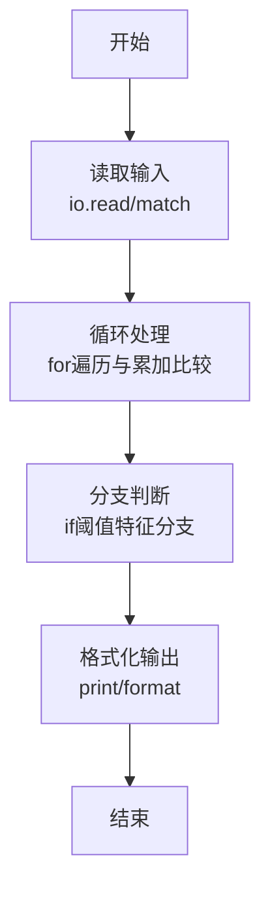
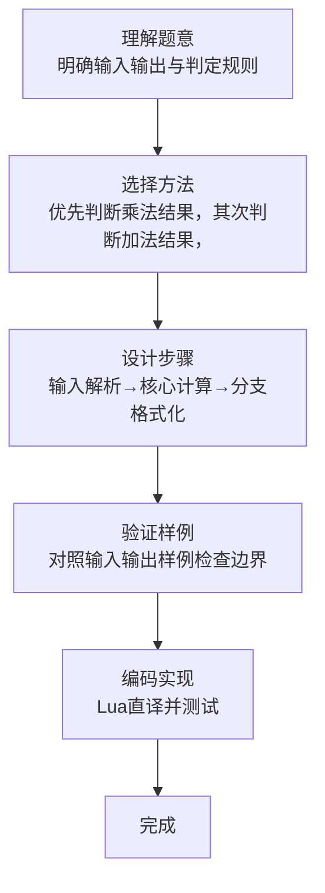

# L1-092 - 进化论（10 分）

- **时间限制**: 400 ms
- **内存限制**: 65536 KB
- **代码长度限制**: 16 KB

---

## 题目描述


在“一年一度喜剧大赛”上有一部作品《进化论》，讲的是动物园两只猩猩进化的故事。猩猩吕严说自己已经进化了 9 年了，因为“三年又三年”。猩猩土豆指出“三年又三年是六年呐”……
本题给定两个数字，以及用这两个数字计算的结果，要求你根据结果判断，这是吕严算出来的，还是土豆算出来的。

### 输入格式:

输入第一行给出一个正整数 $$N$$，随后 $$N$$ 行，每行给出三个正整数 $$A$$、$$B$$ 和 $$C$$。其中 $$C$$ 不超过 10000，其他三个数字都不超过 100。

### 输出格式:

对每一行给出的三个数，如果 $$C$$ 是 $$A\times B$$，就在一行中输出 `Lv Yan`；如果是 $$A+B$$，就在一行中输出 `Tu Dou`；如果都不是，就在一行中输出 `zhe du shi sha ya!`。

### 输入样例:
```in
3
3 3 9
3 3 6
3 3 12
```

### 输出样例:
```out
Lv Yan
Tu Dou
zhe du shi sha ya!
```

## 示例

### 示例 1

**输入:**
```
3
3 3 9
3 3 6
3 3 12
```

**输出:**
```
Lv Yan
Tu Dou
zhe du shi sha ya!
```
### 解题思路

本题属于进化论题型，核心在于优先判断乘法结果，其次判断加法结果，否则为第三种结论。输入规模较小，可直接按题意模拟，无需复杂数据结构。

算法上采用循环遍历配合条件分支：通过 `for/while` 逐项处理输入，利用 `if` 判断实现题设的分支逻辑（如阈值比较、分类输出或异常检测），与 Lua 代码中 `for`/`if` 的结构一一对应。

复杂度方面，遍历部分为 O(N)，额外空间 O(1)（除输入缓冲外）。边界上注意空输入、格式空格及数值精度的处理，Lua 中通过 `tonumber`/`string.format` 保证转换与保留小数位的正确性。

### 代码流程说明

1. **输入解析**：使用 `io.read("*l"):match` 按模式提取字段并经 `tonumber` 转换，得到数值或字符串形式的原始数据，必要时做 `tonumber` 类型转换与去空格处理。
2. **核心计算**：优先判断乘法结果，其次判断加法结果，否则为第三种结论，在循环体内逐项累加、比较或变换（如代码中的 `for` 循环体），维护中间变量（如求和、计数、查表）。
3. **分支判定**：依据阈值或特征进行 `if-else` 分支，选择不同输出文案或标记异常。
4. **输出**：通过 `print` 按行输出结果，含必要的换行与精度控制，完成题目要求的全部输出。

### 代码实现

```lua
-- 实现原理：优先判断乘法结果，其次判断加法结果，否则为第三种结论。
local n = tonumber(io.read("*l"))
for _ = 1, n do local a,b,c=io.read("*l"):match("(%d+)%s+(%d+)%s+(%d+)"); a,b,c=tonumber(a),tonumber(b),tonumber(c); if c==a*b then print("Lv Yan") elseif c==a+b then print("Tu Dou") else print("zhe du shi sha ya!") end end
```

### 代码流程图



### 解题流程图


