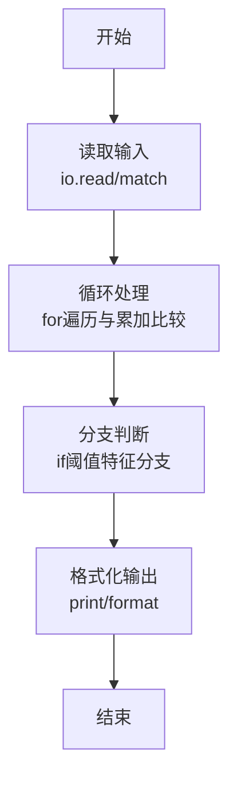
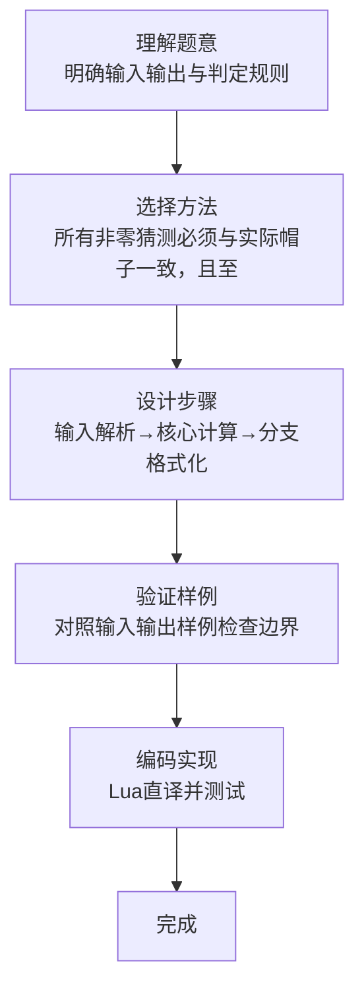

# L1-093 - 猜帽子游戏（15 分）

- **时间限制**: 400 ms
- **内存限制**: 65536 KB
- **代码长度限制**: 16 KB

---

## 题目描述


宝宝们在一起玩一个猜帽子游戏。每人头上被扣了一顶帽子，有的是黑色的，有的是黄色的。每个人可以看到别人头上的帽子，但是看不到自己的。游戏开始后，每个人可以猜自己头上的帽子是什么颜色，或者可以弃权不猜。如果没有一个人猜错、并且至少有一个人猜对了，那么所有的宝宝共同获得一个大奖。如果所有人都不猜，或者只要有一个人猜错了，所有宝宝就都没有奖。
下面顺序给出一排帽子的颜色，假设每一群宝宝来玩的时候，都是按照这个顺序发帽子的。然后给出每一群宝宝们猜的结果，请你判断他们能不能得大奖。

### 输入格式:

输入首先在一行中给出一个正整数 $$N$$（$$2 < N \le 100$$），是帽子的个数。第二行给出 $$N$$ 顶帽子的颜色，数字 `1` 表示黑色，`2` 表示黄色。
再下面给出一个正整数 $$K$$（$$\le 10$$），随后 $$K$$ 行，每行给出一群宝宝们猜的结果，除了仍然用数字 `1` 表示黑色、`2` 表示黄色之外，`0` 表示这个宝宝弃权不猜。
同一行中的数字用空格分隔。

### 输出格式:

对于每一群玩游戏的宝宝，如果他们能获得大奖，就在一行中输出 `Da Jiang!!!`，否则输出 `Ai Ya`。

### 输入样例:
```in
5
1 1 2 1 2
3
0 1 2 0 0
0 0 0 0 0
1 2 2 0 2
```

### 输出样例:
```out
Da Jiang!!!
Ai Ya
Ai Ya
```

## 示例

### 示例 1

**输入:**
```
5
1 1 2 1 2
3
0 1 2 0 0
0 0 0 0 0
1 2 2 0 2
```

**输出:**
```
Da Jiang!!!
Ai Ya
Ai Ya
```
### 解题思路

本题属于猜帽子游戏题型，核心在于所有非零猜测必须与实际帽子一致，且至少有一个非零猜测才获奖。输入规模较小，可直接按题意模拟，无需复杂数据结构。

算法上采用循环遍历配合条件分支：通过 `for/while` 逐项处理输入，利用 `if` 判断实现题设的分支逻辑（如阈值比较、分类输出或异常检测），与 Lua 代码中 `for`/`if` 的结构一一对应。

复杂度方面，遍历部分为 O(N)，额外空间 O(1)（除输入缓冲外）。边界上注意空输入、格式空格及数值精度的处理，Lua 中通过 `tonumber`/`string.format` 保证转换与保留小数位的正确性。

### 代码流程说明

1. **输入解析**：使用 `io.read("*l")` 配合 `gmatch` 逐 token 解析输入，得到数值或字符串形式的原始数据，必要时做 `tonumber` 类型转换与去空格处理。
2. **核心计算**：所有非零猜测必须与实际帽子一致，且至少有一个非零猜测才获奖，在循环体内逐项累加、比较或变换（如代码中的 `for` 循环体），维护中间变量（如求和、计数、查表）。
3. **分支判定**：依据阈值或特征进行 `if-else` 分支，选择不同输出文案或标记异常。
4. **输出**：通过 `print` 按行输出结果，含必要的换行与精度控制，完成题目要求的全部输出。

### 代码实现

```lua
-- 实现原理：所有非零猜测必须与实际帽子一致，且至少有一个非零猜测才获奖。
local n=tonumber(io.read("*l")); local hats={}; for x in io.read("*l"):gmatch("%d+") do hats[#hats+1]=tonumber(x) end; local k=tonumber(io.read("*l"))
for _=1,k do local any,ok=false,true; local i=0; for x in io.read("*l"):gmatch("%d+") do i=i+1; x=tonumber(x); if x~=0 then any=true; if x~=hats[i] then ok=false end end end; print(any and ok and "Da Jiang!!!" or "Ai Ya") end
```

### 代码流程图



### 解题流程图


