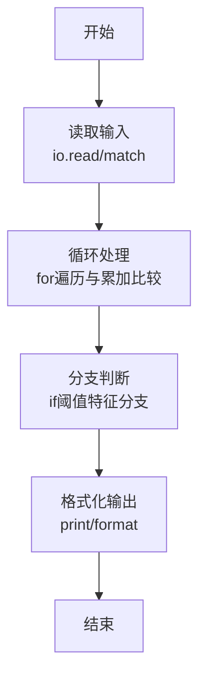
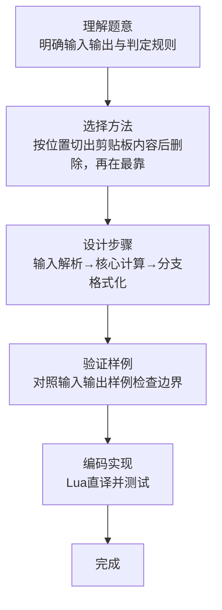

# L1-094 - 剪切粘贴（15 分）

- **时间限制**: 400 ms
- **内存限制**: 65536 KB
- **代码长度限制**: 16 KB

---

## 题目描述


使用计算机进行文本编辑时常见的功能是剪切功能（快捷键：Ctrl + X）。请实现一个简单的具有剪切和粘贴功能的文本编辑工具。

工具需要完成一系列剪切后粘贴的操作，每次操作分为两步：

* 剪切：给定需操作的起始位置和结束位置，将当前字符串中起始位置到结束位置部分的字符串放入剪贴板中，并删除当前字符串对应位置的内容。例如，当前字符串为 `abcdefg`，起始位置为 3，结束位置为 5，则剪贴操作后， 剪贴板内容为 `cde`，操作后字符串变为 `abfg`。字符串位置从 1 开始编号。
* 粘贴：给定插入位置的前后字符串，寻找到插入位置，将剪贴板内容插入到位置中，并清除剪贴板内容。例如，对于上面操作后的结果，给定插入位置前为 `bf`，插入位置后为 `g`，则插入后变为 `abfcdeg`。如找不到应该插入的位置，则直接将插入位置设置为字符串最后，仍然完成插入操作。查找字符串时区分大小写。

每次操作后的字符串即为新的当前字符串。在若干次操作后，请给出最后的编辑结果。

### 输入格式:

输入第一行是一个长度小于等于 200 的字符串 $S$，表示原始字符串。字符串只包含所有可见 ASCII 字符，不包含回车与空格。

第二行是一个正整数 $N$ ($1 \le N \le 100$)，表示要进行的操作次数。

接下来的 $N$ 行，每行是两个数字和两个**长度不大于 5** 的不包含空格的非空字符串，前两个数字表示需要剪切的位置，后两个字符串表示插入位置前和后的字符串，用一个空格隔开。如果有多个可插入的位置，选择最靠近当前操作字符串开头的一个。

剪切的位置保证总是合法的。

### 输出格式:

输出一行，表示操作后的字符串。

### 输入样例:
```in
AcrosstheGreatWall,wecanreacheverycornerintheworld
5
10 18 ery cor
32 40 , we
1 6 tW all
14 18 rnerr eache
1 1 e r
```

### 输出样例:
```out
he,allcornetrrwecaneacheveryGreatWintheworldAcross
```

## 示例

### 示例 1

**输入:**
```
AcrosstheGreatWall,wecanreacheverycornerintheworld
5
10 18 ery cor
32 40 , we
1 6 tW all
14 18 rnerr eache
1 1 e r
```

**输出:**
```
he,allcornetrrwecaneacheveryGreatWintheworldAcross
```
### 解题思路

本题属于剪切粘贴题型，核心在于按位置切出剪贴板内容后删除，再在最靠前的“前串+后串”连接处插入。输入规模较小，可直接按题意模拟，无需复杂数据结构。

算法上采用循环遍历配合条件分支：通过 `for/while` 逐项处理输入，利用 `if` 判断实现题设的分支逻辑（如阈值比较、分类输出或异常检测），与 Lua 代码中 `for`/`if` 的结构一一对应。

复杂度方面，遍历部分为 O(N)，额外空间 O(1)（除输入缓冲外）。边界上注意空输入、格式空格及数值精度的处理，Lua 中通过 `tonumber`/`string.format` 保证转换与保留小数位的正确性。

### 代码流程说明

1. **输入解析**：使用 `io.read("*l"):match` 按模式提取字段并经 `tonumber` 转换，得到数值或字符串形式的原始数据，必要时做 `tonumber` 类型转换与去空格处理。
2. **核心计算**：按位置切出剪贴板内容后删除，再在最靠前的“前串+后串”连接处插入，在循环体内逐项累加、比较或变换（如代码中的 `for` 循环体），维护中间变量（如求和、计数、查表）。
3. **分支判定**：依据阈值或特征进行 `if-else` 分支，选择不同输出文案或标记异常。
4. **输出**：通过 `print` 按行输出结果，含必要的换行与精度控制，完成题目要求的全部输出。

### 代码实现

```lua
-- 实现原理：按位置切出剪贴板内容后删除，再在最靠前的“前串+后串”连接处插入。
local text=io.read("*l"); local n=tonumber(io.read("*l"))
for _=1,n do local l,r,before,after=io.read("*l"):match("(%d+)%s+(%d+)%s+(%S+)%s+(%S+)"); l,r=tonumber(l),tonumber(r); local clip=text:sub(l,r); text=text:sub(1,l-1)..text:sub(r+1); local p=text:find(before..after,1,true); if p then p=p+#before; text=text:sub(1,p-1)..clip..text:sub(p) else text=text..clip end end
print(text)
```

### 代码流程图



### 解题流程图


