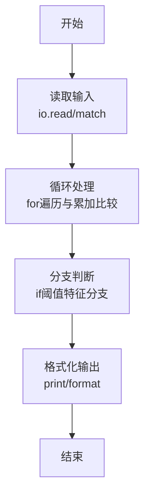
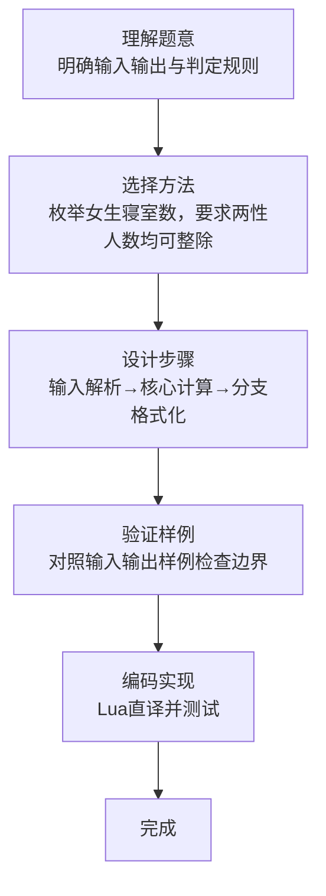

# L1-095 - 分寝室（20 分）

- **时间限制**: 400 ms
- **内存限制**: 65536 KB
- **代码长度限制**: 16 KB

---

## 题目描述


学校新建了宿舍楼，共有 $n$ 间寝室。等待分配的学生中，有女生 $n_0$ 位、男生 $n_1$ 位。所有待分配的学生都必须分到一间寝室。所有的寝室都要分出去，最后不能有寝室留空。\
现请你写程序完成寝室的自动分配。分配规则如下：

* 男女生不能混住；
* 不允许单人住一间寝室；
* 对每种性别的学生，每间寝室入住的人数都必须相同；例如不能出现一部分寝室住 2 位女生，一部分寝室住 3 位女生的情况。但女生寝室都是 2 人一间，男生寝室都是 3 人一间，则是允许的；
* 在有多种分配方案满足前面三项要求的情况下，要求两种性别每间寝室入住的人数差最小。

### 输入格式:

输入在一行中给出 3 个正整数 $n_0$、$n_1$、$n$，分别对应女生人数、男生人数、寝室数。数字间以空格分隔，均不超过 $10^5$。

### 输出格式:

在一行中顺序输出女生和男生被分配的寝室数量，其间以 1 个空格分隔。行首尾不得有多余空格。\
如果有解，题目保证解是唯一的。如果无解，则在一行中输出 `No Solution`。

### 输入样例 1：
```in
24 60 10
```

### 输出样例 1：
```out
4 6
```

### 输入样例 2：
```in
29 30 10
```

### 输出样例 2：
```out
No Solution
```

## 示例

### 示例 1

**输入:**
```
24 60 10
```

**输出:**
```
4 6
```

### 示例 2

**输入:**
```
29 30 10
```

**输出:**
```
No Solution
```
### 解题思路

本题属于分寝室题型，核心在于枚举女生寝室数，要求两性人数均可整除且每间至少两人，选择人数差最小方案。输入规模较小，可直接按题意模拟，无需复杂数据结构。

算法上采用循环遍历配合条件分支：通过 `for/while` 逐项处理输入，利用 `if` 判断实现题设的分支逻辑（如阈值比较、分类输出或异常检测），与 Lua 代码中 `for`/`if` 的结构一一对应。

复杂度方面，遍历部分为 O(N)，额外空间 O(1)（除输入缓冲外）。边界上注意空输入、格式空格及数值精度的处理，Lua 中通过 `tonumber`/`string.format` 保证转换与保留小数位的正确性。

### 代码流程说明

1. **输入解析**：使用 `io.read("*l"):match` 按模式提取字段并经 `tonumber` 转换，得到数值或字符串形式的原始数据，必要时做 `tonumber` 类型转换与去空格处理。
2. **核心计算**：枚举女生寝室数，要求两性人数均可整除且每间至少两人，选择人数差最小方案，在循环体内逐项累加、比较或变换（如代码中的 `for` 循环体），维护中间变量（如求和、计数、查表）。
3. **分支判定**：依据阈值或特征进行 `if-else` 分支，选择不同输出文案或标记异常。
4. **输出**：通过 `print` 按行输出结果，含必要的换行与精度控制，完成题目要求的全部输出。

### 代码实现

```lua
-- 实现原理：枚举女生寝室数，要求两性人数均可整除且每间至少两人，选择人数差最小方案。
local g,b,n=io.read("*l"):match("(%d+)%s+(%d+)%s+(%d+)"); g,b,n=tonumber(g),tonumber(b),tonumber(n); local bg,bb,bd=nil,nil,math.huge
for gr=1,n-1 do local br=n-gr; if g%gr==0 and b%br==0 then local x,y=g//gr,b//br; if x>=2 and y>=2 and math.abs(x-y)<bd then bg,bb,bd=gr,br,math.abs(x-y) end end end
if bg then print(bg.." "..bb) else print("No Solution") end
```

### 代码流程图



### 解题流程图


