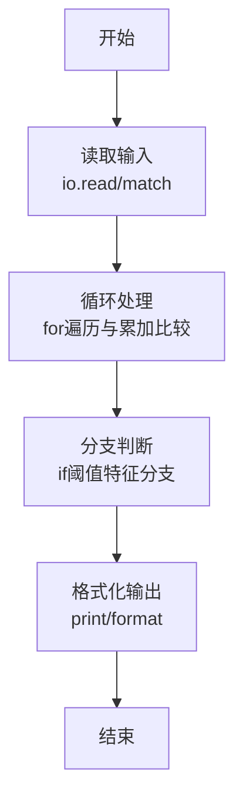
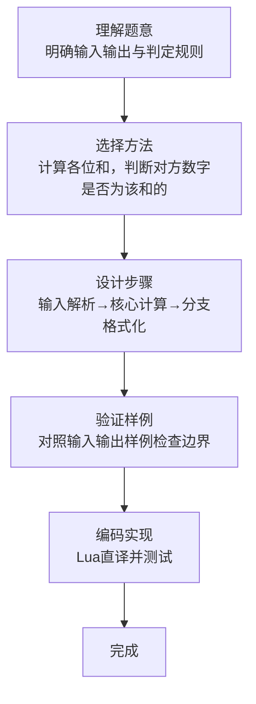

# L1-096 - 谁管谁叫爹（20 分）

- **时间限制**: 400 ms
- **内存限制**: 65536 KB
- **代码长度限制**: 16 KB

---

## 题目描述


《咱俩谁管谁叫爹》是网上一首搞笑饶舌歌曲，来源于东北酒桌上的助兴游戏。现在我们把这个游戏的难度拔高一点，多耗一些智商。
不妨设游戏中的两个人为 A 和 B。游戏开始后，两人同时报出两个整数 $$N_A$$ 和 $$N_B$$。判断谁是爹的标准如下：
- 将两个整数的各位数字分别相加，得到两个和 $$S_A$$ 和 $$S_B$$。如果 $$N_A$$ 正好是 $$S_B$$ 的整数倍，则 A 是爹；如果 $$N_B$$ 正好是 $$S_A$$ 的整数倍，则 B 是爹；
- 如果两人同时满足、或同时不满足上述判定条件，则原始数字大的那个是爹。
本题就请你写一个自动裁判程序，判定谁是爹。

### 输入格式:

输入第一行给出一个正整数 $$N$$（$$\le 100$$），为游戏的次数。以下 $$N$$ 行，每行给出一对不超过 9 位数的正整数，对应 A 和 B 给出的原始数字。题目保证两个数字不相等。

### 输出格式:

对每一轮游戏，在一行中给出赢得“爹”称号的玩家（`A` 或 `B`）。

### 输入样例:
```in
4
999999999 891
78250 3859
267537 52654299
6666 120
```

### 输出样例:
```out
B
A
B
A
```

## 示例

### 示例 1

**输入:**
```
4
999999999 891
78250 3859
267537 52654299
6666 120
```

**输出:**
```
B
A
B
A
```
### 解题思路

本题属于谁管谁叫爹题型，核心在于计算各位和，判断对方数字是否为该和的倍数；同真同假时比较原数大小。输入规模较小，可直接按题意模拟，无需复杂数据结构。

算法上采用循环遍历配合条件分支：通过 `for/while` 逐项处理输入，利用 `if` 判断实现题设的分支逻辑（如阈值比较、分类输出或异常检测），与 Lua 代码中 `for`/`if` 的结构一一对应。

复杂度方面，遍历部分为 O(N)，额外空间 O(1)（除输入缓冲外）。边界上注意空输入、格式空格及数值精度的处理，Lua 中通过 `tonumber`/`string.format` 保证转换与保留小数位的正确性。

### 代码流程说明

1. **输入解析**：使用 `io.read("*l")` 配合 `gmatch` 逐 token 解析输入，得到数值或字符串形式的原始数据，必要时做 `tonumber` 类型转换与去空格处理。
2. **核心计算**：计算各位和，判断对方数字是否为该和的倍数；同真同假时比较原数大小，在循环体内逐项累加、比较或变换（如代码中的 `for` 循环体），维护中间变量（如求和、计数、查表）。
3. **分支判定**：依据阈值或特征进行 `if-else` 分支，选择不同输出文案或标记异常。
4. **输出**：通过 `print` 按行输出结果，含必要的换行与精度控制，完成题目要求的全部输出。

### 代码实现

```lua
-- 实现原理：计算各位和，判断对方数字是否为该和的倍数；同真同假时比较原数大小。
local function ds(s) local r=0; for d in s:gmatch("%d") do r=r+tonumber(d) end; return r end
local n=tonumber(io.read("*l")); for _=1,n do local a,b=io.read("*l"):match("(%d+)%s+(%d+)"); local x,y=tonumber(a)%ds(b)==0,tonumber(b)%ds(a)==0; if x~=y then print(x and "A" or "B") else print(tonumber(a)>tonumber(b) and "A" or "B") end end
```

### 代码流程图



### 解题流程图


