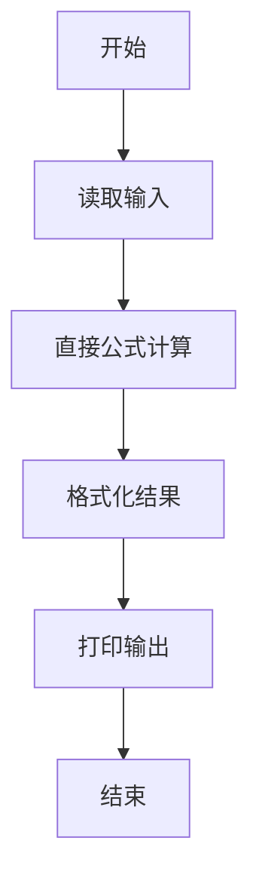
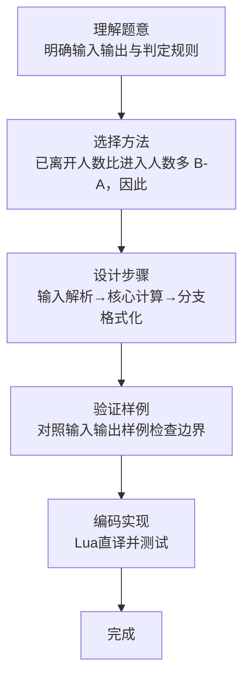

# L1-098 - 再进去几个人（5 分）

- **时间限制**: 400 ms
- **内存限制**: 65536 KB
- **代码长度限制**: 16 KB

---

## 题目描述


数学家、生物学家和物理学家坐在街头咖啡屋里，看着人们从街对面的一间房子走进走出。他们先看到两个人进去。时光流逝。他们又看到三个人出来。
物理学家:“测量不够准确。”
生物学家:“他们进行了繁殖。”
数学家:“如果现在再进去一个人，那房子就空了。”
下面就请你写个程序，根据进去和出来的人数，帮数学家算出来，再进去几个人，那房子就空了。

### 输入格式:

输入在一行中给出 2 个不超过 100 的正整数 A 和 B，其中 A 是进去的人数，B 是出来的人数。题目保证 B 比 A 要大。

### 输出格式:

在一行中输出使得房子变空的、需要再进去的人数。

### 输入样例:
```in
4 7
```

### 输出样例:
```out
3
```

## 示例

### 示例 1

**输入:**
```
4 7
```

**输出:**
```
3
```
### 解题思路

本题属于再进去几个人题型，核心在于已离开人数比进入人数多 B-A，因此再进入 B-A 人即可使人数归零。输入规模较小，可直接按题意模拟，无需复杂数据结构。

算法直接按公式或规则计算：读取输入后通过算术或字符串运算一次性得到结果，无需循环，体现为代码中的直算与格式化输出。

边界与精度方面，需处理输入首尾空格、空行及数值类型转换；输出按题面要求的格式（如保留小数、固定文案）使用 `string.format`/`print` 精确控制，确保样例一致。

### 代码流程说明

1. **输入解析**：使用 `io.read("*l"):match` 按模式提取字段并经 `tonumber` 转换，得到数值或字符串形式的原始数据，必要时做 `tonumber` 类型转换与去空格处理。
2. **核心计算**：已离开人数比进入人数多 B-A，因此再进入 B-A 人即可使人数归零，通过一次算术或逻辑表达式直接求得结果。
3. **结果整理**：对计算结果进行格式化或拼接（如 `string.format`、`table.concat`），保证输出符合样例。
4. **输出**：通过 `print` 按行输出结果，含必要的换行与精度控制，完成题目要求的全部输出。

### 代码实现

```lua
-- 实现原理：已离开人数比进入人数多 B-A，因此再进入 B-A 人即可使人数归零。
local a,b=io.read("*l"):match("(%d+)%s+(%d+)"); print(tonumber(b)-tonumber(a))
```

### 代码流程图



### 解题流程图


