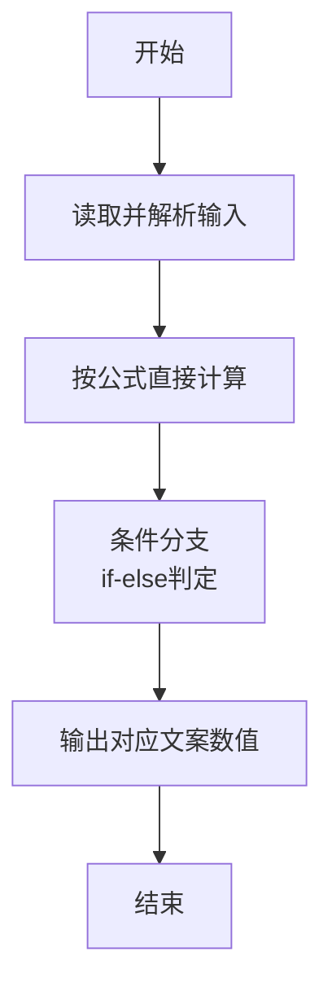
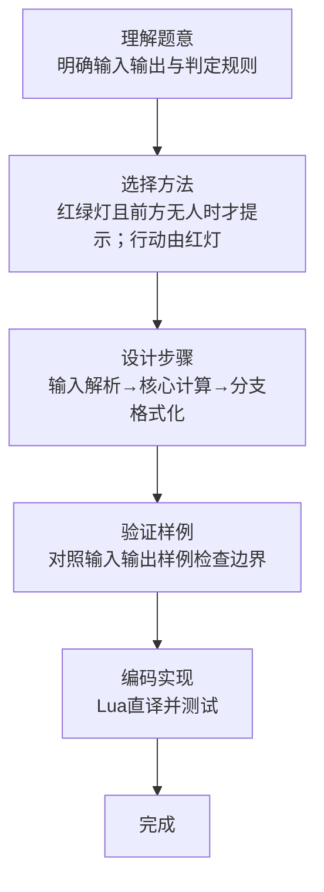

# L1-099 - 帮助色盲（10 分）

- **时间限制**: 400 ms
- **内存限制**: 65536 KB
- **代码长度限制**: 16 KB

---

## 题目描述


在古老的红绿灯面前，红绿色盲患者无法分辨当前亮起的灯是红色还是绿色，有些聪明人通过路口的策略是这样的：当红灯或绿灯亮起时，灯的颜色无法判断，但前方两米内有同向行走的人，就跟着前面那人行动，人家走就跟着走，人家停就跟着停；如果当前是黄灯，那么很快就要变成红灯了，于是应该停下来。麻烦的是，当灯的颜色无法判断时，前方两米内没有人……
本题就请你写一个程序，通过产生不同的提示音来帮助红绿色盲患者判断当前交通灯的颜色；但当患者可以自行判断的时候（例如黄灯或者前方两米内有人），就不做多余的打扰。具体要求的功能为：当前交通灯为红灯或绿灯时，检测其前方两米内是否有同向行走的人 —— 如果有，则患者自己可以判断，程序就不做提示；如果没有，则根据灯的颜色给出不同的提示音。黄灯也不需要给出提示。

### 输入格式:

输入在一行中给出两个数字 A 和 B，其间以空格分隔。其中 A 是当前交通灯的颜色，取值为 0 表示红灯、1 表示绿灯、2 表示黄灯；B 是前方行人的状态，取值为 0 表示前方两米内没有同向行走的人、1 表示有。

### 输出格式:

根据输入的状态在第一行中输出提示音：`dudu` 表示前方为绿灯，可以继续前进；`biii` 表示前方为红灯，应该止步；`-` 表示不做提示。在第二行输出患者应该执行的动作：`move` 表示继续前进、`stop` 表示止步。

### 输入样例 1：
```in
0 0
```

### 输出样例 1：
```out
biii
stop
```

### 输入样例 2：
```in
1 1
```

### 输出样例 2：
```out
-
move
```

## 示例

### 示例 1

**输入:**
```
0 0
```

**输出:**
```
biii
stop
```

### 示例 2

**输入:**
```
1 1
```

**输出:**
```
-
move
```
### 解题思路

本题属于帮助色盲题型，核心在于红绿灯且前方无人时才提示；行动由红灯决定停止，其余情况前进。输入规模较小，可直接按题意模拟，无需复杂数据结构。

算法核心是条件判断：根据输入数值或字符串特征通过 `if-else` 分支选择不同输出路径，直接映射题目给出的判定规则，代码中即体现为多分支的 `if` 结构。

边界与精度方面，需处理输入首尾空格、空行及数值类型转换；输出按题面要求的格式（如保留小数、固定文案）使用 `string.format`/`print` 精确控制，确保样例一致。

### 代码流程说明

1. **输入解析**：使用 `io.read("*l"):match` 按模式提取字段并经 `tonumber` 转换，得到数值或字符串形式的原始数据，必要时做 `tonumber` 类型转换与去空格处理。
2. **核心计算**：红绿灯且前方无人时才提示；行动由红灯决定停止，其余情况前进，通过一次算术或逻辑表达式直接求得结果。
3. **分支判定**：依据阈值或特征进行 `if-else` 分支，选择不同输出文案或标记异常。
4. **输出**：通过 `print` 按行输出结果，含必要的换行与精度控制，完成题目要求的全部输出。

### 代码实现

```lua
-- 实现原理：红绿灯且前方无人时才提示；行动由红灯决定停止，其余情况前进。
local a,b=io.read("*l"):match("(%d+)%s+(%d+)"); a,b=tonumber(a),tonumber(b); if b==1 or a==2 then print("-") elseif a==0 then print("biii") else print("dudu") end; print(a==0 and "stop" or "move")
```

### 代码流程图



### 解题流程图


