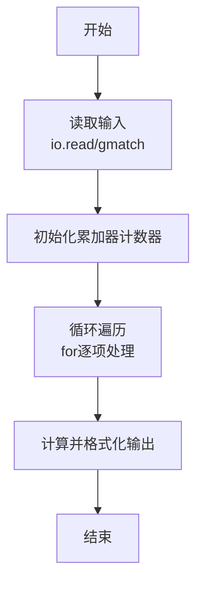
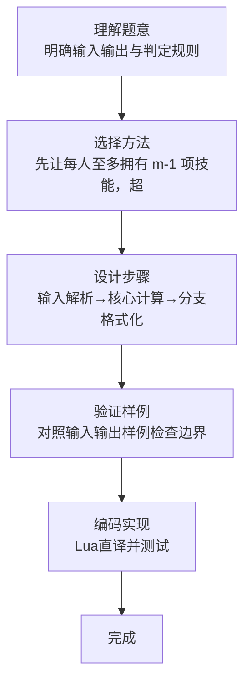

# L1-100 - 四项全能（10 分）

- **时间限制**: 400 ms
- **内存限制**: 65536 KB
- **代码长度限制**: 16 KB

---

## 题目描述


新浪微博上有一个帖子给出了一道题：全班有 50 人，有 30 人会游泳，有 35 人会篮球，有 42 人会唱歌，有 46 人会骑车，至少有（ ）人四项都会。
发帖人不会做这道题，但是回帖有会做的：每一个才艺是一个技能点，一共是 $30+35+42+46=153$ 个技能点，50 个人假设平均分配，每人都会 3 个技能那也只有 150，所以至少有 3 人会四个技能。
本题就请你写个程序来自动解决这类问题：给定全班总人数为 $n$，其中有 $m$ 项技能，分别有 $k_1$、$k_2$、……、$k_m$ 个人会，问至少有多少人 $m$ 项都会。

### 输入格式:

输入在第一行中给出 2 个正整数：$n$（$4\le n\le 1000$）和 $m$（$1<m\le n/2$），分别对应全班人数和技能总数。随后一行给出 $m$ 个不超过 $n$ 的正整数，其中第 $i$ 个整数对应会第 $i$ 项技能的人数。

### 输出格式:

输出至少有多少人 $m$ 项都会。

### 输入样例:
```in
50 4
30 35 42 46
```

### 输出样例:
```out
3
```

## 示例

### 示例 1

**输入:**
```
50 4
30 35 42 46
```

**输出:**
```
3
```
### 解题思路

本题属于四项全能题型，核心在于先让每人至多拥有 m-1 项技能，超出的总技能点必属于全能者。输入规模较小，可直接按题意模拟，无需复杂数据结构。

算法上采用线性遍历：对输入序列使用 `for` 循环逐个处理，累加或变换得到中间结果，再一次性计算最终答案，时间复杂度为 O(N)，与代码中的循环部分一致。

复杂度方面，遍历部分为 O(N)，额外空间 O(1)（除输入缓冲外）。边界上注意空输入、格式空格及数值精度的处理，Lua 中通过 `tonumber`/`string.format` 保证转换与保留小数位的正确性。

### 代码流程说明

1. **输入解析**：使用 `io.read("*l")` 配合 `gmatch` 逐 token 解析输入，得到数值或字符串形式的原始数据，必要时做 `tonumber` 类型转换与去空格处理。
2. **核心计算**：先让每人至多拥有 m-1 项技能，超出的总技能点必属于全能者，在循环体内逐项累加、比较或变换（如代码中的 `for` 循环体），维护中间变量（如求和、计数、查表）。
3. **结果整理**：对计算结果进行格式化或拼接（如 `string.format`、`table.concat`），保证输出符合样例。
4. **输出**：通过 `print` 按行输出结果，含必要的换行与精度控制，完成题目要求的全部输出。

### 代码实现

```lua
-- 实现原理：先让每人至多拥有 m-1 项技能，超出的总技能点必属于全能者。
local n,m=io.read("*l"):match("(%d+)%s+(%d+)"); local sum=0; for x in io.read("*l"):gmatch("%d+") do sum=sum+tonumber(x) end; print(math.max(0,sum-tonumber(n)*(tonumber(m)-1)))
```

### 代码流程图



### 解题流程图


