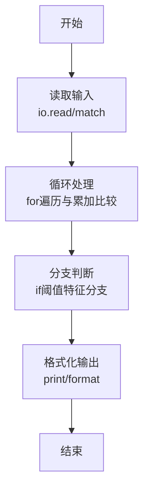
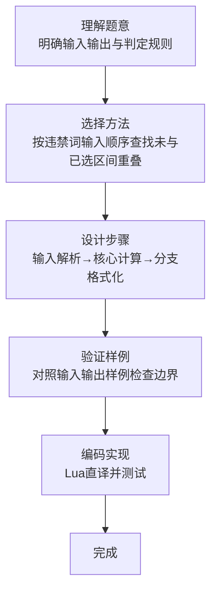

# L1-101 - 别再来这么多猫娘了！（15 分）

- **时间限制**: 400 ms
- **内存限制**: 65536 KB
- **代码长度限制**: 16 KB

---

## 题目描述


以 GPT 技术为核心的人工智能系统出现后迅速引领了行业的变革，不仅用于大量的语言工作（如邮件编写或文章生成等工作），还被应用在一些较特殊的领域——例如去年就有同学尝试使用 ChatGPT 作弊并被当场逮捕（全校被取消成绩）。相信聪明的你一定不会犯一样的错误！

言归正传，对于 GPT 类的 AI，一个使用方式受到不少年轻用户的欢迎——将 AI 变成猫娘：

<br/>


*部分公司使用 AI 进行网络营销，网友同样乐于使用“变猫娘”的方式进行反击。注意：图中内容与题目无关，如无法看到图片不影响解题。*

<br/>

当然，由于训练数据里并不区分道德或伦理倾向，因此如果不加审查，AI 会生成大量的、不一定符合社会公序良俗的内容。尽管关于这个问题仍有争论，但至少在比赛中，我们还是期望 AI 能用于对人类更有帮助的方向上，少来一点猫娘。

因此你的工作是实现一个审查内容的代码，用于对 AI 生成的内容的初步审定。更具体地说，你会得到一段由大小写字母、数字、空格及 ASCII 码范围内的标点符号的文字，以及若干个违禁词以及警告阈值，你需要首先检查内容里有多少违禁词，如果少于阈值个，则简单地将违禁词替换为```<censored>```；如果大于等于阈值个，则直接输出一段警告并输出有几个违禁词。

### 输入格式:

输入第一行是一个正整数 $N$ ($1 \le N \le 100$)，表示违禁词的数量。接下来的 $N$ 行，每行一个长度不超过 10 的、只包含大小写字母、数字及 ASCII 码范围内的标点符号的单词，表示应当屏蔽的违禁词。
然后的一行是一个非负整数 $k$ ($0 \le k \le 100$)，表示违禁词的阈值。
最后是一行不超过 5000 个字符的字符串，表示需要检查的文字。
从左到右处理文本，违禁词则按照输入顺序依次处理；对于有重叠的情况，无论计数还是替换，查找完成后从违禁词末尾继续处理。

### 输出格式:

如果违禁词数量小于阈值，则输出替换后的文本；否则先输出一行一个数字，表示违禁词的数量，然后输出```He Xie Ni Quan Jia!```。

### 输入样例 1：
```in
5
MaoNiang
SeQing
BaoLi
WeiGui
BuHeShi
4
BianCheng MaoNiang ba! WeiGui De Hua Ye Keyi Shuo! BuYao BaoLi NeiRong.
```

### 输出样例 1：
```out
BianCheng <censored> ba! <censored> De Hua Ye Keyi Shuo! BuYao <censored> NeiRong.
```

### 输入样例 2：
```in
5
MaoNiang
SeQing
BaoLi
WeiGui
BuHeShi
3
BianCheng MaoNiang ba! WeiGui De Hua Ye Keyi Shuo! BuYao BaoLi NeiRong.
```

### 输出样例 2：
```out
3
He Xie Ni Quan Jia!
```

### 输入样例 3：
```in
2
AA
BB
3
AAABBB
```

### 输出样例 3：
```out
<censored>A<censored>B
```

### 输入样例 4：
```in
2
AB
BB
3
AAABBB
```

### 输出样例 4：
```out
AA<censored><censored>
```

### 输入样例 5：
```in
2
BB
AB
3
AAABBB
```

### 输出样例 5：
```out
AAA<censored>B
```

## 示例

### 示例 1

**输入:**
```
5
MaoNiang
SeQing
BaoLi
WeiGui
BuHeShi
4
BianCheng MaoNiang ba! WeiGui De Hua Ye Keyi Shuo! BuYao BaoLi NeiRong.
```

**输出:**
```
BianCheng <censored> ba! <censored> De Hua Ye Keyi Shuo! BuYao <censored> NeiRong.
```

### 示例 2

**输入:**
```
5
MaoNiang
SeQing
BaoLi
WeiGui
BuHeShi
3
BianCheng MaoNiang ba! WeiGui De Hua Ye Keyi Shuo! BuYao BaoLi NeiRong.
```

**输出:**
```
3
He Xie Ni Quan Jia!
```

### 示例 3

**输入:**
```
2
AA
BB
3
AAABBB
```

**输出:**
```
<censored>A<censored>B
```

### 示例 4

**输入:**
```
2
AB
BB
3
AAABBB
```

**输出:**
```
AA<censored><censored>
```

### 示例 5

**输入:**
```
2
BB
AB
3
AAABBB
```

**输出:**
```
AAA<censored>B
```
### 解题思路

本题属于别再来这么多题型，核心在于按违禁词输入顺序查找未与已选区间重叠的出现位置；计数达阈值时只报警，否则统一替换。输入规模较小，可直接按题意模拟，无需复杂数据结构。

算法上采用循环遍历配合条件分支：通过 `for/while` 逐项处理输入，利用 `if` 判断实现题设的分支逻辑（如阈值比较、分类输出或异常检测），与 Lua 代码中 `for`/`if` 的结构一一对应。

复杂度方面，遍历部分为 O(N)，额外空间 O(1)（除输入缓冲外）。边界上注意空输入、格式空格及数值精度的处理，Lua 中通过 `tonumber`/`string.format` 保证转换与保留小数位的正确性。

### 代码流程说明

1. **输入解析**：使用 `io.read` 直接读取输入行，得到数值或字符串形式的原始数据，必要时做 `tonumber` 类型转换与去空格处理。
2. **核心计算**：按违禁词输入顺序查找未与已选区间重叠的出现位置；计数达阈值时只报警，否则统一替换，在循环体内逐项累加、比较或变换（如代码中的 `for` 循环体），维护中间变量（如求和、计数、查表）。
3. **分支判定**：依据阈值或特征进行 `if-else` 分支，选择不同输出文案或标记异常。
4. **输出**：通过 `print` 按行输出结果，含必要的换行与精度控制，完成题目要求的全部输出。

### 代码实现

```lua
-- 实现原理：按违禁词输入顺序查找未与已选区间重叠的出现位置；计数达阈值时只报警，否则统一替换。
local n=tonumber(io.read("*l")); local words={}; for i=1,n do words[i]=io.read("*l") end; local limit=tonumber(io.read("*l")); local text=io.read("*l"); local marked,count={},0
for _,word in ipairs(words) do local start=1; while true do local p=text:find(word,start,true); if not p then break end; local ok=true; for i=p,p+#word-1 do if marked[i] then ok=false; break end end; if ok then for i=p,p+#word-1 do marked[i]=true end; count=count+1 end; start=p+#word end end
if count>=limit then print(count); print("He Xie Ni Quan Jia!") else local out,i={},1; while i<=#text do if marked[i] then while marked[i] do i=i+1 end; out[#out+1]="<censored>" else out[#out+1]=text:sub(i,i); i=i+1 end end; print(table.concat(out)) end
```

### 代码流程图



### 解题流程图


