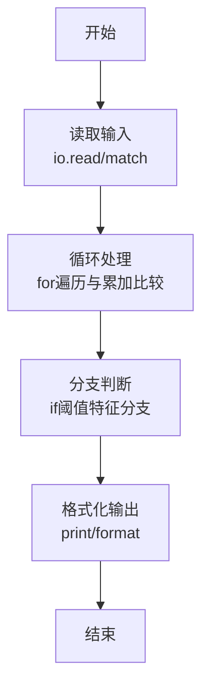
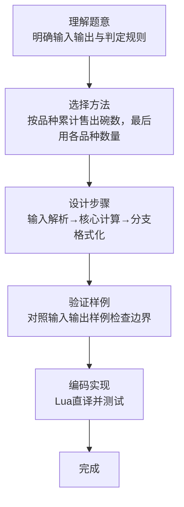

# L1-102 - 兰州牛肉面（15 分）

- **时间限制**: 400 ms
- **内存限制**: 65536 KB
- **代码长度限制**: 16 KB

---

## 题目描述


兰州牛肉面是历史悠久的美食，根据牛肉面的宽窄、配料的种类，可以细分为上百个不同的品种。你进到兰州的任何一家牛肉面馆，只说：“来一碗牛肉面！”就好像进到加州的咖啡馆说“来一杯咖啡”一样，会被店主人当成外星人……
本题的任务是，请你写程序帮助一家牛肉面馆的老板统计一下，他们一天卖出各种品种的牛肉面有多少碗，营业额一共有多少。

### 输入格式:

输入第一行给出一个正整数 $N$（$\le 100$），为牛肉面的种类数量。这里为了简单起见，我们把不同种类的牛肉面从 1 到 $N$ 编号，以后就用编号代替牛肉面品种的名称。第二行给出 $N$ 个价格，第 $i$ 个价格对应第 $i$ 种牛肉面一碗的单价。这里的价格是 [0.01, 200.00] 区间内的实数，以元为单位，精确到分。
随后是一天内客人买面的记录，每条记录占一行，格式为：
```
品种编号 碗数
```
其中`碗数`保证是正整数。当对应的 `品种编号` 为 `0` 时，表示输入结束。这个记录不算在内。

### 输出格式:

首先输出 $N$ 行，第 $i$ 行输出第 $i$ 种牛肉面卖出了多少碗。最后一行输出当天的总营业额，仍然是以元为单位，精确到分。题目保证总营业额不超过 $10^6$。

### 输入样例:
```in
5
4.00 8.50 3.20 12.00 14.10
3 5
5 2
1 1
2 3
2 2
1 9
0 0
```

### 输出样例:
```out
10
5
5
0
2
126.70
```

## 示例

### 示例 1

**输入:**
```
5
4.00 8.50 3.20 12.00 14.10
3 5
5 2
1 1
2 3
2 2
1 9
0 0
```

**输出:**
```
10
5
5
0
2
126.70
```
### 解题思路

本题属于兰州牛肉面题型，核心在于按品种累计售出碗数，最后用各品种数量乘单价累加营业额。输入规模较小，可直接按题意模拟，无需复杂数据结构。

算法上采用循环遍历配合条件分支：通过 `for/while` 逐项处理输入，利用 `if` 判断实现题设的分支逻辑（如阈值比较、分类输出或异常检测），与 Lua 代码中 `for`/`if` 的结构一一对应。

复杂度方面，遍历部分为 O(N)，额外空间 O(1)（除输入缓冲外）。边界上注意空输入、格式空格及数值精度的处理，Lua 中通过 `tonumber`/`string.format` 保证转换与保留小数位的正确性。

### 代码流程说明

1. **输入解析**：使用 `io.read("*l")` 配合 `gmatch` 逐 token 解析输入，得到数值或字符串形式的原始数据，必要时做 `tonumber` 类型转换与去空格处理。
2. **核心计算**：按品种累计售出碗数，最后用各品种数量乘单价累加营业额，在循环体内逐项累加、比较或变换（如代码中的 `for` 循环体），维护中间变量（如求和、计数、查表）。
3. **分支判定**：依据阈值或特征进行 `if-else` 分支，选择不同输出文案或标记异常。
4. **输出**：通过 `print` 按行输出结果，含必要的换行与精度控制，完成题目要求的全部输出。

### 代码实现

```lua
-- 实现原理：按品种累计售出碗数，最后用各品种数量乘单价累加营业额。
local n=tonumber(io.read("*l")); local price={}; for x in io.read("*l"):gmatch("[%d.]+") do price[#price+1]=tonumber(x) end; local sold={}; for i=1,n do sold[i]=0 end
while true do local id,count=io.read("*l"):match("(%d+)%s+(%d+)"); id,count=tonumber(id),tonumber(count); if id==0 then break end; sold[id]=sold[id]+count end
local total=0; for i=1,n do print(sold[i]); total=total+sold[i]*price[i] end; print(string.format("%.2f",total))
```

### 代码流程图



### 解题流程图


