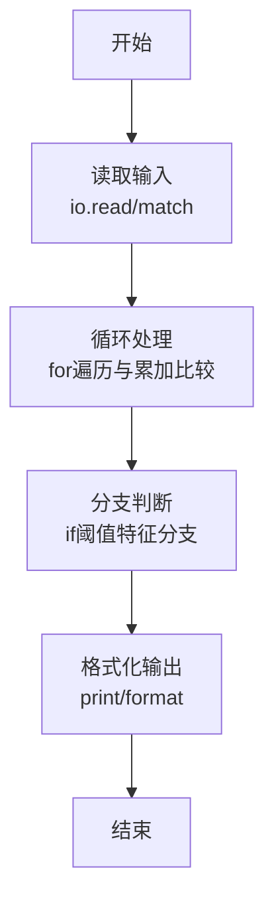
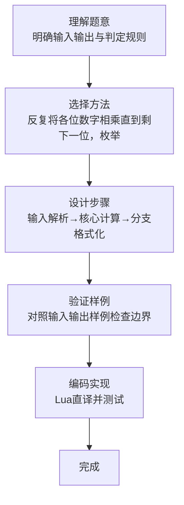

# L1-103 - 整数的持续性（20 分）

- **时间限制**: 400 ms
- **内存限制**: 65536 KB
- **代码长度限制**: 16 KB

---

## 题目描述


从任一给定的正整数 $n$ 出发，将其每一位数字相乘，记得到的乘积为 $n_1$。以此类推，令 $n_{i+1}$ 为 $n_i$ 的各位数字的乘积，直到最后得到一个个位数 $n_m$，则 $m$ 就称为 $n$ 的**持续性**。例如 $679$ 的持续性就是 5，因为我们从 $679$ 开始，得到 $6\times 7\times 9 = 378$，随后得到 $3\times 7\times 8 = 168$、$1\times 6\times 8 = 48$、$4\times 8 = 32$，最后得到 $3\times 2 = 6$，一共用了 5 步。
本题就请你编写程序，找出任一给定区间内持续性最长的整数。

### 输入格式:

输入在一行中给出两个正整数 $a$ 和 $b$（$1\le a \le b \le 10^9$ 且 $(b-a)<10^3$），为给定区间的两个端点。

### 输出格式:

首先在第一行输出区间 $[a, b]$ 内整数最长的持续性。随后在第二行中输出持续性最长的整数。如果这样的整数不唯一，则按照递增序输出，数字间以 1 个空格分隔，行首尾不得有多余空格。

### 输入样例:
```in
500 700
```

### 输出样例:
```out
5
679 688 697
```

## 示例

### 示例 1

**输入:**
```
500 700
```

**输出:**
```
5
679 688 697
```
### 解题思路

本题属于整数的持续性题型，核心在于反复将各位数字相乘直到剩下一位，枚举区间并收集持续性最大的数。输入规模较小，可直接按题意模拟，无需复杂数据结构。

算法上采用循环遍历配合条件分支：通过 `for/while` 逐项处理输入，利用 `if` 判断实现题设的分支逻辑（如阈值比较、分类输出或异常检测），与 Lua 代码中 `for`/`if` 的结构一一对应。

复杂度方面，遍历部分为 O(N)，额外空间 O(1)（除输入缓冲外）。边界上注意空输入、格式空格及数值精度的处理，Lua 中通过 `tonumber`/`string.format` 保证转换与保留小数位的正确性。

### 代码流程说明

1. **输入解析**：使用 `io.read("*l")` 配合 `gmatch` 逐 token 解析输入，得到数值或字符串形式的原始数据，必要时做 `tonumber` 类型转换与去空格处理。
2. **核心计算**：反复将各位数字相乘直到剩下一位，枚举区间并收集持续性最大的数，在循环体内逐项累加、比较或变换（如代码中的 `for` 循环体），维护中间变量（如求和、计数、查表）。
3. **分支判定**：依据阈值或特征进行 `if-else` 分支，选择不同输出文案或标记异常。
4. **输出**：通过 `print` 按行输出结果，含必要的换行与精度控制，完成题目要求的全部输出。

### 代码实现

```lua
-- 实现原理：反复将各位数字相乘直到剩下一位，枚举区间并收集持续性最大的数。
local a,b=io.read("*l"):match("(%d+)%s+(%d+)"); a,b=tonumber(a),tonumber(b)
local function persistence(x) local steps=0; while x>=10 do local p=1; for d in tostring(x):gmatch("%d") do p=p*tonumber(d) end; x=p; steps=steps+1 end; return steps end
local best,answer=-1,{}; for x=a,b do local p=persistence(x); if p>best then best,answer=p,{x} elseif p==best then answer[#answer+1]=x end end; print(best); print(table.concat(answer," "))
```

### 代码流程图



### 解题流程图


