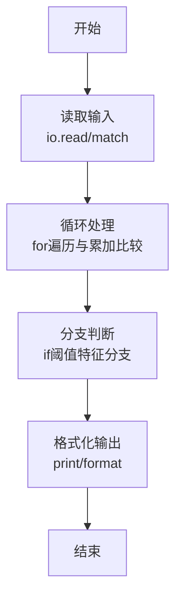
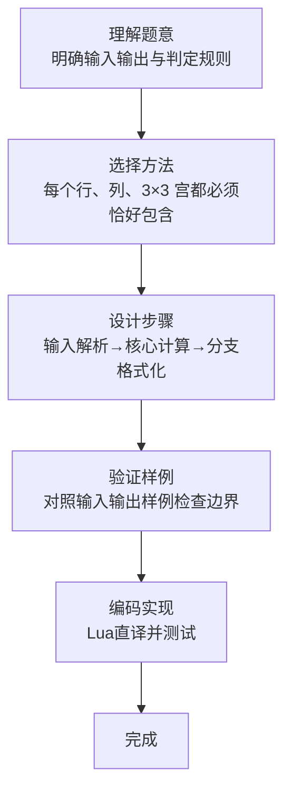

# L1-104 - 九宫格（20 分）

- **时间限制**: 400 ms
- **内存限制**: 65536 KB
- **代码长度限制**: 16 KB

---

## 题目描述


九宫格是一款数字游戏，传说起源于河图洛书，现代数学中称之为三阶幻方。游戏规则是：将一个 $9\times 9$ 的正方形区域划分为 9 个 $3\times 3$ 的正方形宫位，要求 1 到 9 这九个数字中的每个数字在每一行、每一列、每个宫位中都只能出现一次。
本题并不要求你写程序解决这个问题，只是对每个填好数字的九宫格，判断其是否满足游戏规则的要求。

### 输入格式:

输入首先在第一行给出一个正整数 $n$（$\le 10$），随后给出 $n$ 个填好数字的九宫格。每个九宫格分 9 行给出，每行给出 9 个数字，其间以空格分隔。

### 输出格式:

对每个给定的九宫格，判断其中的数字是否满足游戏规则的要求。满足则在一行中输出 1，否则输出 0。

### 输入样例:
```in
3
5 1 9 2 8 3 4 6 7
7 2 8 9 6 4 3 5 1
3 4 6 5 7 1 9 2 8
8 9 2 1 4 5 7 3 6
4 7 3 6 2 8 1 9 5
6 5 1 7 3 9 2 8 4
9 3 4 8 1 6 5 7 2
1 6 7 3 5 2 8 4 9
2 8 5 4 9 7 6 1 3
8 2 5 4 9 7 1 3 6
7 9 6 5 1 3 8 2 4
3 4 1 6 8 2 7 9 5
6 8 4 2 7 1 3 5 9
9 1 2 8 3 5 6 4 7
5 3 7 9 6 4 2 1 8
2 7 9 1 5 8 4 6 3
4 5 8 3 2 6 9 7 1
1 6 3 7 4 9 5 8 3
81 2 5 4 9 7 1 3 6
7 9 6 5 1 3 8 2 4
3 4 1 6 8 2 7 9 5
6 8 4 2 7 1 3 5 9
9 1 2 8 3 5 6 4 7
5 3 7 9 6 4 2 1 8
2 7 9 1 5 8 4 6 3
4 5 8 3 2 6 9 7 1
1 6 3 7 4 9 5 8 2
```

### 输出样例:
```out
1
0
0
```

## 示例

### 示例 1

**输入:**
```
3
5 1 9 2 8 3 4 6 7
7 2 8 9 6 4 3 5 1
3 4 6 5 7 1 9 2 8
8 9 2 1 4 5 7 3 6
4 7 3 6 2 8 1 9 5
6 5 1 7 3 9 2 8 4
9 3 4 8 1 6 5 7 2
1 6 7 3 5 2 8 4 9
2 8 5 4 9 7 6 1 3
8 2 5 4 9 7 1 3 6
7 9 6 5 1 3 8 2 4
3 4 1 6 8 2 7 9 5
6 8 4 2 7 1 3 5 9
9 1 2 8 3 5 6 4 7
5 3 7 9 6 4 2 1 8
2 7 9 1 5 8 4 6 3
4 5 8 3 2 6 9 7 1
1 6 3 7 4 9 5 8 3
81 2 5 4 9 7 1 3 6
7 9 6 5 1 3 8 2 4
3 4 1 6 8 2 7 9 5
6 8 4 2 7 1 3 5 9
9 1 2 8 3 5 6 4 7
5 3 7 9 6 4 2 1 8
2 7 9 1 5 8 4 6 3
4 5 8 3 2 6 9 7 1
1 6 3 7 4 9 5 8 2
```

**输出:**
```
1
0
0
```
### 解题思路

本题属于九宫格题型，核心在于每个行、列、3×3 宫都必须恰好包含 1~9，用集合检查重复即可。输入规模较小，可直接按题意模拟，无需复杂数据结构。

算法上采用循环遍历配合条件分支：通过 `for/while` 逐项处理输入，利用 `if` 判断实现题设的分支逻辑（如阈值比较、分类输出或异常检测），与 Lua 代码中 `for`/`if` 的结构一一对应。

复杂度方面，遍历部分为 O(N)，额外空间 O(1)（除输入缓冲外）。边界上注意空输入、格式空格及数值精度的处理，Lua 中通过 `tonumber`/`string.format` 保证转换与保留小数位的正确性。

### 代码流程说明

1. **输入解析**：使用 `io.read("*l")` 配合 `gmatch` 逐 token 解析输入，得到数值或字符串形式的原始数据，必要时做 `tonumber` 类型转换与去空格处理。
2. **核心计算**：每个行、列、3×3 宫都必须恰好包含 1~9，用集合检查重复即可，在循环体内逐项累加、比较或变换（如代码中的 `for` 循环体），维护中间变量（如求和、计数、查表）。
3. **分支判定**：依据阈值或特征进行 `if-else` 分支，选择不同输出文案或标记异常。
4. **输出**：通过 `print` 按行输出结果，含必要的换行与精度控制，完成题目要求的全部输出。

### 代码实现

```lua
-- 实现原理：每个行、列、3×3 宫都必须恰好包含 1~9，用集合检查重复即可。
local cases=tonumber(io.read("*l")); local function valid(a) local function check(vals) local seen={}; for _,v in ipairs(vals) do if v<1 or v>9 or seen[v] then return false end; seen[v]=true end; return true end; for i=1,9 do if not check(a[i]) then return false end; local col={}; for j=1,9 do col[j]=a[j][i] end; if not check(col) then return false end end; for r=1,9,3 do for c=1,9,3 do local box={}; for i=r,r+2 do for j=c,c+2 do box[#box+1]=a[i][j] end end; if not check(box) then return false end end end; return true end
for _=1,cases do local grid={}; for i=1,9 do grid[i]={}; for x in io.read("*l"):gmatch("%d+") do grid[i][#grid[i]+1]=tonumber(x) end end; print(valid(grid) and 1 or 0) end
```

### 代码流程图



### 解题流程图


