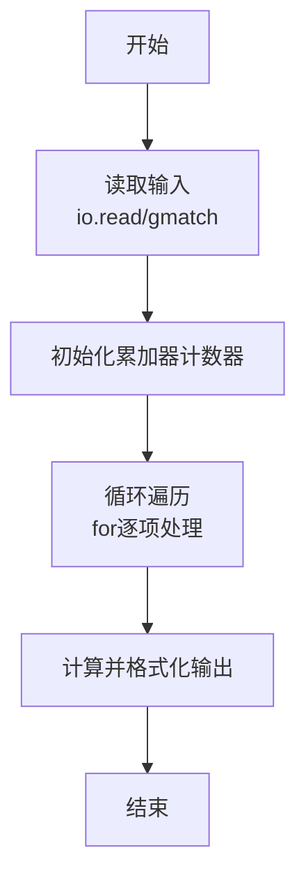
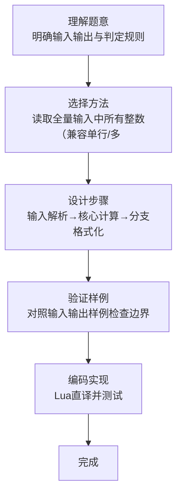

# L1-106 - 偷感好重（5 分）

- **时间限制**: 400 ms
- **内存限制**: 65536 KB
- **代码长度限制**: 16 KB

---

## 题目描述


以上图片截自新浪微博“iPanda 熊猫频道”，说“大熊猫吃苹果边吃边拿偷感好重。滚滚嘴里含 2 块，右手拿 1 块，左手捂 3 块…… 请问，它一共得到了多少块小苹果？”本题就请你计算一下这个问题的答案。

### 输入格式:

输入在一行中给出 3 个不超过 100 的正整数，分别为熊猫嘴里含的、右手拿的、左手捂的小苹果块数。同行数字间以空格分隔。

### 输出格式:

在一行中输出熊猫一共得到的小苹果块数。

### 输入样例:
```in
2 1 3
```

### 输出样例:
```out
6
```

## 示例

### 示例 1

**输入:**
```
2 1 3
```

**输出:**
```
6
```
### 解题思路

本题属于偷感好重题型，核心在于读取全量输入中所有整数（兼容单行/多行），取前三个求和；题面为嘴含+手拿+手捂三数之和，样例 $2+1+3=6$。输入规模较小，可直接按题意模拟，无需复杂数据结构。

算法上采用线性遍历：对输入序列使用 `for` 循环逐个处理，累加或变换得到中间结果，再一次性计算最终答案，时间复杂度为 O(N)，与代码中的循环部分一致。

复杂度方面，遍历部分为 O(N)，额外空间 O(1)（除输入缓冲外）。边界上注意空输入、格式空格及数值精度的处理，Lua 中通过 `tonumber`/`string.format` 保证转换与保留小数位的正确性。

### 代码流程说明

1. **输入解析**：使用 `io.read("*l")` 配合 `gmatch` 逐 token 解析输入，得到数值或字符串形式的原始数据，必要时做 `tonumber` 类型转换与去空格处理。
2. **核心计算**：读取全量输入中所有整数（兼容单行/多行），取前三个求和；题面为嘴含+手拿+手捂三数之和，样例 $2+1+3=6$，在循环体内逐项累加、比较或变换（如代码中的 `for` 循环体），维护中间变量（如求和、计数、查表）。
3. **结果整理**：对计算结果进行格式化或拼接（如 `string.format`、`table.concat`），保证输出符合样例。
4. **输出**：通过 `print` 按行输出结果，含必要的换行与精度控制，完成题目要求的全部输出。

### 代码实现

```lua
-- 实现原理：读取全量输入中所有整数（兼容单行/多行），取前三个求和；题面为嘴含+手拿+手捂三数之和，样例 2+1+3=6
local data = io.read("*a") or ""
local nums = {}
for x in data:gmatch("-?%d+") do nums[#nums+1] = tonumber(x) end
local sum = 0
for i = 1, math.min(3, #nums) do sum = sum + nums[i] end
-- 若输入不足3个数（健壮性），则对已有数求和；若多于3个数按题面仅取前3个
print(sum)
```

### 代码流程图



### 解题流程图


