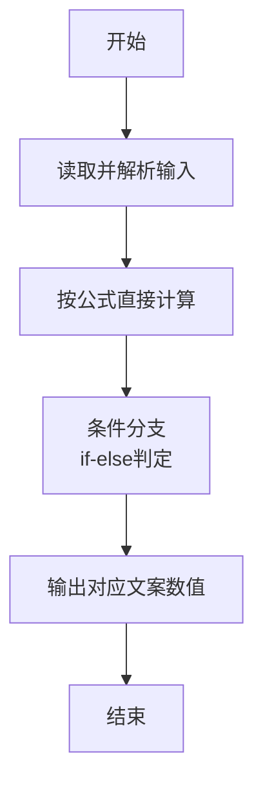
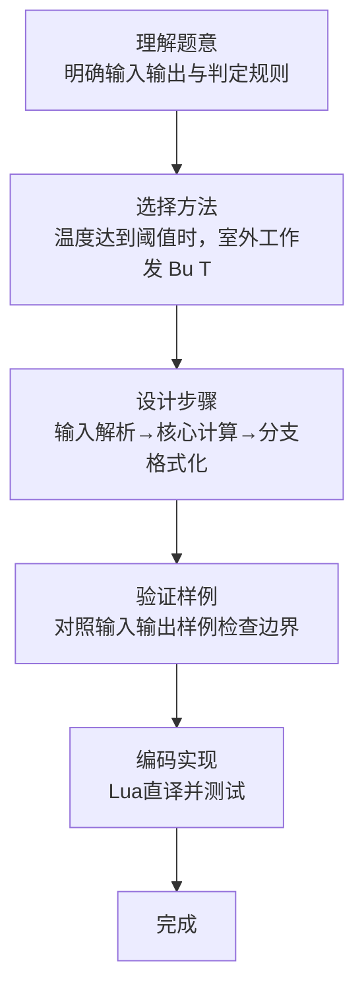

# L1-107 - 高温补贴（10 分）

- **时间限制**: 400 ms
- **内存限制**: 65536 KB
- **代码长度限制**: 16 KB

---

## 题目描述


高温补贴是为保证炎夏季节高温条件下经济建设和企业生产经营活动的正常进行，保障企业职工在劳动生产过程中的安全和身体健康进行的补贴。国家规定，用人单位安排劳动者在高温天气下（日最高气温达到 35° 以上），露天工作，以及不能采取有效措施将工作场所温度降低到 33° 以下的，应当向劳动者支付高温补贴。
给定当日最高气温、以及某用人单位的工作条件，请你写个程序判断，该单位员工能否获得高温补贴。

### 输入格式:

输入在一行中给出 3 个整数，即当日最高气温 $T$、工作场所状态 $S$、工作场所温度 $t$。其中温度为 $[-40, 50]$ 区间内的整数；工作场所状态为 1 表示露天，0 表示室内。

### 输出格式:

根据输入情况，如果可以获得高温补贴，则在一行中输出 `Bu Tie`（补贴），第二行输出 $T$ 的值；否则输出不补贴的原因：如果室内外温度都超标，仅仅是因为室内工作就不补贴，则输出 `Shi Nei`（室内），第二行输出 $T$ 的值；如果在室外工作但天气不热、或工作场所温度不高，则输出 `Bu Re`（不热），第二行输出 $t$ 的值；如果天气不热、或工作场所温度不高，且在室内工作，则输出 `Shu Shi`（舒适），第二行输出 $t$ 的值。

### 输入样例 1：
```in
36 1 33
```

### 输出样例 1：
```out
Bu Tie
36
```

### 输入样例 2：
```in
36 0 33
```

### 输出样例 2：
```out
Shi Nei
36
```

### 输入样例 3：
```in
36 1 27
```

### 输出样例 3：
```out
Bu Re
27
```

### 输入样例 4：
```in
36 0 24
```

### 输出样例 4：
```out
Shu Shi
24
```

## 示例

### 示例 1

**输入:**
```
36 1 33
```

**输出:**
```
Bu Tie
36
```

### 示例 2

**输入:**
```
36 0 33
```

**输出:**
```
Shi Nei
36
```

### 示例 3

**输入:**
```
36 1 27
```

**输出:**
```
Bu Re
27
```

### 示例 4

**输入:**
```
36 0 24
```

**输出:**
```
Shu Shi
24
```
### 解题思路

本题属于高温补贴题型，核心在于温度达到阈值时，室外工作发 Bu Tie、室内发 Shi Nei；未达到时分别发 Bu Re、Shu Shi。输入规模较小，可直接按题意模拟，无需复杂数据结构。

算法核心是条件判断：根据输入数值或字符串特征通过 `if-else` 分支选择不同输出路径，直接映射题目给出的判定规则，代码中即体现为多分支的 `if` 结构。

边界与精度方面，需处理输入首尾空格、空行及数值类型转换；输出按题面要求的格式（如保留小数、固定文案）使用 `string.format`/`print` 精确控制，确保样例一致。

### 代码流程说明

1. **输入解析**：使用 `io.read("*l"):match` 按模式提取字段并经 `tonumber` 转换，得到数值或字符串形式的原始数据，必要时做 `tonumber` 类型转换与去空格处理。
2. **核心计算**：温度达到阈值时，室外工作发 Bu Tie、室内发 Shi Nei；未达到时分别发 Bu Re、Shu Shi，通过一次算术或逻辑表达式直接求得结果。
3. **分支判定**：依据阈值或特征进行 `if-else` 分支，选择不同输出文案或标记异常。
4. **输出**：通过 `print` 按行输出结果，含必要的换行与精度控制，完成题目要求的全部输出。

### 代码实现

```lua
-- 实现原理：温度达到阈值时，室外工作发 Bu Tie、室内发 Shi Nei；未达到时分别发 Bu Re、Shu Shi。
local t,outdoor,limit=io.read("*l"):match("(%d+)%s+(%d+)%s+(%d+)"); t,outdoor,limit=tonumber(t),tonumber(outdoor),tonumber(limit); if t>=limit then print(outdoor==1 and "Bu Tie" or "Shi Nei") else print(outdoor==1 and "Bu Re" or "Shu Shi") end; print(t)
```

### 代码流程图



### 解题流程图


