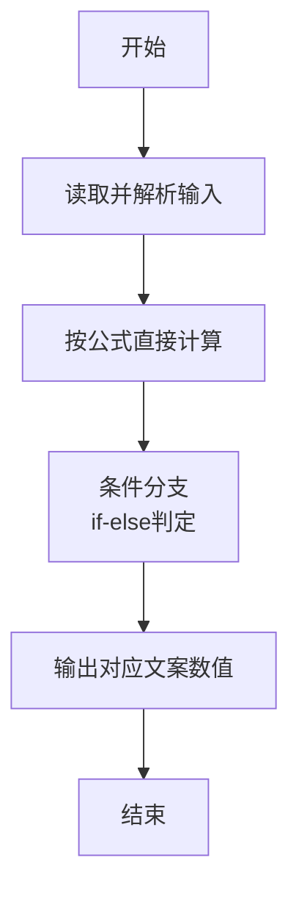
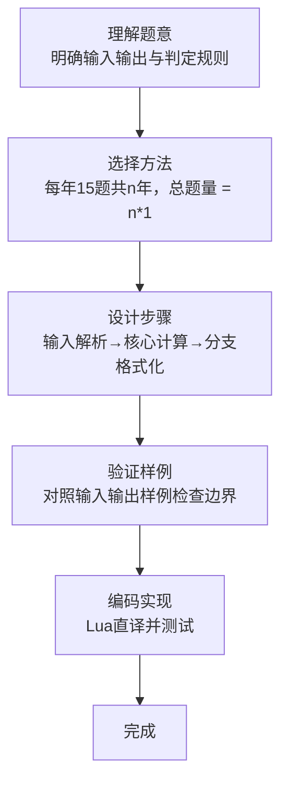

# L1-114 - 要刷多少题（5 分）

- **时间限制**: 400 ms
- **内存限制**: 65536 KB
- **代码长度限制**: 16 KB

---

## 题目描述


老师说：想在天梯赛取得好成绩，第一件事是把前面 $n$ 年的天梯赛真题做一遍。
已知每年的天梯赛有 15 道题目，全新不重复。请你算一下，一共要刷多少道真题？

### 输入格式:

输入第一行给出一个正整数 $n$（$\le 10$），为题面中所述老师提出的比赛年数。

### 输出格式:

在一行中输出学生需要做完的题目总数。

### 输入样例:
```in
2
```

### 输出样例:
```out
30
```

## 示例

### 示例 1

**输入:**
```
2
```

**输出:**
```
30
```
### 解题思路

本题属于要刷多少题题型，核心在于每年15题共n年，总题量 = n*15；稳健读取全量输入的首个整数，参数化计算而非硬编码。输入规模较小，可直接按题意模拟，无需复杂数据结构。

算法核心是条件判断：根据输入数值或字符串特征通过 `if-else` 分支选择不同输出路径，直接映射题目给出的判定规则，代码中即体现为多分支的 `if` 结构。

边界与精度方面，需处理输入首尾空格、空行及数值类型转换；输出按题面要求的格式（如保留小数、固定文案）使用 `string.format`/`print` 精确控制，确保样例一致。

### 代码流程说明

1. **输入解析**：使用 `io.read("*l"):match` 按模式提取字段并经 `tonumber` 转换，得到数值或字符串形式的原始数据，必要时做 `tonumber` 类型转换与去空格处理。
2. **核心计算**：每年15题共n年，总题量 = n*15；稳健读取全量输入的首个整数，参数化计算而非硬编码，通过一次算术或逻辑表达式直接求得结果。
3. **分支判定**：依据阈值或特征进行 `if-else` 分支，选择不同输出文案或标记异常。
4. **输出**：通过 `print` 按行输出结果，含必要的换行与精度控制，完成题目要求的全部输出。

### 代码实现

```lua
-- 实现原理：每年15题共n年，总题量 = n*15；稳健读取全量输入的首个整数，参数化计算而非硬编码
local data = io.read("*a") or ""
local n = tonumber(data:match("-?%d+"))
if n then print(n * 15) end
```

### 代码流程图



### 解题流程图


