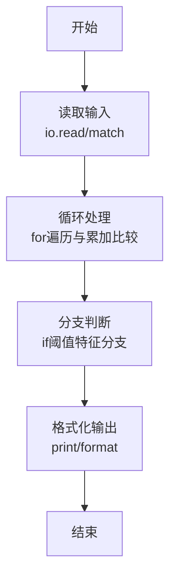
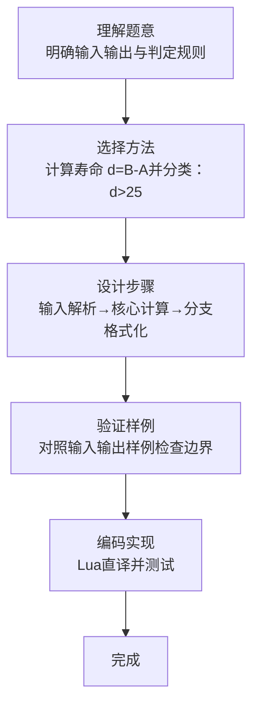

# L1-115 - 就挺突然的（10 分）

- **时间限制**: 400 ms
- **内存限制**: 65536 KB
- **代码长度限制**: 16 KB

---

## 题目描述


上面是新浪微博上的一张图，内容是“蹲厕所时突然想到，2026 年出生的孩子，能活到 3001 年”，就，挺突然的……

本题假设人类最长寿命为 250 岁，请你编写程序判断一下墙上的标语是否合理。

### 输入格式:

输入在一行给出 2 个不超过 5000 的正整数 $A$ 和 $B$，对应的标语为“蹲厕所时突然想到，$A$ 年出生的孩子，能活到 $B$ 年”。

### 输出格式:

首先在第一行输出写标语的人认为 $A$ 年出生的孩子有多长的寿命。如果该寿命超过了人类最长寿命，在第二行中输出 `jiu ting tu ran de...`；如果该寿命不是正数，输出 `hai sheng ma?`；如果寿命在正常范围内，输出 `nin tai cong ming le!`

### 输入样例 1：
```in
2026 3001
```

### 输出样例 1：
```out
975
jiu ting tu ran de...
```

### 输入样例 2：
```in
3001 2026
```

### 输出样例 2：
```out
-975
hai sheng ma?
```

### 输入样例 3：
```in
2025 2275
```

### 输出样例 3：
```out
250
nin tai cong ming le!
```

## 示例

### 示例 1

**输入:**
```
2026 3001
```

**输出:**
```
975
jiu ting tu ran de...
```

### 示例 2

**输入:**
```
3001 2026
```

**输出:**
```
-975
hai sheng ma?
```

### 示例 3

**输入:**
```
2025 2275
```

**输出:**
```
250
nin tai cong ming le!
```
### 解题思路

本题属于就挺突然的题型，核心在于计算寿命 d=B-A并分类：d>250 输出 jiu ting tu ran de...，d<=0 输出 hai sheng ma?，否则 nin tai cong ming le!。输入规模较小，可直接按题意模拟，无需复杂数据结构。

算法上采用循环遍历配合条件分支：通过 `for/while` 逐项处理输入，利用 `if` 判断实现题设的分支逻辑（如阈值比较、分类输出或异常检测），与 Lua 代码中 `for`/`if` 的结构一一对应。

复杂度方面，遍历部分为 O(N)，额外空间 O(1)（除输入缓冲外）。边界上注意空输入、格式空格及数值精度的处理，Lua 中通过 `tonumber`/`string.format` 保证转换与保留小数位的正确性。

### 代码流程说明

1. **输入解析**：使用 `io.read("*l")` 配合 `gmatch` 逐 token 解析输入，得到数值或字符串形式的原始数据，必要时做 `tonumber` 类型转换与去空格处理。
2. **核心计算**：计算寿命 d=B-A并分类：d>250 输出 jiu ting tu ran de...，d<=0 输出 hai sheng ma?，否则 nin tai cong ming le!，在循环体内逐项累加、比较或变换（如代码中的 `for` 循环体），维护中间变量（如求和、计数、查表）。
3. **分支判定**：依据阈值或特征进行 `if-else` 分支，选择不同输出文案或标记异常。
4. **输出**：通过 `print` 按行输出结果，含必要的换行与精度控制，完成题目要求的全部输出。

### 代码实现

```lua
-- 实现原理：计算寿命 d=B-A并分类：d>250 输出 jiu ting tu ran de...，d<=0 输出 hai sheng ma?，否则 nin tai cong ming le!
local data = io.read("*a") or ""
local nums = {}
for x in data:gmatch("-?%d+") do nums[#nums+1] = tonumber(x) end
local A = nums[1] or 0
local B = nums[2] or 0
local d = B - A
print(d)
if d > 250 then
  print("jiu ting tu ran de...")
elseif d <= 0 then
  print("hai sheng ma?")
else
  print("nin tai cong ming le!")
end
```

### 代码流程图



### 解题流程图


