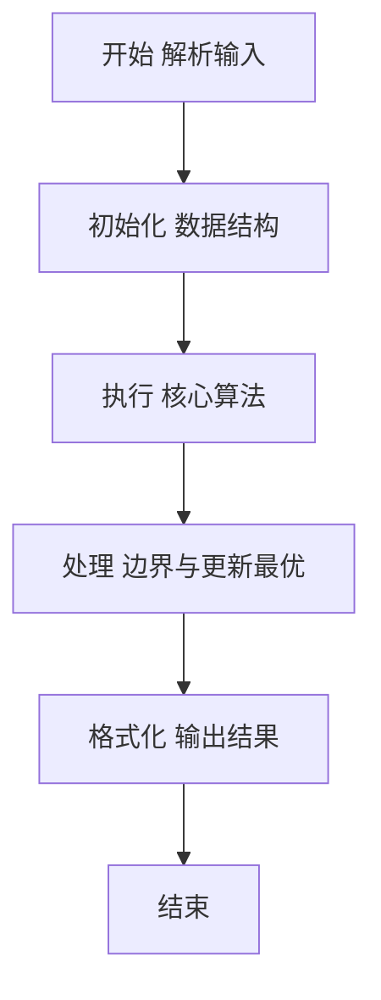
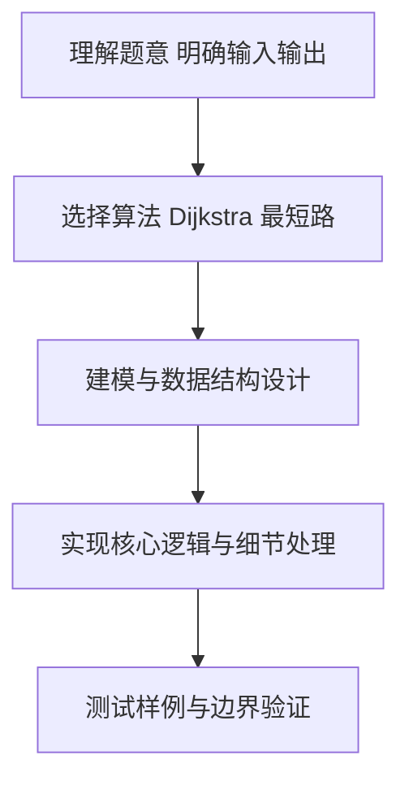

# L2-001 - 紧急救援（25 分）

- **时间限制**: 200 ms
- **内存限制**: 65536 KB
- **代码长度限制**: 16 KB

---

## 题目描述


作为一个城市的应急救援队伍的负责人，你有一张特殊的全国地图。在地图上显示有多个分散的城市和一些连接城市的快速道路。每个城市的救援队数量和每一条连接两个城市的快速道路长度都标在地图上。当其他城市有紧急求助电话给你的时候，你的任务是带领你的救援队尽快赶往事发地，同时，一路上召集尽可能多的救援队。

### 输入格式:

输入第一行给出4个正整数$N$、$M$、$S$、$D$，其中$N$（$2\le N\le 500$）是城市的个数，顺便假设城市的编号为0 ~ $(N-1)$；$M$是快速道路的条数；$S$是出发地的城市编号；$D$是目的地的城市编号。

第二行给出$N$个正整数，其中第$i$个数是第$i$个城市的救援队的数目，数字间以空格分隔。随后的$M$行中，每行给出一条快速道路的信息，分别是：城市1、城市2、快速道路的长度，中间用空格分开，数字均为整数且不超过500。输入保证救援可行且最优解唯一。

### 输出格式:

第一行输出最短路径的条数和能够召集的最多的救援队数量。第二行输出从$S$到$D$的路径中经过的城市编号。数字间以空格分隔，输出结尾不能有多余空格。

### 输入样例:
```in
4 5 0 3
20 30 40 10
0 1 1
1 3 2
0 3 3
0 2 2
2 3 2
```

### 输出样例:
```out
2 60
0 1 3
```

## 示例

### 示例 1

**输入:**
```
4 5 0 3
20 30 40 10
0 1 1
1 3 2
0 3 3
0 2 2
2 3 2
```

**输出:**
```
2 60
0 1 3
```

### 解题思路

本题要求根据给定的输入数据完成相应的判定或计算任务，以“L2-001_紧急救援”为核心，需在约束条件下构造出满足题意的结果。以 Lua 实现为参照，其实现原理概括为：Dijkstra 维护最短路条数与最短路可召集队伍数；同距离时选择队伍数更多的前驱。

在算法选型上，针对题目数据规模与结构特征，选择了 Dijkstra 最短路 等关键技术。Lua 代码通过紧凑的表结构与迭代逻辑，将原理转化为可执行流程，既保证了正确性也兼顾了简洁性。例如代码中对输入的逐行解析、数据结构的初始化与核心循环的组织均体现了该思路。

关键在于细节处理与鲁棒性：如对空输入、重复键、边界值的正确处理，以及输出格式的精确控制。时间复杂度为 Dijkstra 的 O(N²)朴素实现（N≤500）或堆优化 O(M log N)，空间为 O(N+M)。 结合 Lua 的快速 I/O 与表操作，能够在限制时间内完成判定并输出结果。
### 代码流程说明

1. 输入解析与预处理：按题面格式读取全部数据，将数值、字符串或图结构存入 Lua 表，必要时建立映射（如地址→节点、编号→集合）并处理边界空行。
2. 数据建模与初始化：将输入转化为内部模型（图、树、链表或数组），初始化距离、访问标记、计数器等辅助数组。
3. 核心算法执行：运行 Dijkstra 松弛过程，维护最短距离、路径条数与最大救援队数，同步更新前驱以便回溯路径；等价于在最短路 DAG 上做 DP。
4. 结果输出与格式化：按要求的格式拼接输出（如保留两位小数、按编号排序、输出路径或分类结果），注意末尾空格与换行控制，确保与样例一致。

### 代码实现

```lua
-- 实现原理：Dijkstra 维护最短路条数与最短路可召集队伍数；同距离时选择队伍数更多的前驱。
local n,m,s,d=io.read("*l"):match("(%d+)%s+(%d+)%s+(%d+)%s+(%d+)"); n,m,s,d=tonumber(n),tonumber(m),tonumber(s),tonumber(d); local teams={}; for x in io.read("*l"):gmatch("%d+") do teams[#teams+1]=tonumber(x) end; local g={}; for i=0,n-1 do g[i]={} end
for _=1,m do local a,b,w=io.read("*l"):match("(%d+)%s+(%d+)%s+(%d+)"); a,b,w=tonumber(a),tonumber(b),tonumber(w); g[a][b]=w; g[b][a]=w end
local dist,ways,rescue,pre,used={}, {}, {}, {}, {}; for i=0,n-1 do dist[i]=math.huge end; dist[s],ways[s],rescue[s]=0,1,teams[s]
for _=1,n do local u=nil; for i=0,n-1 do if not used[i] and (not u or dist[i]<dist[u]) then u=i end end; if not u then break end; used[u]=true; for v,w in pairs(g[u]) do local nd=dist[u]+w; if nd<dist[v] then dist[v],ways[v],rescue[v],pre[v]=nd,ways[u],rescue[u]+teams[v],u elseif nd==dist[v] then ways[v]=ways[v]+ways[u]; if rescue[u]+teams[v]>rescue[v] then rescue[v],pre[v]=rescue[u]+teams[v],u end end end end
local path={}; local x=d; while x do table.insert(path,1,x); x=pre[x] end; print(ways[d]." ".rescue[d]); print(table.concat(path," "))
```

### 代码流程图



### 解题流程图



