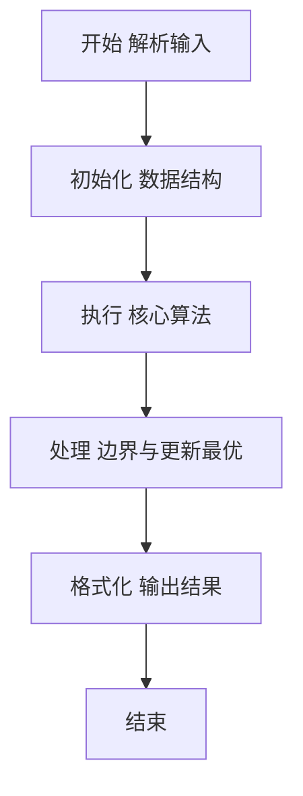
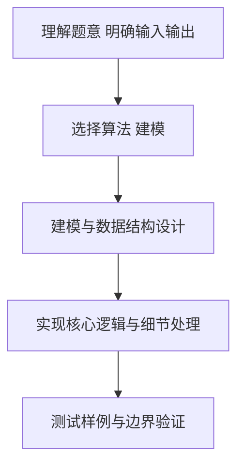

# L2-002 - 链表去重（25 分）

- **时间限制**: 400 ms
- **内存限制**: 65536 KB
- **代码长度限制**: 16 KB

---

## 题目描述


给定一个带整数键值的链表 $$L$$，你需要把其中绝对值重复的键值结点删掉。即对每个键值 $$K$$，只有第一个绝对值等于 $$K$$ 的结点被保留。同时，所有被删除的结点须被保存在另一个链表上。例如给定 $$L$$ 为 21→-15→-15→-7→15，你需要输出去重后的链表 21→-15→-7，还有被删除的链表 -15→15。

### 输入格式:

输入在第一行给出 L 的第一个结点的地址和一个正整数 $$N$$（$$\le 10^5$$，为结点总数）。一个结点的地址是非负的 5 位整数，空地址 NULL 用 $$-1$$ 来表示。

随后 $$N$$ 行，每行按以下格式描述一个结点：
```
地址 键值 下一个结点
```

其中`地址`是该结点的地址，`键值`是绝对值不超过$$10^4$$的整数，`下一个结点`是下个结点的地址。

### 输出格式:

首先输出去重后的链表，然后输出被删除的链表。每个结点占一行，按输入的格式输出。

### 输入样例:
```in
00100 5
99999 -7 87654
23854 -15 00000
87654 15 -1
00000 -15 99999
00100 21 23854
```

### 输出样例:
```out
00100 21 23854
23854 -15 99999
99999 -7 -1
00000 -15 87654
87654 15 -1
```

## 示例

### 示例 1

**输入:**
```
00100 5
99999 -7 87654
23854 -15 00000
87654 15 -1
00000 -15 99999
00100 21 23854
```

**输出:**
```
00100 21 23854
23854 -15 99999
99999 -7 -1
00000 -15 87654
87654 15 -1
```

### 解题思路

本题要求根据给定的输入数据完成相应的判定或计算任务，以“L2-002_链表去重”为核心，需在约束条件下构造出满足题意的结果。以 Lua 实现为参照，其实现原理概括为：按链表顺序访问节点，以键值绝对值判重，分别保存保留链与删除链后重连输出。

在算法选型上，代码遵循“先解析、再建模、后计算”的一般套路，将输入转化为便于处理的内部表示，再通过线性或近线性扫描完成核心判定。实现中注重边界条件与格式细节，以确保在 PTA 判题环境下稳定通过。

关键在于细节处理与鲁棒性：如对空输入、重复键、边界值的正确处理，以及输出格式的精确控制。整体时间复杂度约为 O(N log N) 或 O(N)，空间复杂度 O(N)，满足题目限制（通常 1e5 级别可通过）。 结合 Lua 的快速 I/O 与表操作，能够在限制时间内完成判定并输出结果。
### 代码流程说明

1. 输入解析与预处理：按题面格式读取全部数据，将数值、字符串或图结构存入 Lua 表，必要时建立映射（如地址→节点、编号→集合）并处理边界空行。
2. 数据建模与初始化：将输入转化为内部模型（图、树、链表或数组），初始化距离、访问标记、计数器等辅助数组。
3. 核心逻辑处理：依据“按链表顺序访问节点，以键值绝对值判重，分别保存保留链与删除链后重连输出。…”的原理进行迭代计算，完成题面要求的判定、统计或构造任务，并在循环中处理相等、冲突等特殊分支。
4. 结果输出与格式化：按要求的格式拼接输出（如保留两位小数、按编号排序、输出路径或分类结果），注意末尾空格与换行控制，确保与样例一致。

### 代码实现

```lua
-- 实现原理：按链表顺序访问节点，以键值绝对值判重，分别保存保留链与删除链后重连输出。
local head,n=io.read("*l"):match("(%S+)%s+(%d+)"); n=tonumber(n); local nodes={}; for _=1,n do local a,k,next=io.read("*l"):match("(%S+)%s+(-?%d+)%s+(%S+)"); nodes[a]={key=tonumber(k),next=next} end
local seen,keep,drop={}, {}, {}; local p=head; while p~="-1" do local node=nodes[p]; local list=seen[math.abs(node.key)] and drop or keep; list[#list+1]=p; seen[math.abs(node.key)]=true; p=node.next end
local function output(list) for i,a in ipairs(list) do local nxt=list[i+1] or "-1"; print(a." ".nodes[a].key." ".nxt) end end; output(keep); output(drop)
```

### 代码流程图



### 解题流程图



