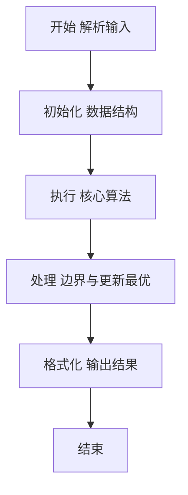
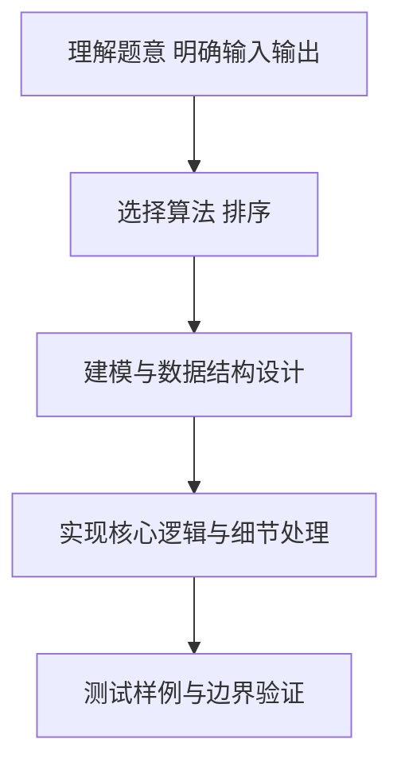

# L2-003 - 月饼（25 分）

- **时间限制**: 150 ms
- **内存限制**: 65536 KB
- **代码长度限制**: 16 KB

---

## 题目描述


月饼是中国人在中秋佳节时吃的一种传统食品，不同地区有许多不同风味的月饼。现给定所有种类月饼的库存量、总售价、以及市场的最大需求量，请你计算可以获得的最大收益是多少。

注意：销售时允许取出一部分库存。样例给出的情形是这样的：假如我们有 3 种月饼，其库存量分别为 18、15、10 万吨，总售价分别为 75、72、45 亿元。如果市场的最大需求量只有 20 万吨，那么我们最大收益策略应该是卖出全部 15 万吨第 2 种月饼、以及 5 万吨第 3 种月饼，获得 72 + 45/2 = 94.5（亿元）。

### 输入格式:

每个输入包含一个测试用例。每个测试用例先给出一个不超过 1000 的正整数 $$N$$ 表示月饼的种类数、以及不超过 500（以万吨为单位）的正整数 $$D$$ 表示市场最大需求量。随后一行给出 $$N$$ 个正数表示每种月饼的库存量（以万吨为单位）；最后一行给出 $$N$$ 个正数表示每种月饼的总售价（以亿元为单位）。数字间以空格分隔。

### 输出格式:

对每组测试用例，在一行中输出最大收益，以亿元为单位并精确到小数点后 2 位。

### 输入样例:
```in
3 20
18 15 10
75 72 45
```

### 输出样例:
```out
94.50
```

## 示例

### 示例 1

**输入:**
```
3 20
18 15 10
75 72 45
```

**输出:**
```
94.50
```

### 解题思路

本题要求根据给定的输入数据完成相应的判定或计算任务，以“L2-003_月饼”为核心，需在约束条件下构造出满足题意的结果。以 Lua 实现为参照，其实现原理概括为：按单位库存售价降序贪心销售，最后一种可卖出部分库存。

在算法选型上，针对题目数据规模与结构特征，选择了 排序、贪心 等关键技术。Lua 代码通过紧凑的表结构与迭代逻辑，将原理转化为可执行流程，既保证了正确性也兼顾了简洁性。例如代码中对输入的逐行解析、数据结构的初始化与核心循环的组织均体现了该思路。

关键在于细节处理与鲁棒性：如对空输入、重复键、边界值的正确处理，以及输出格式的精确控制。整体时间复杂度约为 O(N log N) 或 O(N)，空间复杂度 O(N)，满足题目限制（通常 1e5 级别可通过）。 结合 Lua 的快速 I/O 与表操作，能够在限制时间内完成判定并输出结果。
### 代码流程说明

1. 输入解析与预处理：按题面格式读取全部数据，将数值、字符串或图结构存入 Lua 表，必要时建立映射（如地址→节点、编号→集合）并处理边界空行。
2. 数据组织与排序：对关键对象按指定关键字排序（如按单价、按得分、按字典序），或构建哈希表/集合以支持 O(1) 判重与统计。
3. 贪心/遍历求解：按既定顺序遍历候选（如按单位价格降序取月饼），每次取尽或取部分，直至满足需求或遍历结束，累加收益。
4. 结果输出与格式化：按要求的格式拼接输出（如保留两位小数、按编号排序、输出路径或分类结果），注意末尾空格与换行控制，确保与样例一致。

### 代码实现

```lua
-- 实现原理：按单位库存售价降序贪心销售，最后一种可卖出部分库存。
local n,d=io.read("*l"):match("(%d+)%s+(%d+)"); n,d=tonumber(n),tonumber(d); local stock={}; for x in io.read("*l"):gmatch("%d+") do stock[#stock+1]=tonumber(x) end; local cakes={}; local i=1; for x in io.read("*l"):gmatch("%d+") do cakes[i]={stock=stock[i],price=tonumber(x),unit=tonumber(x)/stock[i]}; i=i+1 end; table.sort(cakes,function(a,b)return a.unit>b.unit end); local income=0; for _,c in ipairs(cakes) do local take=math.min(d,c.stock); income=income+take*c.unit; d=d-take; if d==0 then break end end; print(string.format("%.2f",income))
```

### 代码流程图



### 解题流程图



