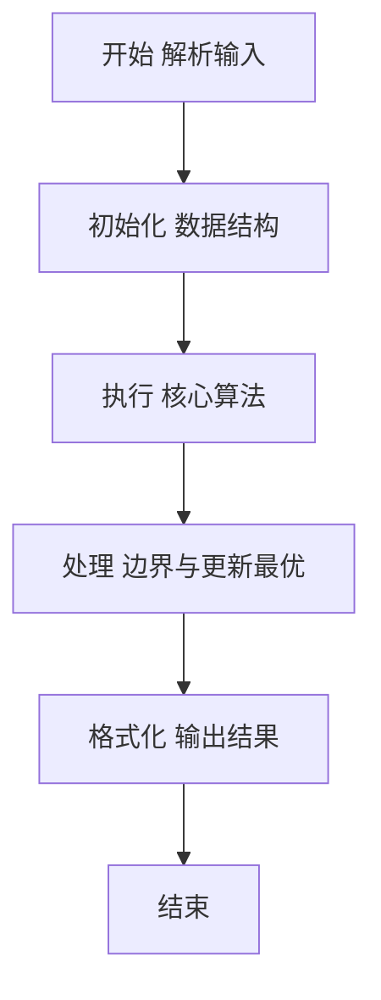
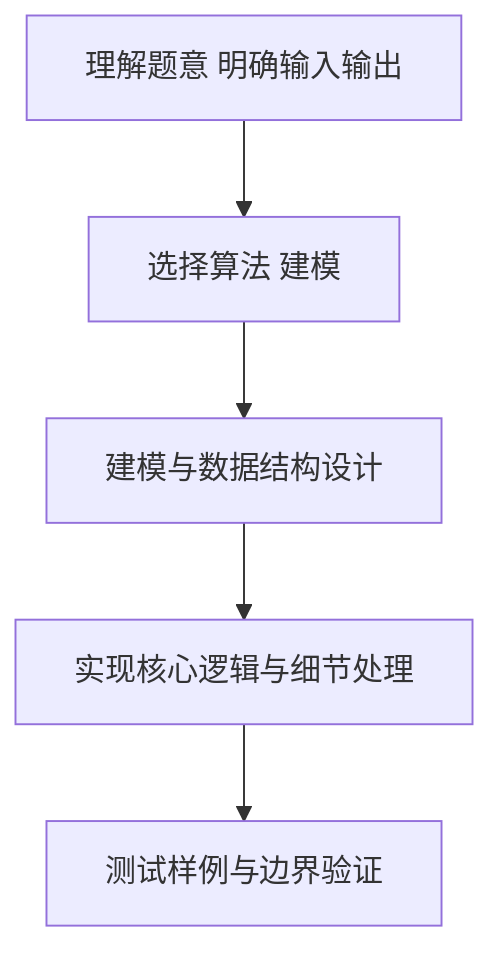

# L2-004 - 这是二叉搜索树吗？（25 分）

- **时间限制**: 400 ms
- **内存限制**: 65536 KB
- **代码长度限制**: 16 KB

---

## 题目描述


一棵二叉搜索树可被递归地定义为具有下列性质的二叉树：对于任一结点，

- 其左子树中所有结点的键值小于该结点的键值；
- 其右子树中所有结点的键值大于等于该结点的键值；
- 其左右子树都是二叉搜索树。

所谓二叉搜索树的“镜像”，即将所有结点的左右子树对换位置后所得到的树。

给定一个整数键值序列，现请你编写程序，判断这是否是对一棵二叉搜索树或其镜像进行前序遍历的结果。

### 输入格式:

输入的第一行给出正整数 $N$（$\le 1000$）。随后一行给出 $N$ 个整数键值，其间以空格分隔。

### 输出格式:

如果输入序列是对一棵二叉搜索树或其镜像进行前序遍历的结果，则首先在一行中输出 `YES` ，然后在下一行输出该树后序遍历的结果。数字间有 1 个空格，一行的首尾不得有多余空格。若答案是否，则输出 `NO`。

### 输入样例 1：
```in
7
8 6 5 7 10 8 11
```

### 输出样例 1：
```out
YES
5 7 6 8 11 10 8
```

### 输入样例 2：
```in
7
8 10 11 8 6 7 5
```

### 输出样例 2：
```out
YES
11 8 10 7 5 6 8
```

### 输入样例 3：
```in
7
8 6 8 5 10 9 11
```

### 输出样例 3：
```out
NO
```

## 示例

### 示例 1

**输入:**
```
7
8 6 5 7 10 8 11
```

**输出:**
```
YES
5 7 6 8 11 10 8
```

### 示例 2

**输入:**
```
7
8 10 11 8 6 7 5
```

**输出:**
```
YES
11 8 10 7 5 6 8
```

### 示例 3

**输入:**
```
7
8 6 8 5 10 9 11
```

**输出:**
```
NO
```

### 解题思路

本题要求根据给定的输入数据完成相应的判定或计算任务，以“L2-004_这是二叉搜索树吗？”为核心，需在约束条件下构造出满足题意的结果。以 Lua 实现为参照，其实现原理概括为：按普通 BST 和镜像 BST 的范围递归验证前序序列，验证成功后递归生成后序序列。

在算法选型上，代码遵循“先解析、再建模、后计算”的一般套路，将输入转化为便于处理的内部表示，再通过线性或近线性扫描完成核心判定。实现中注重边界条件与格式细节，以确保在 PTA 判题环境下稳定通过。

关键在于细节处理与鲁棒性：如对空输入、重复键、边界值的正确处理，以及输出格式的精确控制。整体时间复杂度约为 O(N log N) 或 O(N)，空间复杂度 O(N)，满足题目限制（通常 1e5 级别可通过）。 结合 Lua 的快速 I/O 与表操作，能够在限制时间内完成判定并输出结果。
### 代码流程说明

1. 输入解析与预处理：按题面格式读取全部数据，将数值、字符串或图结构存入 Lua 表，必要时建立映射（如地址→节点、编号→集合）并处理边界空行。
2. 数据建模与初始化：将输入转化为内部模型（图、树、链表或数组），初始化距离、访问标记、计数器等辅助数组。
3. 核心逻辑处理：依据“按普通 BST 和镜像 BST 的范围递归验证前序序列，验证成功后递归生成后序序…”的原理进行迭代计算，完成题面要求的判定、统计或构造任务，并在循环中处理相等、冲突等特殊分支。
4. 结果输出与格式化：按要求的格式拼接输出（如保留两位小数、按编号排序、输出路径或分类结果），注意末尾空格与换行控制，确保与样例一致。

### 代码实现

```lua
-- 实现原理：按普通 BST 和镜像 BST 的范围递归验证前序序列，验证成功后递归生成后序序列。
local n=tonumber(io.read("*l")); local a={}; for x in io.read("*l"):gmatch("-?%d+") do a[#a+1]=tonumber(x) end
local function build(l,r,mirror,out) if l>r then return true end; local root=a[l]; local p=l+1; if not mirror then while p<=r and a[p]<root do p=p+1 end; for i=p,r do if a[i]<root then return false end end else while p<=r and a[p]>=root do p=p+1 end; for i=p,r do if a[i]>=root then return false end end end; if not build(l+1,p-1,mirror,out) or not build(p,r,mirror,out) then return false end; out[#out+1]=root; return true end
local out={}; local ok=build(1,n,false,out); if not ok then out={}; ok=build(1,n,true,out) end; if ok then print("YES"); print(table.concat(out," ")) else print("NO") end
```

### 代码流程图



### 解题流程图



