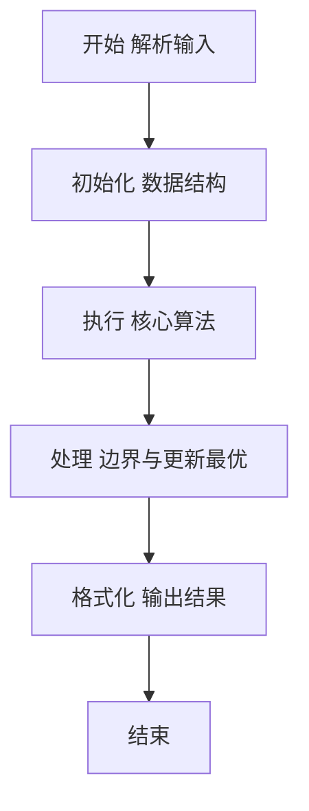
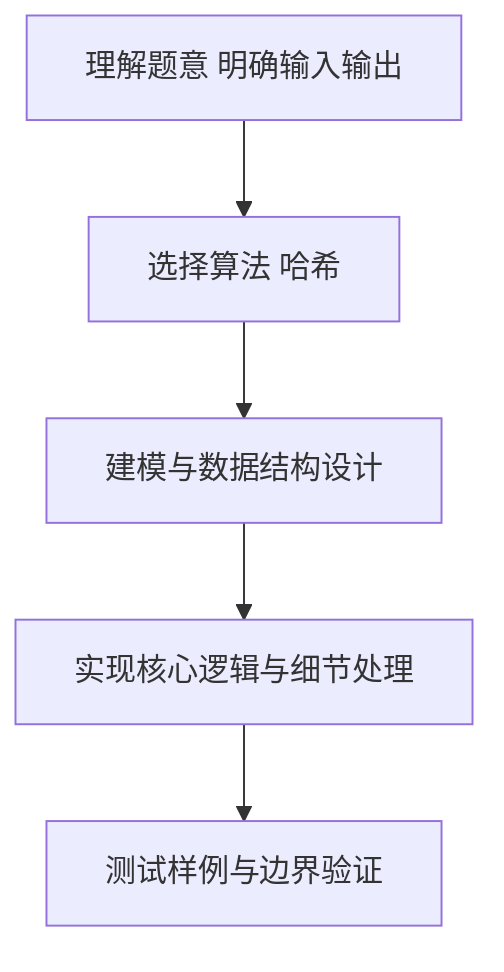

# L2-005 - 集合相似度（25 分）

- **时间限制**: 400 ms
- **内存限制**: 65536 KB
- **代码长度限制**: 16 KB

---

## 题目描述


给定两个整数集合，它们的相似度定义为：$$N_c / N_t \times 100\%$$。其中$$N_c$$是两个集合都有的不相等整数的个数，$$N_t$$是两个集合一共有的不相等整数的个数。你的任务就是计算任意一对给定集合的相似度。

### 输入格式:

输入第一行给出一个正整数$$N$$（$$\le 50$$），是集合的个数。随后$$N$$行，每行对应一个集合。每个集合首先给出一个正整数$$M$$（$$\le 10^4$$），是集合中元素的个数；然后跟$$M$$个$$[0, 10^9]$$区间内的整数。

之后一行给出一个正整数$$K$$（$$\le 2000$$），随后$$K$$行，每行对应一对需要计算相似度的集合的编号（集合从1到$$N$$编号）。数字间以空格分隔。

### 输出格式:

对每一对需要计算的集合，在一行中输出它们的相似度，为保留小数点后2位的百分比数字。

### 输入样例:
```in
3
3 99 87 101
4 87 101 5 87
7 99 101 18 5 135 18 99
2
1 2
1 3
```

### 输出样例:
```out
50.00%
33.33%
```

## 示例

### 示例 1

**输入:**
```
3
3 99 87 101
4 87 101 5 87
7 99 101 18 5 135 18 99
2
1 2
1 3
```

**输出:**
```
50.00%
33.33%
```

### 解题思路

本题要求根据给定的输入数据完成相应的判定或计算任务，以“L2-005_集合相似度”为核心，需在约束条件下构造出满足题意的结果。以 Lua 实现为参照，其实现原理概括为：以哈希表保存每个集合的不同元素；查询时统计交集，再由 $|A|+|B|-|A\cap B|$ 得并集。

在算法选型上，针对题目数据规模与结构特征，选择了 哈希 等关键技术。Lua 代码通过紧凑的表结构与迭代逻辑，将原理转化为可执行流程，既保证了正确性也兼顾了简洁性。例如代码中对输入的逐行解析、数据结构的初始化与核心循环的组织均体现了该思路。

关键在于细节处理与鲁棒性：如对空输入、重复键、边界值的正确处理，以及输出格式的精确控制。整体时间复杂度约为 O(N log N) 或 O(N)，空间复杂度 O(N)，满足题目限制（通常 1e5 级别可通过）。 结合 Lua 的快速 I/O 与表操作，能够在限制时间内完成判定并输出结果。
### 代码流程说明

1. 输入解析与预处理：按题面格式读取全部数据，将数值、字符串或图结构存入 Lua 表，必要时建立映射（如地址→节点、编号→集合）并处理边界空行。
2. 数据建模与初始化：将输入转化为内部模型（图、树、链表或数组），初始化距离、访问标记、计数器等辅助数组。
3. 核心逻辑处理：依据“以哈希表保存每个集合的不同元素；查询时统计交集，再由 |A|+|B|-交集 得并…”的原理进行迭代计算，完成题面要求的判定、统计或构造任务，并在循环中处理相等、冲突等特殊分支。
4. 结果输出与格式化：按要求的格式拼接输出（如保留两位小数、按编号排序、输出路径或分类结果），注意末尾空格与换行控制，确保与样例一致。

### 代码实现

```lua
-- 实现原理：以哈希表保存每个集合的不同元素；查询时统计交集，再由 |A|+|B|-交集 得并集。
local n=tonumber(io.read("*l")); local sets={}; for i=1,n do sets[i]={}; local vals={}; for x in io.read("*l"):gmatch("%d+") do vals[#vals+1]=tonumber(x) end; for j=2,#vals do sets[i][vals[j]]=true end end; local q=tonumber(io.read("*l")); for _=1,q do local a,b=io.read("*l"):match("(%d+)%s+(%d+)"); a,b=sets[tonumber(a)],sets[tonumber(b)]; local ca,cb,common=0,0,0; for x in pairs(a) do ca=ca+1; if b[x] then common=common+1 end end; for _ in pairs(b) do cb=cb+1 end; print(string.format("%.2f%%",common/(ca+cb-common)*100)) end
```

### 代码流程图



### 解题流程图


