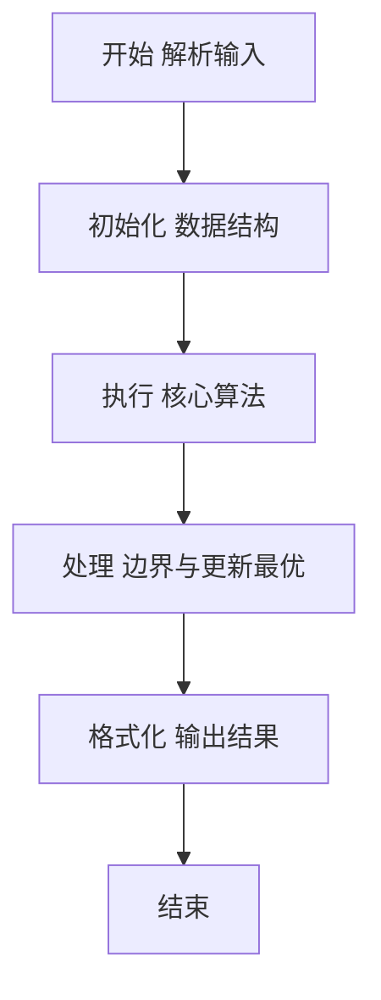
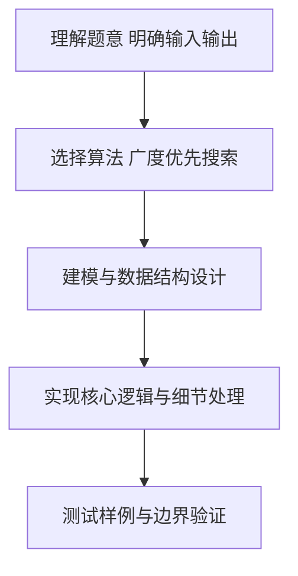

# L2-006 - 树的遍历（25 分）

- **时间限制**: 400 ms
- **内存限制**: 65536 KB
- **代码长度限制**: 16 KB

---

## 题目描述


给定一棵二叉树的后序遍历和中序遍历，请你输出其层序遍历的序列。这里假设键值都是互不相等的正整数。

### 输入格式:

输入第一行给出一个正整数$$N$$（$$\le 30$$），是二叉树中结点的个数。第二行给出其后序遍历序列。第三行给出其中序遍历序列。数字间以空格分隔。

### 输出格式:

在一行中输出该树的层序遍历的序列。数字间以1个空格分隔，行首尾不得有多余空格。

### 输入样例:
```in
7
2 3 1 5 7 6 4
1 2 3 4 5 6 7
```

### 输出样例:
```out
4 1 6 3 5 7 2
```

## 示例

### 示例 1

**输入:**
```
7
2 3 1 5 7 6 4
1 2 3 4 5 6 7
```

**输出:**
```
4 1 6 3 5 7 2
```

### 解题思路

本题要求根据给定的输入数据完成相应的判定或计算任务，以“L2-006_树的遍历”为核心，需在约束条件下构造出满足题意的结果。以 Lua 实现为参照，其实现原理概括为：由后序末尾确定根并在中序中分割左右子树，递归建树后用队列层序遍历。

在算法选型上，针对题目数据规模与结构特征，选择了 广度优先搜索 等关键技术。Lua 代码通过紧凑的表结构与迭代逻辑，将原理转化为可执行流程，既保证了正确性也兼顾了简洁性。例如代码中对输入的逐行解析、数据结构的初始化与核心循环的组织均体现了该思路。

关键在于细节处理与鲁棒性：如对空输入、重复键、边界值的正确处理，以及输出格式的精确控制。整体时间复杂度约为 O(N log N) 或 O(N)，空间复杂度 O(N)，满足题目限制（通常 1e5 级别可通过）。 结合 Lua 的快速 I/O 与表操作，能够在限制时间内完成判定并输出结果。
### 代码流程说明

1. 输入解析与预处理：按题面格式读取全部数据，将数值、字符串或图结构存入 Lua 表，必要时建立映射（如地址→节点、编号→集合）并处理边界空行。
2. 数据建模与初始化：将输入转化为内部模型（图、树、链表或数组），初始化距离、访问标记、计数器等辅助数组。
3. 核心逻辑处理：依据“由后序末尾确定根并在中序中分割左右子树，递归建树后用队列层序遍历。…”的原理进行迭代计算，完成题面要求的判定、统计或构造任务，并在循环中处理相等、冲突等特殊分支。
4. 结果输出与格式化：按要求的格式拼接输出（如保留两位小数、按编号排序、输出路径或分类结果），注意末尾空格与换行控制，确保与样例一致。

### 代码实现

```lua
-- 实现原理：由后序末尾确定根并在中序中分割左右子树，递归建树后用队列层序遍历。
local n=tonumber(io.read("*l")); local post,inorder={}, {}; for x in io.read("*l"):gmatch("%d+") do post[#post+1]=tonumber(x) end; for x in io.read("*l"):gmatch("%d+") do inorder[#inorder+1]=tonumber(x) end; local pos={}; for i,x in ipairs(inorder) do pos[x]=i end
local function build(pl,pr,il,ir) if pl>pr then return nil end; local root=post[pr]; local k=pos[root]; local left=k-il; return {v=root,l=build(pl,pl+left-1,il,k-1),r=build(pl+left,pr-1,k+1,ir)} end
local root=build(1,n,1,n); local q,out={root},{}; local h=1; while q[h] do local x=q[h]; h=h+1; out[#out+1]=x.v; if x.l then q[#q+1]=x.l end; if x.r then q[#q+1]=x.r end end; print(table.concat(out," "))
```

### 代码流程图



### 解题流程图



