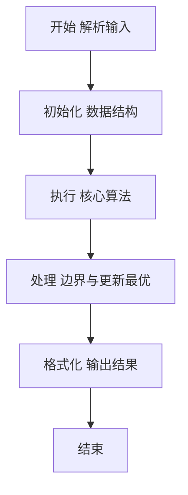
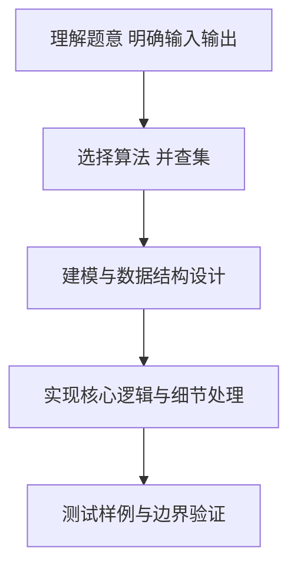

# L2-007 - 家庭房产（25 分）

- **时间限制**: 400 ms
- **内存限制**: 65536 KB
- **代码长度限制**: 16 KB

---

## 题目描述


给定每个人的家庭成员和其自己名下的房产，请你统计出每个家庭的人口数、人均房产面积及房产套数。

### 输入格式:

输入第一行给出一个正整数$$N$$（$$\le 1000$$），随后$$N$$行，每行按下列格式给出一个人的房产：
```
编号 父 母 k 孩子1 .. 孩子k 房产套数 总面积
```
其中`编号`是每个人独有的一个4位数的编号；`父`和`母`分别是该编号对应的这个人的父母的编号（如果已经过世，则显示`-1`）；`k`（$$0\le$$`k`$$\le 5$$）是该人的子女的个数；`孩子i`是其子女的编号。

### 输出格式:

首先在第一行输出家庭个数（所有有亲属关系的人都属于同一个家庭）。随后按下列格式输出每个家庭的信息：
```
家庭成员的最小编号 家庭人口数 人均房产套数 人均房产面积
```
其中人均值要求保留小数点后3位。家庭信息首先按人均面积降序输出，若有并列，则按成员编号的升序输出。

### 输入样例:
```in
10
6666 5551 5552 1 7777 1 100
1234 5678 9012 1 0002 2 300
8888 -1 -1 0 1 1000
2468 0001 0004 1 2222 1 500
7777 6666 -1 0 2 300
3721 -1 -1 1 2333 2 150
9012 -1 -1 3 1236 1235 1234 1 100
1235 5678 9012 0 1 50
2222 1236 2468 2 6661 6662 1 300
2333 -1 3721 3 6661 6662 6663 1 100
```

### 输出样例:
```out
3
8888 1 1.000 1000.000
0001 15 0.600 100.000
5551 4 0.750 100.000
```

## 示例

### 示例 1

**输入:**
```
10
6666 5551 5552 1 7777 1 100
1234 5678 9012 1 0002 2 300
8888 -1 -1 0 1 1000
2468 0001 0004 1 2222 1 500
7777 6666 -1 0 2 300
3721 -1 -1 1 2333 2 150
9012 -1 -1 3 1236 1235 1234 1 100
1235 5678 9012 0 1 50
2222 1236 2468 2 6661 6662 1 300
2333 -1 3721 3 6661 6662 6663 1 100
```

**输出:**
```
3
8888 1 1.000 1000.000
0001 15 0.600 100.000
5551 4 0.750 100.000
```

### 解题思路

本题要求根据给定的输入数据完成相应的判定或计算任务，以“L2-007_家庭房产”为核心，需在约束条件下构造出满足题意的结果。以 Lua 实现为参照，其实现原理概括为：并查集合并亲属关系，按连通分量汇总人口、套数和面积，再按人均面积排序。

在算法选型上，针对题目数据规模与结构特征，选择了 并查集、排序 等关键技术。Lua 代码通过紧凑的表结构与迭代逻辑，将原理转化为可执行流程，既保证了正确性也兼顾了简洁性。例如代码中对输入的逐行解析、数据结构的初始化与核心循环的组织均体现了该思路。

关键在于细节处理与鲁棒性：如对空输入、重复键、边界值的正确处理，以及输出格式的精确控制。并查集操作近乎 O(α(N))，总体时间 O(N α(N))，空间 O(N)。 结合 Lua 的快速 I/O 与表操作，能够在限制时间内完成判定并输出结果。
### 代码流程说明

1. 输入解析与预处理：按题面格式读取全部数据，将数值、字符串或图结构存入 Lua 表，必要时建立映射（如地址→节点、编号→集合）并处理边界空行。
2. 结构初始化：初始化并查集父指针、集合大小或图邻接表，标记活跃节点，准备用于后续合并与查询的核心数据结构。
3. 核心逻辑处理：依据“并查集合并亲属关系，按连通分量汇总人口、套数和面积，再按人均面积排序。…”的原理进行迭代计算，完成题面要求的判定、统计或构造任务，并在循环中处理相等、冲突等特殊分支。
4. 结果输出与格式化：按要求的格式拼接输出（如保留两位小数、按编号排序、输出路径或分类结果），注意末尾空格与换行控制，确保与样例一致。

### 代码实现

```lua
-- 实现原理：并查集合并亲属关系，按连通分量汇总人口、套数和面积，再按人均面积排序。
local n=tonumber(io.read("*l")); local parent,active,sets,areas={}, {}, {}, {}; for i=0,9999 do parent[i]=i end
local function find(x) if parent[x]~=x then parent[x]=find(parent[x]) end; return parent[x] end
local function join(a,b) if a>=0 and b>=0 then a,b=find(a),find(b); if a~=b then parent[a]=b end end end
for _=1,n do local v={}; for x in io.read("*l"):gmatch("-?%d+") do v[#v+1]=tonumber(x) end; local id,f,m,k=v[1],v[2],v[3],v[4]; active[id]=true; join(id,f); join(id,m); for i=1,k do active[v[4+i]]=true; join(id,v[4+i]) end; sets[id]=(sets[id] or 0)+v[5+k]; areas[id]=(areas[id] or 0)+v[6+k] end
local groups={}; for id in pairs(active) do local r=find(id); groups[r]=groups[r] or {min=id,cnt=0,s=0,a=0}; local g=groups[r]; g.min=math.min(g.min,id); g.cnt=g.cnt+1; g.s=g.s+(sets[id] or 0); g.a=g.a+(areas[id] or 0) end
local out={}; for _,g in pairs(groups) do out[#out+1]=g end; table.sort(out,function(x,y) local ax,ay=x.a/x.cnt,y.a/y.cnt; return ax==ay and x.min<y.min or ax>ay end); print(#out); for _,g in ipairs(out) do print(string.format("%04d %d %.3f %.3f",g.min,g.cnt,g.s/g.cnt,g.a/g.cnt)) end
```

### 代码流程图



### 解题流程图



